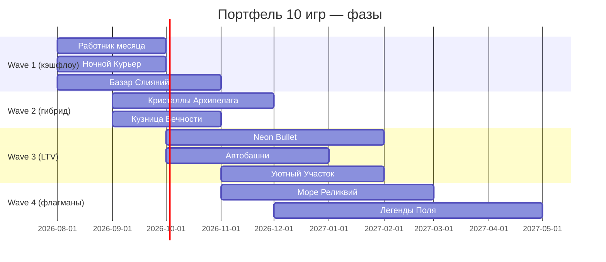

# Яндекс Игры: анализ рынка и портфель из 10 игр

**Дата:** 17 июля 2026  
**Цель портфеля:** монетизация через гибрид (реклама РСЯ + инапы), покрытие разных сегментов ЦА  
**Рабочее пространство:** `yandex-games-portfolio`

---

## 1. Снимок рынка (2025 → 2026)

### Масштаб платформы

| Метрика | Значение | Источник / смысл |
|--------|----------|------------------|
| MAU | ~50 млн | Платформа выросла ~+10% к 2024 |
| Каталог | ~19 тыс. игр | Планка качества поднята: сняли десятки тысяч слабых проектов |
| Средний плейтайм | → ~60 мин | Игроки уходят от «случайного гиперказуала» к осознанным сессиям |
| Инапы | +75% выручки разработчиков г/г | Стратегический фокус Яндекса на платежах |

**Вывод:** в 2026 «просто выложить аркаду с interstitial» уже не стратегия роста. Алгоритмы и витрина продвигают игры с рейтингом, удержанием, глубиной и гибридной экономикой.

### Что платформа явно хочет

1. **Гибридная монетизация** — реклама + покупки как стандарт для сильных жанров.
2. **Мидкор** — вошёл в топ-5; ставка платформы на 2026.
3. **Качество и LiveOps** — ивенты, обновления, облачные сохранения, авторизация.
4. **Разнообразие жанров** — стратегии, RPG, симуляторы, кооп; веб догоняет мобайл.

### Технические жёсткие правила SDK

- Реклама и платежи **только** через Yandex Games SDK.
- Rewarded — только по добровольному действию игрока, с понятной наградой.
- Interstitial — на естественных паузах (смерть, конец уровня, смена экрана), не mid-action.
- Sticky-баннер — допустим, но не ломает UX (особенно на мобильном вебе).
- Обязательны: корректный consume покупок, проверка необработанных покупок при старте.
- Сильный буст к продвижению: лидерборды, cloud saves, авторизация Яндекса.

---

## 2. Сегменты ЦА на платформе

| # | Сегмент | Кто это | Что играет | Как платит |
|---|---------|---------|------------|------------|
| A | Экшен / «крутой» казуал | 14–35, м+ж, мобильный веб | аркады, runners, top-down | RV continue, скины, отключение рекламы |
| B | Вирусный юмор / офис | 18–45, широкая | короткие аркады с мем-сеттингом | в основном ads + soft IAP |
| C | Стратегия / roguelike | 20–40, мидкор | FTL-like, TD, deckbuilders | сильные инапы, пропуски, мета |
| D | Спорт + коллекционирование | 16–45, футбольные фанаты | менеджеры, карточки, PvP-лайк | паки, battle pass, энергия |
| E | Merge / уютный казуал | 25–55, часто ж | merge, фермы, декор | бустеры, энергия, косметика |
| F | Классический puzzle | 25–60 | match-3, блок-пазлы | бустеры, жизни, пропуски |
| G | Idle / AFK | 18–50 | кликеры, idle tycoon | ускорения, оффлайн-бонусы, премиум |
| H | Cozy / life-sim | 20–50 | фермы, строительство | декор, слоты, премиум-пропуск |
| I | Лёгкий мидкор-стратег | 16–40 | TD, auto-battler lite | герои, башни, прогресс |
| J | Сессионный runner | 14–35 | endless / delivery | continue, мультипликаторы, скины |

Портфель из 10 игр ниже закрывает **A–J** без сильного каннибализма жанров.

---

## 3. Модель монетизации портфеля

### Общий принцип

```
Трафик / витрина Яндекса
        ↓
Короткий «вау»-луп (30–90 сек)
        ↓
Удержание D1/D7 (мета, цели, cloud save)
        ↓
Гибрид: RV + interstitial + sticky
        ↓
Инапы для 3–8% платящих (валюта, pass, косметика, convenience)
```

### Матрица дохода по типам игр

| Тип | Ads ARPU | IAP ARPU | Роль в портфеле |
|-----|----------|----------|-----------------|
| Короткие аркады (2, 10) | высокий | низкий | кэшфлоу и тест креативов |
| Puzzle / merge / farm (5, 6, 8) | средний | средний+ | стабильный гибрид |
| Idle (7) | средний | средний | долгий LTV при низкой стоимости контента |
| Мидкор (1, 3, 4, 9) | средний | высокий | основной LTV-двигатель |

### Экономика «с первого дня» (обязательный минимум в каждой игре)

1. Soft currency + hard currency (или премиум-валюта портала).
2. Хотя бы 1–2 инапа: пак валюты / отключение рекламы / battle pass.
3. RV на continue / бустер / x2 / daily free.
4. Interstitial на конце рана / уровня (частота — платформа).
5. Ежедневная награда + цель на 3–7 дней.

---

## 4. Портфель: какие 10 игр делать

### Краткая сводка

| # | Рабочее название | Жанр | Сегмент | Приоритет разработки | Монетизация |
|---|------------------|------|---------|----------------------|-------------|
| 1 | **Neon Bullet** | Top-down экшен (Hotline-like) | A | P1 (ваш IP) | hybrid, косметика |
| 2 | **Работник месяца** | Escape-аркада, офис | B | P0 (быстрый MVP) | ads-first + soft IAP |
| 3 | **Море Реликвий** | Naval FTL / roguelike | C | P1 | IAP-heavy midcore |
| 4 | **Легенды Поля** | Футбол CCG + autochess + менеджмент | D | P1 (высокий LTV) | IAP-heavy |
| 5 | **Базар Слияний** | Merge-tycoon | E | P0 | hybrid |
| 6 | **Кристаллы Архипелага** | Match-3 | F | P0 | hybrid classic |
| 7 | **Кузница Вечности** | Idle / incremental | G | P0 | hybrid |
| 8 | **Уютный Участок** | Cozy farm | H | P1 | hybrid + декор |
| 9 | **Автобашни** | TD + auto-battler lite | I | P1 | hybrid midcore |
| 10 | **Ночной Курьер** | Endless runner / delivery | J | P0 | ads-first |

**P0** = можно довести до стора быстрее (8–12 недель одним агентом с шаблоном).  
**P1** = выше сложность / LTV (12–20 недель).

### Почему именно эти 7 новых идей

1. **Базар Слияний** — merge сейчас сильнее классического match-3 по глубине и LTV, женская + широкая ЦА.
2. **Кристаллы Архипелага** — «бессмертный» puzzle-кэшфлоу, понятная экономика бустеров.
3. **Кузница Вечности** — idle дешёв в контенте, хорошо живёт на оффлайн-возвратах и RV.
4. **Уютный Участок** — фермы стабильно в топе казуала на веб-платформах РФ.
5. **Автобашни** — мидкор без тяжести полноценной стратегии; близко к тренду платформы.
6. **Ночной Курьер** — быстрый session loop, отличный ads engine и тест креативов.
7. **Легенды Поля** (развитие вашей сырой идеи) — см. ниже.

### Идея футбольного менеджера: имеет ли смысл?

**Да — при правильном скоупе.** На CIS-аудитории футбол = огромный эмоциональный крючок. Смесь CCG + autochess + межматчевый менеджмент даёт:

- **Коллекционирование** → паки / гача-лайк (инапы).
- **Сессию 3–8 минут** → autochess-матч (удержание + RV).
- **Мета между матчами** → состав, колода, тренировки, трансферный рынок (daily login).
- **LiveOps** — сезоны, турниры, рейтинги (лидерборды Яндекса).

**Риски:** перегруз UI, долгая разработка, модерация «азартных» формулировок.  
**Решение:** не делать полноценный Football Manager. Делать **упрощённый midcore**: 5–8 слотов на поле, карты-скиллы, автобой с редкими ручными решениями, менеджмент на 2–3 экрана.

Полный концепт — в `docs/concepts/04-legends-of-the-pitch.md`.

---

## 5. Порядок выхода (рекомендуемый roadmap)



**Логика:** сначала 2–3 быстрых ads-игры → денежный поток и понимание SDK/модерации → затем гибридные казуалы → затем мидкор-флагманы с максимальным LTV.

---

## 6. KPI, без которых игру «не качаем»

| KPI | Минимум до маркетинга / доработки | Здоровый таргет |
|-----|-----------------------------------|-----------------|
| Tutorial completion | ≥70% | ≥85% |
| D1 retention | ≥25% | ≥35% |
| D7 retention | ≥8% | ≥15% |
| Avg session | ≥4 мин | ≥8–15 мин (мидкор) |
| RV opt-in rate | ≥20% сессий | ≥35% |
| IAP conversion | ≥1% | 3–8% (мидкор) |
| Рейтинг стора | ≥4.2 | ≥4.5 |

Если D1 < 20% — не вкладываться в продвижение, чинить онбординг и первый «вау».

---

## 7. Документы в этом репозитории

| Файл | Назначение |
|------|------------|
| `docs/00-market-analysis-and-portfolio.md` | Этот документ |
| `docs/concepts/01…10-*.md` | Концепт каждой игры (+ картинка) |
| `docs/agents/10-agent-prompts.md` | 10 промптов для агентов-разработчиков |
| `docs/agents/control-methodology.md` | Как контролировать подагентов |
| `pdf/*.pdf` | PDF-версии с встроенными изображениями |
| `assets/concepts/*.png` | Ключевые арты |

---

## 8. Итоговая рекомендация

Делать **не 10 одинаковых гиперказуалов**, а **лестницу**:

1. **Ads-engine игры** (Работник месяца, Курьер) — скорость и кэш.
2. **Гибридные казуалы** (Merge, Match-3, Idle, Farm) — стабильность.
3. **Мидкор-флагманы** (Neon Bullet, Море Реликвий, Автобашни, Легенды Поля) — основной LTV.

Главная цель — монетизация — достигается не количеством билдов, а **гибридной экономикой + удержанием + регулярными LiveOps** в 3–4 сильнейших тайтлах. Остальные 6–7 служат диверсификацией сегментов и страховкой жанровых провалов.
