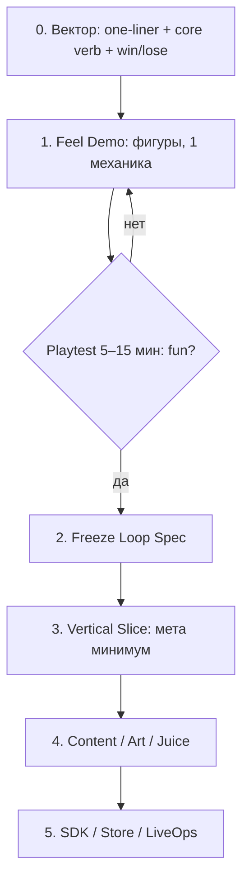

# Методология разработки портфеля (уроки chas-pik + Яндекс Игры)

**Дата:** 2026-07-17  
**Зачем документ:** в прошлых попытках каждый новый промпт ухудшал игру. Ниже — правила, чтобы агент **двигал вектор сам**, а правки не ломали feel.

---

## 1. Главный вывод

> **Сначала фиксируем вектор и играбельную демку. Потом контент/арт/стор. Промпты не лечат отсутствие fun.**

Типичный провал (`chas-pik` / «Работник месяца»):

```
Модерация SDK → красивый арт → мега-промпты 2048 → 15 скинов → дизайн-пакет для LLM
                                                                    ↑
                                                         core loop почти не углубился
```

Агент оптимизировал **измеримое** (ready(), PNG count, store checklist), а не **ощущение раунда**.

---

## 2. Почему «ещё один промпт» делает хуже

| Механизм | Что происходит |
|----------|----------------|
| **Цель смещается** | Новый промпт = новая цель (арт/SDK/скины). Старая цель (dodge feel) перестаёт быть DoD. |
| **Контекст раздувается** | Агент держит 50 ограничений и теряет 5 чувственных. |
| **Локальный фикс** | «Почини кольцо у спрайта» не трогает tutorial/controls, но тратит сессию. |
| **Документы расходятся с кодом** | Промпты описывают target, runtime — legacy. Следующий агент «улучшает» target, игнорируя playable truth. |
| **Нет regress-теста feel** | Нельзя проверить, что после правки «стало хуже бегать». |

**Правило:** новый промпт разрешён только если он **не меняет DoD текущего гейта**. Иначе это смена фазы, а не «уточнение».

---

## 3. Вектор разработки (обязательный порядок)



### Гейты (новые, поверх G0–G5)

| Gate | Название | Можно / нельзя |
|------|----------|----------------|
| **F0** | Vector lock | one-liner, core verb, controls, win/lose. **Нельзя** арт-фабрику |
| **F1** | Feel demo | играбельная демка простыми фигурами. **Нельзя** скины/стор |
| **F2** | Loop freeze | DESIGN_LLM §Feel + §Retention зафиксированы. Только после этого CONFIRM дизайна |
| **G0+** | как раньше | код production |

**CONFIRM дизайна** = F2 пройден, не «много красивых картинок».

---

## 4. Feel Demo — обязательный артефакт

На странице каждой игры в дашборде вкладка **«Демка»**:

- Простые фигуры (круги/квадраты), без AI-арта
- Только **core verb** за 30–90 сек
- Управление сразу видно (кнопки/свайп/WASD)
- Цель раунда и fail state понятны без текста

Демка отвечает на вопросы, которых нет на картинках:

1. Как управлять?  
2. Сколько держит один ран?  
3. Почему рестартнуть ещё раз?  
4. Что будет «контентом завтра» (хотя бы намёк: этаж/волна/паттерн)?

Путь: `management/demos/<slug>.js` + вкладка в `management/projects/<slug>.html`.

---

## 5. Как вносить правки, не убивая геймплей

### 5.1 Классификация изменений

| Тип | Пример | Правило |
|-----|--------|---------|
| **A. Feel** | скорость, deadzone, catch radius | Только на демке/слайсе; A/B с собой «до/после» 10 ранов |
| **B. Loop** | win condition, новый verb | Требует re-freeze F2; остановить арт/контент |
| **C. Content** | новый этаж/враг на тех же правилах | OK, если не меняет feel numbers |
| **D. Presentation** | спрайты, UI skin | Запрещено менять hitbox/timing «заодно» |
| **E. Platform** | SDK, ads, i18n | Отдельный агент; не в том же чате, что feel |

### 5.2 Протокол «не ухудшить»

Перед любой правкой типа A/B агент обязан:

1. Записать **baseline** (3 числа): median run length, deaths/10 runs, «хочу ещё?» 1–5.  
2. Внести **одно** изменение.  
3. Повторить 10 ранов.  
4. Если хуже — **revert**, не «компенсировать» вторым промптом.

### 5.3 Запрет scope creep в одном чате

Один агент / одна сессия = один тип (A–E).  
Оркестратор режет: «сначала feel, стор потом».

---

## 6. Что агент должен двигать сам (автономия)

После F2 агент **не ждёт** микро-промптов. Он идёт по backlog внутри гейта:

**F1 backlog (пример Работника месяца):**
1. Движение + камера  
2. 1 босс chase  
3. Catch / restart  
4. 1 hide или 1 gadget  
5. Эскалация 60с  

**G1 backlog:** добить AC из DESIGN_LLM без вопросов «а сделать ли скины?».

Микро-промпты пользователя допустимы только как **ACCEPT / REWORK / CUT** по гейту — не как новые фичи mid-flight.

---

## 7. Уроки chas-pik → чеклист оркестратора

- [ ] DoD гейта = player outcome, не PNG count  
- [ ] Есть STATUS с колонками: Loop / Feel / Content / Art / Store  
- [ ] Docs ⊄ «target», который врёт про runtime (иначе агент полирует фантазию)  
- [ ] Art QA reject **до** интеграции в билд  
- [ ] Content = новая механика/layout, не только tint неба  
- [ ] SDK/модерация не маскируют тонкий loop  
- [ ] Промпт-пакет обновляется только после sync с кодом  

---

## 8. Рекомендуемый процесс на 1 игру

| Неделя | Фокус | Выход |
|--------|-------|-------|
| 0 | Vector + сравнение с рефами | one-pager + open decisions |
| 1 | Feel demo | вкладка «Демка», playtest |
| 1–2 | Loop freeze | DESIGN pass-2, F2 |
| 2–4 | Vertical slice | G1–G2 |
| 4+ | Art/content/SDK | G3–G5 |

**Не параллелить** «15 скинов» и «ещё не ясно управление».

---

## 9. Связанные файлы

- Сравнение Работник месяца vs chas-pik: `games/deadline-escape/docs/GAP_VS_CHAS_PIK.md`  
- Дашборд: `management/portfolio-dashboard.html` → вкладка «Демка»  
- Feel demos: `management/demos/`  
