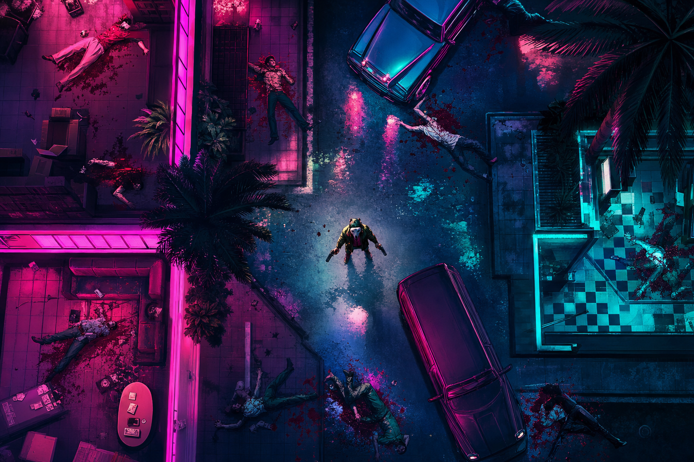

# 01 — Neon Bullet

**Жанр:** 2D top-down экшен (Hotline Miami-like)  
**Сегмент ЦА:** A — экшен / «крутой» казуал, 14–35  
**Приоритет:** P1  
**Платформа:** Яндекс Игры (HTML5 / Phaser или PixiJS)

---

## One-liner

Короткие кроваво-стильные рейды сверху: зайди в локацию, зачисть всех, не умри от одной пули — и сделай это под неоновый саундтрек.

## Fantasy / сеттинг

Неоновый нуар конца 80-х. Игрок — наёмник в маске, выполняющий «грязные» заказы в ночном городе. Уровни — квартиры, клубы, парковки, склады. Эстетика важнее реализма: розовый/циан неон, резкий контраст, ударный саунд.

## Core loop (60–120 сек)

1. Выбор маски/оружия → старт миссии.  
2. Top-down зачистка комнаты за комнатой (stealth optional, но не обязателен).  
3. Смерть с одной-двух ошибок → мгновенный рестарт **или** RV continue.  
4. Победа → оценка стиля (время, комбо, без урона) → валюта + шанс на скин.  
5. Мета: открытие районов, масок, оружия, контрактов.

## Механики MVP

- Движение WASD/стик + прицел мышью/тачем.  
- Оружие: пистолет, дробовик, нож, временный пулемёт.  
- Враги с простыми паттернами (патруль, алерт, стрельба).  
- One-hit / low HP tension.  
- 15–25 миссий + 3 босса.  
- Система комбо и ranking (S/A/B/C) → лидерборд Яндекса.

## Мета-прогрессия

- Маски (скиллы пассивные: +скорость, тише шаги, +патроны).  
- Оружейный шкаф.  
- Районы города как хаб.  
- Ежедневный контракт.

## Монетизация (гибрид)

| Источник | Как |
|----------|-----|
| Interstitial | После миссии / смерти (не mid-fight) |
| Rewarded | Continue, x2 награда, пробная маска на 1 ран |
| IAP | Отключение рекламы, паки hard currency, battle pass сезона, премиум-маски |
| Soft | Монеты за миссии → апгрейды и косметика |

**Нельзя:** paywall на базовый прогресс; pay-to-win урон.

## Удержание

- Daily contract.  
- Сезонный pass с 30 уровнями.  
- Рейтинговые забеги недели.  
- Cloud save + лидерборд «лучший рейтинг района».

## Скоуп MVP → Store Ready

- Управление, 3 типа врагов, 12 миссий, 5 масок, 4 оружия.  
- SDK: adv, rewarded, payments, leaderboard, player auth, cloud save.  
- Туториал ≤90 сек.  
- Desktop + mobile web.

## Риски

- Слишком хардкор → отток казуала (смягчить через маски/continue).  
- Цензура насилия (стилизовать кровь, без расчленёнки).  
- Сравнение с Hotline — нужен свой визуальный и аудио-идентити.

## Критерии готовности к стору

- [ ] 12+ миссий проходимы на touch.  
- [ ] D1≥25% на closed test.  
- [ ] Монетизация подключена и проходит чеклист Яндекса.  
- [ ] Рейтинг/лидерборд работает.  
- [ ] Нет крашей на 30 мин сессии.
