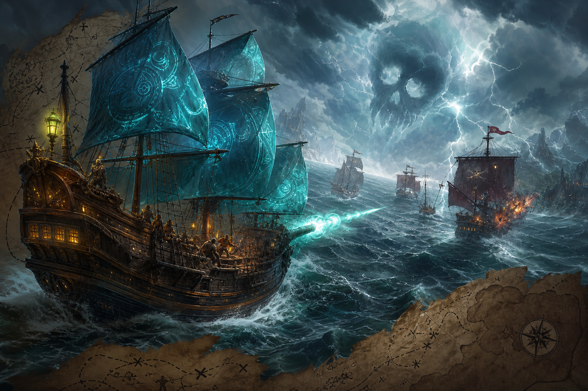

# 03 — Море Реликвий

**Жанр:** Roguelike-стратегия (FTL-like), морской фэнтези-сеттинг  
**Сегмент ЦА:** C — стратегия / midcore 20–40  
**Приоритет:** P1  
**Платформа:** Яндекс Игры (Phaser/Pixi + собственный UI)

---

## One-liner

Проведи эскадру через опасный архипелаг: управляй системами корабля, выбирай маршруты и активируй фэнтезийные скиллы — как FTL, но на море.

## Fantasy / сеттинг

Мир островов и проклятых течений. Корабли разных классов (бриг, галеон, драккар, арканоносец). Враги: пираты, морская нечисть, имперский флот. Реликвии дают активные скиллы (шторм, щупальца, огненные ядра).

## Core loop (8–15 мин на ран)

1. Выбор корабля/капитана.  
2. Карта секторов → выбор узла (бой / событие / магазин / элитный).  
3. Бой в реальном времени с паузой: распределяй энергию по щитам/пушкам/парусам/магии.  
4. Победа → лут, ремонт, найм.  
5. Смерть ран → мета-разблокировки → новый ран.

## Механики MVP

- 3 класса кораблей.  
- Системы: корпус, паруса, пушки, щит, аркана.  
- 8–12 типов врагов + 2 босса акта.  
- События текстом с 2–3 выборами.  
- Активные скиллы на кулдауне.  
- 2 акта (MVP), цель — 3 акта в live.

## Мета-прогрессия

- Открытие кораблей и стартовых реликвий.  
- Древо капитана.  
- Achievement-квесты.  
- Еженедельный seeded-ран (лидерборд).

## Монетизация (IAP-heavy midcore)

| Источник | Как |
|----------|-----|
| Interstitial | Между ранами / после поражения (редко) |
| Rewarded | +1 heal, reroll магазина, второй шанс на событие |
| IAP | Premium-корабль, battle pass, валюта мета-прокачки, косметика парусов |
| Soft | Обломки/дублоны за раны |

**Важно:** баланс fair — платные корабли = альтернативный стиль, не строго сильнее.

## Удержание

- Weekly challenge.  
- Сезоны с новыми реликвиями.  
- Cloud save обязателен (длинные раны).

## Скоуп MVP → Store Ready

- 1 корабль полный + 2 урезанных.  
- 1 акт (12–16 узлов) + финальный босс.  
- 15 событий, 6 врагов, 8 реликвий.  
- SDK payments + cloud + leaderboard.

## Риски

- Сложность FTL пугает казуал → сильный туториал и «лёгкий» режим.  
- Долгая разработка UI боя.  
- Нужен строгий скоуп, иначе не выйти в стор.

## Критерии готовности к стору

- [ ] Полный ран 10–20 минут.  
- [ ] Понятная пауза/управление на мобильном.  
- [ ] Мета после 5 ранов ощущается.  
- [ ] Нет softlock в событиях.
