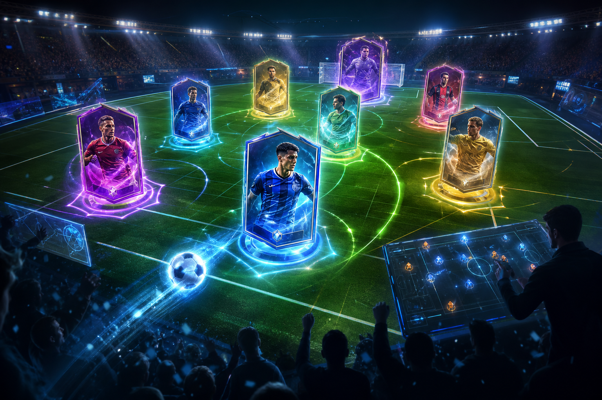

# 04 — Легенды Поля

**Жанр:** Football manager-lite × CCG × Autochess  
**Сегмент ЦА:** D — спорт + коллекционеры, 16–45  
**Приоритет:** P1 (флагман LTV)  
**Платформа:** Яндекс Игры

---

## One-liner

Собери колоду футбольных героев, расставь их на поле как в autochess, досмотри автобой со скиллами — а между матчами управляй клубом и колодой.

## Почему концепция имеет смысл

На CIS футбол — сильный эмоциональный IP-безлицензионный хук (вымышленные лиги/клубы).  
CCG даёт **коллекционирование и инапы**, autochess — **короткую зрелищную сессию**, менеджмент — **причину возвращаться завтра**. Это ровно тот midcore + hybrid, который Яндекс продвигает в 2026.

**Не делать:** симулятор Excel как Football Manager.  
**Делать:** упрощённый клубный цикл вокруг карточного автобоя.

## Fantasy / сеттинг

Вымышленная лига «Arena League». Игроки — карточки с редкостью (N/R/SR/UR), позициями и активными скиллами («Снукер-удар», «Стена», «Контратака»). Стадионы и формы — косметика.

## Двойной цикл

### A. Матч-луп (3–6 мин)

1. Выбери состав (5–8 слотов на сетке поля).  
2. Добор/замена карт из колоды (ограниченные рероллы).  
3. Автобой по тикам: синергии линий (защита/полузащита/атака), каст скиллов.  
4. Победа/поражение → награды, рейтинг MMR.

### B. Межматчевый менеджмент (2–4 мин)

1. Колода: прокачка, распыление дубликатов.  
2. Тренировка / форма / мораль (упрощённо, 1–2 параметра).  
3. Трансферный рынок (soft + hard).  
4. Турнир/сезон: календарь из 5–10 матчей.

## Механики MVP

- 40 карт (по 8 на роль: GK, DEF, MID, FWD, FLEX).  
- Синергии: «Прессинг», «Владение», «Контры» (бонусы за 2/3/4 карты тега).  
- 3 активных скилла на матч (энергия набирается в бою).  
- Автобой с возможностью **1 ручного вмешательства** за тайм (тайм-аут / замена).  
- Рейтинговый режим + быстрый матч vs бот.

## Мета и LiveOps

- Сезон 4–6 недель.  
- Battle Pass с карточками и косметикой.  
- Еженедельный турнир на лидерборде.  
- Daily: 3 матча / логин-бонус / контракт клуба.

## Монетизация (IAP-heavy)

| Источник | Как |
|----------|-----|
| Rewarded | Бесплатный пак дня, реролл, +энергия |
| Interstitial | После матча (не чаще лимита платформы) |
| IAP | Пакеты карт, pass, remove ads, косметика стадиона/формы, удобство (слот колоды) |
| Soft | Монеты за матчи → прокачка |

**Анти-токсик:** гарантированный pity на UR; дубликаты → пыль; P2W ограничить косметикой и скоростью, не «непробиваемым» статом.

## UX для Яндекс Игр

- Онбординг: 1 учебный матч vs слабого бота.  
- Все ключевые действия — крупные кнопки под палец.  
- Текст правил — коротко, иконки синергий.  
- Облачные сохранения обязательны.

## Скоуп MVP → Store Ready

- 40 карт, 2 режима (бот + рейтинг), 1 лига, battle pass light.  
- Матч полностью играбелен offline vs AI.  
- Платежи: 3 пака + remove ads + pass.  
- Лидерборд сезона.

## Риски

- Скоп creep (физика мяча не нужна — бой абстрактный).  
- Баланс карт.  
- Юридически: никаких реальных клубов/имён звёзд.

## Критерии готовности к стору

- [ ] 50+ матчей без краша.  
- [ ] Понятные синергии за 1 матч.  
- [ ] Pity и экономика не ломают F2P прогресс первой недели.  
- [ ] Pass и паки проходят модерацию формулировок.
