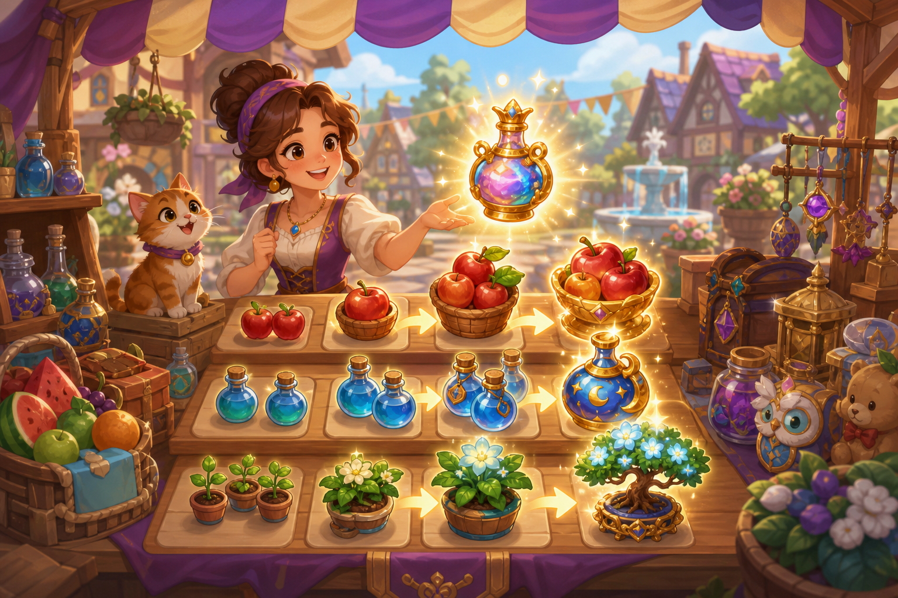

# 05 — Базар Слияний

**Жанр:** Merge-tycoon / merge puzzle  
**Сегмент ЦА:** E — уютный казуал, 25–55  
**Приоритет:** P0  
**Платформа:** Яндекс Игры

---

## One-liner

Сливай товары на торговом прилавке, открывай новые цепочки предметов и развивай свой базар.

## Fantasy / сеттинг

Восточный/сказочный базар: фрукты, амулеты, сладости, безделушки. Каждый max-merge открывает заказ NPC и декор лавки.

## Core loop

1. Получай предметы (генераторы / заказы / энергия).  
2. Мёрджи 1+1 → следующий тир.  
3. Сдавай заказы → монеты/опыт.  
4. Расширяй доску и открывай генераторы.  
5. Декор и коллекции → долгосрок.

## Механики MVP

- Доска 6×5 → апгрейд до 7×6.  
- 3–4 merge-цепочки по 8–10 уровней.  
- Генераторы с кулдауном.  
- Энергия на действия.  
- Заказы с таймером (мягким).

## Монетизация (hybrid)

| Источник | Как |
|----------|-----|
| Rewarded | +энергия, ускорение генератора, убрать предмет-мусор |
| Interstitial | При возврате в хаб / после крупного заказа |
| IAP | Энергия, pass, слоты доски, косметика лавки |
| Soft | Монеты, материалы декора |

## Скоуп MVP → Store Ready

- 2 полные цепочки, 20 заказов, энергия, декор 10 предметов.  
- Daily reward + 3 инапа.

## Риски

- Paywall энергии слишком жёсткий → отток. Держать F2P темп комфортным.

## Критерии готовности к стору

- [ ] 30+ минут слияния без тупика доски.  
- [ ] Энергия восстанавливается предсказуемо.  
- [ ] Туториал merge за 1 минуту.
