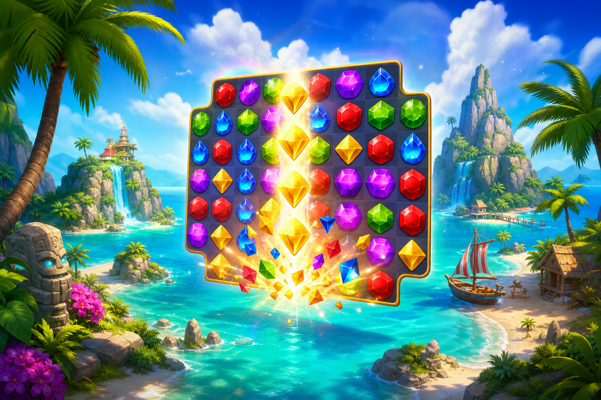

# 06 — Кристаллы Архипелага

**Жанр:** Match-3 adventure  
**Сегмент ЦА:** F — классический puzzle, 25–60  
**Приоритет:** P0  
**Платформа:** Яндекс Игры

---

## One-liner

Классический match-3: очищай уровни на островах архипелага, собирай звёзды и открывай карту мира.

## Fantasy / сеттинг

Тропические острова, храмы, лагуны. Уровни — «очистить кристаллы / собрать N / освободить клетки».

## Core loop

1. Старт уровня с целью и лимитом ходов.  
2. Мэтчи 3+ → спецкамни (4, 5, T-формы).  
3. Победа → 1–3 звезды → прогресс карты.  
4. Поражение → RV ходы / бустер / рестарт.  
5. Мета: жизнь/энергия, сундуки, pass.

## Механики MVP

- 50 уровней (волна 1), цель 150+ в live.  
- 5 цветов + 4 бустера.  
- Карта из 3 островов.  
- Daily challenge.

## Монетизация (hybrid classic)

| Источник | Как |
|----------|-----|
| Rewarded | +5 ходов, бесплатный бустер, life |
| Interstitial | Между островами / после fail |
| IAP | Lives, бустер-паки, remove ads, pass |
| Soft | Монеты за уровни |

## Скоуп MVP → Store Ready

- 50 уровней, 4 бустера, карта, жизни, платежи.

## Риски

- Высокая конкуренция → Differentiator: визуал архипелага + weekly events.

## Критерии готовности к стору

- [ ] Баланс уровней: winrate 60–75% на первой попытке в early game.  
- [ ] Нет уровней-стен без бустеров на первых 20.
