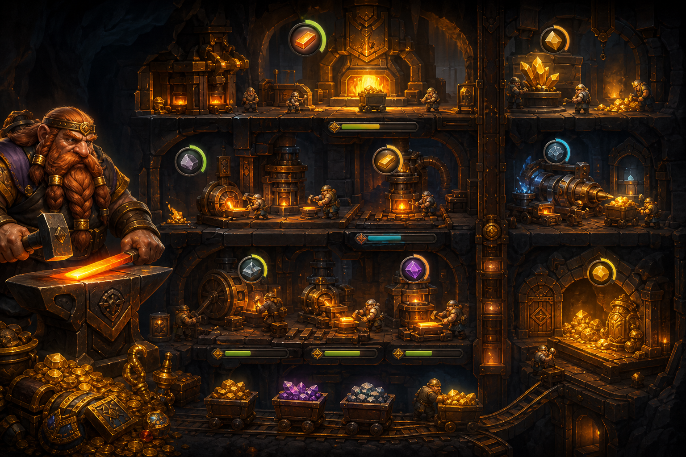

# 07 — Кузница Вечности

**Жанр:** Idle / incremental  
**Сегмент ЦА:** G — AFK / idle игроки, 18–50  
**Приоритет:** P0  
**Платформа:** Яндекс Игры

---

## One-liner

Автоматизируй подземную кузницу: рабочие добывают руду, куют артефакты, а ты возвращаешься за оффлайн-доходом и престижем.

## Fantasy / сеттинг

Гномья/тёмно-фэнтезийная кузня под горой. Этажи шахт, конвейеры, реликвии.

## Core loop

1. Тап/автодобыча → ресурсы.  
2. Покупка апгрейдов скорости/дохода.  
3. Оффлайн-прогресс (cap 4–8 ч).  
4. Prestige / «переплав эпохи» → постоянные бонусы.  
5. Коллекция артефактов.

## Механики MVP

- 3 ресурса, 8 апгрейдов, prestige.  
- Автокликеры/рабочие.  
- Простая карта этажей.  
- Daily chest.

## Монетизация (hybrid)

| Источник | Как |
|----------|-----|
| Rewarded | x2 доход 5 мин, мгновенный оффлайн, skip time |
| Interstitial | При входе раз в сессию / после prestige |
| IAP | Permanent x2, remove ads, starter pack, pass |
| Soft | Золото/руда |

## Скоуп MVP → Store Ready

- Полный idle-цикл + prestige + 15 артефактов + ads/IAP.

## Риски

- Скука без целей → квесты и milestones обязательны.

## Критерии готовности к стору

- [ ] Оффлайн-расчёт честный и прозрачный.  
- [ ] Есть цель на 7 дней прогресса.
