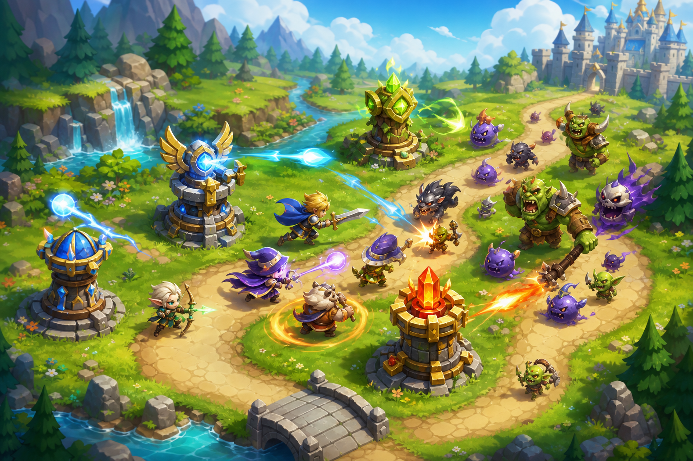

# 09 — Автобашни

**Жанр:** Tower Defense + auto-battler lite  
**Сегмент ЦА:** I — лёгкий мидкор-стратег, 16–40  
**Приоритет:** P1  
**Платформа:** Яндекс Игры

---

## One-liner

Ставь башни и героев на тропу, усиливай синергии и переживай волны — бой идёт сам, решения принимаешь между волнами.

## Fantasy / сеттинг

Сказочная тропа через луга и руины. Милые, читаемые силуэты врагов и башен.

## Core loop (5–10 мин)

1. Старт волны → доход.  
2. Покупка/апгрейд башен и 1–2 героев.  
3. Автобой волны.  
4. Анлок новых мест строительства.  
5. Победа главы → мета-прокачка.

## Механики MVP

- 6 башен, 4 героя, 3 синергии.  
- 30 волн / 3 главы.  
- Редкие ручные скиллы героя (1 на волну).  
- Рогалик-модификаторы между главами (опционально light).

## Монетизация (hybrid midcore)

| Источник | Как |
|----------|-----|
| Rewarded | Retry волны, x2 награда главы, временный герой |
| Interstitial | После поражения/главы |
| IAP | Герои, pass, косметика башен, remove ads |
| Soft | Пыль/золото за волны |

## Скоуп MVP → Store Ready

- 3 главы, 6 башен, 3 героя, мета-древо, платежи.

## Риски

- Баланс волн; держать early easy, spike на боссах.

## Критерии готовности к стору

- [ ] Touch-placement башен без мискликов.  
- [ ] Одна глава = одна сессия.
