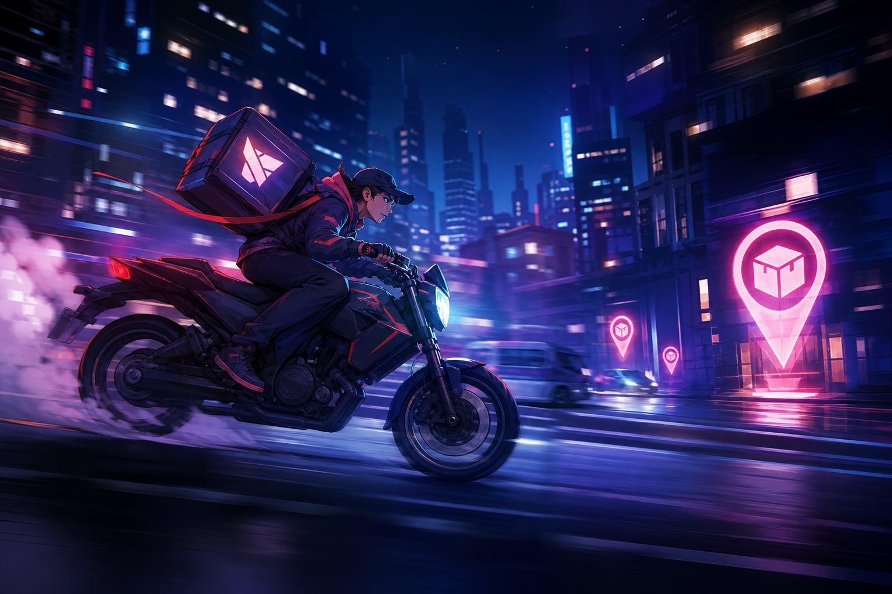

# 10 — Ночной Курьер

**Жанр:** Endless runner / delivery  
**Сегмент ЦА:** J — сессионный runner, 14–35  
**Приоритет:** P0  
**Платформа:** Яндекс Игры

---

## One-liner

Мчись по ночному городу на байке, доставляй посылки, уворачивайся от трафика и копи комбо доставки.

## Fantasy / сеттинг

Неоновый мегаполис, срочные заказы, рейтинг курьера. Лёгкий кибер-казуал без тяжёлого лора.

## Core loop (40–90 сек)

1. Старт заказа → разгон по трём полосам.  
2. Собирай посылки, избегай машин/ямок.  
3. Доставь → комбо-множитель.  
4. Crash → RV continue или конец рана.  
5. Мета: байки, курьеры, районы.

## Механики MVP

- 3 lane swipe.  
- 4 типа препятствий, 3 типа заказов.  
- Комбо и near-miss бонусы.  
- 5 скинов байка, 3 персонажа.

## Монетизация (ads-first)

| Источник | Как |
|----------|-----|
| Rewarded | Continue, x2 монет, щит на старт |
| Interstitial | После рана |
| Sticky | В хабе |
| IAP | Remove ads, скины, starter pack |

## Скоуп MVP → Store Ready

- Endless + миссии дня, мета-апгрейды, ads/IAP, лидерборд дистанции.

## Риски

- Жанр конкурентный → Differentiator: тема курьера + комбо доставки + daily districts.

## Критерии готовности к стору

- [ ] Управление свайпами без input lag.  
- [ ] Continue не выглядит обманом.  
- [ ] Есть цель вернуться завтра (daily orders).
