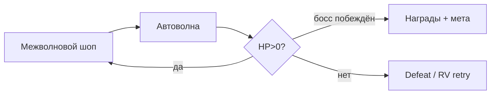

# Автобашни — Game Design Document

| Поле | Значение |
|------|----------|
| **Slug** | `auto-towers` |
| **Название** | Автобашни |
| **Жанр** | Tower Defense + auto-battler lite |
| **Сегмент** | I — лёгкий мидкор, 16–40 |
| **Приоритет** | P1 |
| **Стек** | Phaser 3 + TypeScript + Vite |
| **Статус дизайна** | `DRAFT` — код до `CONFIRMED` запрещён |
| **Концепт** | `docs/concepts/09-auto-towers.md` |
| **Арт** | `assets/concepts/09-auto-towers.png` |

---

## 1. Vision

Игрок строит оборону на сказочной тропе: ставит башни и героев в слоты, собирает синергии, переживает волны. Бой автоматический; решения — между волнами (магазин/апгрейды) и редкий ручной скилл героя (1 раз за волну).

## 2. Pillars

1. **Решения между волнами** — во время волны минимум микроконтроля.  
2. **Читаемые синергии** — 3 тега, бонусы очевидны.  
3. **Early easy, boss spike** — обучение без tilt.  
4. **Touch placement без мискликов** — крупные слоты, confirm.  
5. **Одна глава = одна сессия** (8–12 мин).

## 3. Core Loop (5–10 мин глава)

## 4. Systems

### 4.1 Battlefield
- Path TD: враги идут по сплайну.  
- Build slots: 8–12 фиксированных точек (не freeplace) для touch accuracy.  
- Hero slots: 2.

### 4.2 Towers (6)
| ID | Имя | Тег | Роль |
|----|-----|-----|------|
| arrow | Лучник | Hunt | single DPS |
| cannon | Пушка | Blast | AoE |
| frost | Мороз | Control | slow |
| beam | Луч | Arcane | % maxHP chip |
| barricade | Частокол | Bastion | block/HP wall |
| totem | Тотем | Arcane | aura buff |

Уровни башни 1–3 (merge-same или gold upgrade — **LOCKED: gold upgrade**).

### 4.3 Heroes (MVP 3, data ready 4th)
| ID | Имя | Тег | Скилл (1/волну) |
|----|-----|-----|-----------------|
| knight | Рыцарь | Bastion | Taunt stun |
| witch | Ведьма | Arcane | Nova damage |
| ranger | Следопыт | Hunt | Multishot |
| (lock) druid | Друид | Control | Root path |

### 4.4 Synergies (3)
| Тег | 2 | 3+ |
|-----|---|-----|
| Hunt | +15% AS | +35% AS + crit 10% |
| Blast | +20% AoE radius | +40% AoE dmg |
| Arcane | +10% spell | skills CD -1 wave equiv buff |
| Bastion | +15% hero/tower HP | path slow aura |
| Control | slow +10% | enemies take +10% dmg while slowed |

*(На экране показываем топ-3 активных; Bastion/Control входят в пул тегов башен/героев.)*

### 4.5 Waves / Chapters
- 3 главы × 10 волн (волна 10 = босс).  
- Глава 1 луг, 2 руины, 3 королевская тропа.  
- Между главами light modifier (опционально): «+gold», «swarm», «armored».

### 4.6 Economy in-run
Gold за убийства + wave clear bonus. Interest нет (упрощение). Reroll shop 1 gold.

### 4.7 Meta tree
Пыль за главы → узлы: start gold, slot unlock, tower XP, skin.  
Не ломает first-chapter fairness.

## 5. Monetization (hybrid midcore)

| Канал | Использование |
|-------|----------------|
| Rewarded | Retry волны; ×2 награда главы; trial hero 1 chapter |
| Interstitial | После поражения / конца главы |
| IAP | Hero unlock, pass, tower skins, remove ads, starter dust |
| Soft | gold in-run, dust meta |

Платные герои = альтернативный стиль, не строго must-have (knight+witch+ranger F2P path).

## 6. Content List
6 towers, 3 heroes, 3 chapters/30 waves, synergies, meta tree 12 nodes, daily challenge light, SDK.

## 7. UX
Chapter select → Loadout → Battle (shop↔wave) → Result.  
Placement: tap slot → choose tower card → confirm. Cancel easy.

## 8. KPIs & Risks
Chapter1 clear D1 ≥55%. Risk: balance spikes → telemetry hooks on wave fail rate.

## 9. Onboarding
Волна 1: принудительная постановка Лучника → автобой → магазин (Мороз) → подсветка синергии → кнопка скилла → фрагмент победы. Touch-first, без мелкого текста.

## 10. Audio / Juice
Place pop, shoot ticks, slow whoosh, skill sting, leak warning beep, boss intro, win jingle. Numbers optional.

## 11. LiveOps light
Daily challenge: фиксированный seed волны 1–10 главы 1 с модификатором. Pass season cosmetic towers.

## 12. Out of Scope
Freeform building grid, PvP, complex path editing, 3D, 20+ tower roster.

## 13. Связанные документы
`DESIGN_LLM.md`, `prompts/*`. Статус: `DRAFT`.

**Код запрещён до `CONFIRMED`.**
