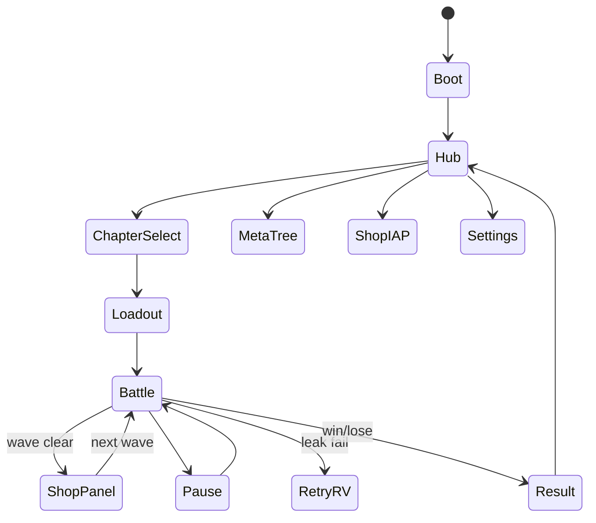

# DESIGN_LLM — auto-towers (Автобашни)

> LLM-исполняемая библия. Статус: `DRAFT`. **⛔ Код запрещён до `CONFIRMED`.**

---

## 0. Project Contract

| Key | Value |
|-----|-------|
| `slug` | `auto-towers` |
| `title_ru` | Автобашни |
| `title_en` | Auto Towers |
| `engine` | Phaser 3 + TypeScript + Vite |
| `platform` | Yandex Games HTML5 |
| `resolution` | 720×1280 portrait; battlefield letterbox safe |
| `sim_tick` | 50ms fixed |
| `design_status` | `DRAFT` |
| `coding_allowed` | **`false` until `CONFIRMED`** |
| `key_art_ref` | `refs/art/key-art.png` |

```
⛔ coding_allowed = false
IF design_status != CONFIRMED: FORBIDDEN games/auto-towers/src/**
✅ Allowed: docs/, prompts/, refs/, STATUS.md updates only
```

### Folders
```
games/auto-towers/
  docs/ prompts/ refs/
  public/assets/{art,sprites,ui,tiles,audio,data}/
  src/{scenes,battle,meta,ui,systems,data}/
  STATUS.md STORE_CHECKLIST.md README.md DEV_MOCK.md
```

### Naming / Asset IDs
`{domain}_{subject}_{variant}`  
domains: `art|tower|hero|enemy|vfx|ui|tile|audio|data|env`

### Integration paths
| Asset | Path |
|-------|------|
| Key art | `public/assets/art/art_key_towers.png` |
| Chapter BGs | `public/assets/env/env_ch{1,2,3}_bg.png` |
| Path overlay | `public/assets/env/path_ch{n}.json` (waypoints) |
| Tower sheets | `public/assets/sprites/tower_{id}_sheet.png` |
| Hero sheets | `public/assets/sprites/hero_{id}_sheet.png` |
| Enemy sheets | `public/assets/sprites/enemy_{id}_sheet.png` |
| Projectiles | `public/assets/sprites/proj_{id}_sheet.png` |
| UI atlas | `public/assets/ui/ui_kit_atlas.png` |
| Wave data | `public/assets/data/chapters.json` |
| Units data | `public/assets/data/towers.json` `heroes.json` `enemies.json` `synergies.json` |
| Meta | `public/assets/data/meta_tree.json` |

---

## 1. Systems + AC

### 1.1 Path & Spawner
Waypoints array; enemies lerp; spawn schedule from wave table.

**AC:**
- [ ] AC-PATH-01: enemy reaches end → `-1` life (start 20).
- [ ] AC-PATH-02: wave complete when spawned==dead|leaked and queue empty.
- [ ] AC-PATH-03: boss wave flagged `isBoss`.

### 1.2 BuildSlots
12 slots max; state empty/occupied; adjacency optional for aura.

**AC:**
- [ ] AC-SLOT-01: mis-tap empty space does nothing.
- [ ] AC-SLOT-02: confirm modal/card pick before spend gold.
- [ ] AC-SLOT-03: sell returns 50% invested.

### 1.3 Combat Autobattler
Towers retarget nearest/in-range each tick; heroes patrol slot radius; skills gated once per wave.

**AC:**
- [ ] AC-CBT-01: во время волны нельзя строить (только skill button).
- [ ] AC-CBT-02: between-wave shop open pause enemies.
- [ ] AC-CBT-03: damage numbers optional toggle default ON early.

### 1.4 SynergySystem
Count tags among placed towers+heroes; apply mults.

**AC:** AC-SYN-01 UI shows active tiers; AC-SYN-02 recompute on place/sell.

### 1.5 Shop (between waves)
Offers 3 cards (tower tier1 / upgrade token / hero if slot free). Reroll cost 1.

**AC:** AC-SHOP-01 always afford at least one option on wave1 after start gold 50.

### 1.6 Meta
Dust rewards; tree nodes; persistent unlocks.

### 1.7 SDK
RV retry wave (restore lives to 3 min once/chapter), ×2 chapter reward, trial hero.  
Interstitial after chapter/defeat. IAP heroes/pass/skins/remove ads.

**AC-SDK:** no interstitial mid-wave.

---

## 2. Content Grammar

### 2.1 LOOKS
Bright fairy-tale; big silhouettes; path high-contrast dirt `#C4A574` on grass `#7CB518`. Enemies readable role colors (red armored, green swarm, blue fast).

### 2.2 PLAYS — wave authoring grammar

**Grammar:** `WAVE := { wave, entries[], clearBonus, isBoss? }`  
`ENTRY := { enemy, count, intervalMs, delayMs? }`  
**Path:** `PATH := { points[8..14], slots[≤12] }` — slots 40–60px off path; HUD-safe (top 96 / bottom 140).

#### Concrete recipes (≥5)

| # | Recipe ID | Wave JSON essence | Teach / tension |
|---|-----------|-------------------|-----------------|
| R1 | `ch1_w1_swarm` | swarm×8 @500ms, bonus 20 | place first arrow |
| R2 | `ch1_w3_armor` | swarm×10 + armored×2 | need cannon/frost |
| R3 | `ch1_w8_fly` | flyer×6 + swarm×12 | beam teach |
| R4 | `ch1_w10_boss` | boss_grove + swarm×20 | skill once/wave |
| R5 | `shop_reroll` | between-wave 3 cards; reroll cost 1 | economy |
| R6 | `syn_hunt2` | place 2 Hunt-tag towers → +dmg UI | synergy strip |
| R7 | `ch2_scaled` | Ch1 table ×1.25 HP + flyer earlier | chapter escalate |

| Wave band | Composition |
|-----------|-------------|
| 1–3 | swarm small |
| 4–6 | +armored |
| 7–8 | mixed + flying (beam teach) |
| 9 | elite pack |
| 10 | boss + adds |

**Encounter recipe JSON:**
```json
{"wave":7,"entries":[{"enemy":"swarm","count":20,"intervalMs":350},{"enemy":"armored","count":4,"intervalMs":1200}],"clearBonus":40}
```

### 2.3 Difficulty curve
Chapter1 HP budget forgiving (fail rate <30% first try target).  
Chapter2 +25% HP, new enemy. Chapter3 + boss mechanics (shield phases).

### 2.4 Tower stats baseline (tier1)
| Tower | Cost | DPS | Range | Note |
|-------|------|-----|-------|------|
| arrow | 50 | 12 | 140 | — |
| cannon | 80 | 8 AoE | 120 | splash 60 |
| frost | 70 | 4 | 130 | slow 30% 1.5s |
| beam | 90 | 6 | 150 | +1% maxHP |
| barricade | 60 | 0 | — | block 8 hits |
| totem | 100 | 0 | 110 | +15% dmg aura |

### 2.5 Synergy thresholds (authoring)
| Tag | Tier2 | Tier3 | Effect sketch |
|-----|-------|-------|---------------|
| Hunt | 2 | 4 | +10% / +25% dmg to swarm/fast |
| Blast | 2 | 3 | AoE radius +10% / +20% |
| Arcane | 2 | 3 | beam +totem amp |
| Bastion | 2 | — | barricade HP +30% |
| Control | 2 | 3 | frost slow +5% / +10% |

---

## 3. UI Map + Wireframes

Screens: `boot`, `meta_hub`, `chapter_select`, `loadout`, `battle`, `shop_panel`, `skill_btn`, `pause`, `result`, `retry_rv`, `shop_iap`, `settings`.



### 3.1 Full UI component inventory

| Component ID | Screen | Behavior | Min touch |
|--------------|--------|----------|-----------|
| `ui_btn_chapters` | hub | open chapter select | 48×48 |
| `ui_btn_meta` | hub | open dust tree | 48×48 |
| `ui_btn_heroes` | hub | hero roster | 48×48 |
| `ui_btn_shop_iap` | hub | IAP shop | 48×48 |
| `ui_life_bar` | battle | hearts / count | display |
| `ui_gold_label` | battle/shop | gold tap→shop | 40×40 |
| `ui_wave_banner` | battle | wave N/10 intro | display |
| `ui_synergy_strip` | battle | active tag tiers | 40×40 chips |
| `ui_slot_marker` | battle | empty/filled select | **72×72** |
| `ui_card_offer` | shop_panel | buy tower/hero/upg | **96×128** |
| `ui_btn_reroll` | shop_panel | spend 1 gold reroll | 48×48 |
| `ui_btn_sell` | shop_panel | sell 50% confirm | 48×48 |
| `ui_btn_start_wave` | shop_panel | close shop → fight | 56×56 |
| `ui_skill_btn` | battle | hero skill 1/wave | **80×80** |
| `ui_pause_btn` | battle | pause | 44×44 |
| `ui_result_stars` | result | 0–3 stars | display |
| `ui_retry_rv` | retry_rv | restore lives≥3 once | 56×56 |
| `ui_btn_x2` | result | RV ×2 dust/gold | 56×56 |
| `ui_meta_node` | meta | buy dust node | 48×48 |
| `ui_loadout_hero` | loadout | pick 1 hero | 64×64 |

### 3.2 Wireframe — Boot
```
+----------------------------------+
|           АВТОБАШНИ              |
|            ░ LOAD ░              |
+----------------------------------+
```

### 3.3 Wireframe — Meta hub
```
+-- Автобашни ----------------+
| Пыль 320                [⚙] |
| [Древо] [Главы] [Герои] [🛒]|
|     (key-art meadow loop)   |
+-----------------------------+
```

### 3.4 Wireframe — Chapter select
```
+-- Главы ---------------------+
| [Ch1 Meadow ★★☆]            |
| [Ch2 Ruins  ★☆☆]            |
| [Ch3 Crown  🔒]             |
| [Назад]                     |
+-----------------------------+
```

### 3.5 Wireframe — Loadout
```
+-- Отряд ---------------------+
| Hero: [Knight][Witch][Ranger]|
| Trial hero RV chip optional  |
|      [ В БОЙ ]               |
+------------------------------+
```

### 3.6 Wireframe — Battle
```
+----------------------------------+
| ❤ 18   💰 120   Wave 3/10  [II]  |
| Syn: Hunt2 Blast1                |
+----------------------------------+
|     path + slots + enemies       |
|                                  |
|                         [SKILL]  |
+----------------------------------+
| (shop hidden until wave end)     |
+----------------------------------+
```

### 3.7 Wireframe — Shop panel
```
+-- Магазин волны -----------------+
| [Arrow 50] [Cannon 80] [Reroll 1]|
| [Upgrade selected] [Sell 50%]    |
| [Старт волны]                    |
+----------------------------------+
```

### 3.8 Wireframe — Pause / Retry RV / Result
```
PAUSE: [Продолжить][Настройки][Сдаться]
RETRY: [▶ Повторить волну RV][Поражение]
RESULT WIN:
+-- Победа главы 1 -----------+
| Звёзды: ★★☆                 |
| Пыль +40  Золото мета +120  |
| [×2 RV] [В хаб] [След. глава]|
+-----------------------------+
```

### 3.9 Wireframe — Settings / IAP
```
SETTINGS: music/sfx/damage numbers/cloud
IAP: at_remove_ads, at_hero_druid, at_pass_s1, at_skin_pack, at_starter_dust
```

---

## 4. Art Bible

Style: cute stylized fantasy strategy; readable chibi-ish units; **not** grimdark; **not** ultra-real.

Palette:
| Role | Hex |
|------|-----|
| Grass | `#7CB518` |
| Path | `#C4A574` |
| Sky | `#A8DADC` |
| UI Panel | `#F1FAEE` |
| CTA | `#E63946` |
| Gold | `#F4D35E` |
| Arcane | `#9B5DE5` |
| Frost | `#00BBF9` |
| Text | `#1D3557` |

Do: silhouette test B/W. Don't: blood gibs; busy VFX hiding path; purple-on-white default AI UI.

---

## 5. Image Prompts (copy-paste, ≥8)

> Ground truth: `refs/art/key-art.png`, `refs/ui/wireframe-main.png`, `refs/levels/layout-main.png`, `refs/sprites/sheet-main.png`.

### P1 — Key art → `refs/art/key-art.png`
```
Tower defense auto-battler game key art matching refs/art/key-art.png, fairy tale meadow path, cute stylized towers shooting sparkles at cartoon monsters, heroes near towers, bright strategy casual illustration, clear silhouettes, 16:9, no text, no UI
```

### P2 — UI wireframe → `refs/ui/wireframe-main.png`
```
Mobile portrait 720x1280 TD UI wireframe matching refs/ui/wireframe-main.png, battle HUD lives gold wave, synergy strip, skill button bottom-right, shop cards bottom, cream #F1FAEE red CTA #E63946, label blocks not real text
```

### P3 — Level layout → `refs/levels/layout-main.png`
```
Top-down fairy tale winding path level layout matching refs/levels/layout-main.png, chapter 1 meadow, build slots as circles beside path, portrait safe margins, soft colors, no text
```

### P4 — Sprite sheet → `refs/sprites/sheet-main.png`
```
Cute fantasy TD sprite sheet overview matching refs/sprites/sheet-main.png, towers 96px idle/attack, enemies 64px walk/die, projectiles, transparent, even grid, no text
```

### P5 — Chapter 1 battlefield
```
Portrait game battlefield background chapter 1 meadow, winding dirt path left to right, soft hills, empty build slot markers subtle, match refs/art/key-art.png palette, no text
```

### P6 — Chapter 2 / 3 BGs
```
Chapter 2 ruined stone path and Chapter 3 royal evening trail battlefield backgrounds, same camera framing as meadow chapter and refs/levels/layout-main.png, casual fantasy, no text
```

### P7 — Towers + heroes
```
Game tower sprites cute archer cannon frost beam barricade totem full body transparent; hero knight witch ranger cute stylized; style locked to refs/sprites/sheet-main.png
```

### P8 — Enemies + bosses
```
Game enemy sprites swarm armored fast flyer elite plus boss_grove titan cute not grimdark, readable role colors, transparent, match refs/sprites/sheet-main.png
```

### P9 — VFX
```
Projectile and hit VFX sprite sheets arrows frost flakes arcane beam aoe ring skill burst, on black/transparent, casual game, refs/sprites/sheet-main.png consistent
```

### P10 — UI kit
```
Mobile strategy UI kit matching refs/ui/wireframe-main.png, cream panels #F1FAEE, red CTA #E63946, gold frames, card offers, synergy icons, 9-slice, no text labels
```

---

## 6. Sprite + Timing

### 6.1 Sheet registry

| Sheet | Cell | Anim | Frames | FPS | Loop |
|-------|------|------|--------|-----|------|
| `tower_{id}_sheet` | 96×96 | idle | 4 | 6 | yes |
| `tower_{id}_sheet` | 96×96 | attack | 4 | 12 | no |
| `hero_{id}_sheet` | 96×96 | idle | 4 | 6 | yes |
| `hero_{id}_sheet` | 96×96 | cast | 6 | 12 | no |
| `enemy_{id}_sheet` | 64×64 | walk | 6 | 10 | yes |
| `enemy_{id}_sheet` | 64×64 | die | 4 | 14 | no |
| `proj_{id}_sheet` | 32×32 | fly/hit | 2–4 / 3 | 16 | fly yes |
| `vfx_slow_sheet` | 48×48 | flakes | 6 | 12 | no |
| `vfx_aoe_ring_sheet` | 128×128 | ring | 8 | 16 | no |
| `vfx_skill_burst_sheet` | 128×128 | burst | 10 | 18 | no |

Attack frame 2 = projectile spawn. Bosses optional 96 cell.

### 6.2 Runtime juice (ms)

| Event | ms | Notes |
|-------|-----|-------|
| Place tower pop | 160 | scale outBack |
| Sell confirm | 0 | modal unless quickBuild |
| Wave start banner | 900 | input soft-lock |
| Skill cinematic zoom | 400 | camera punch |
| Boss intro | 1500 | once per chapter |
| Damage number float | 500 | optional toggle |
| Win confetti | 2000 | |
| Leak warning pulse | 600 | life <5 |

---

## 7. Prompt packs
`games/auto-towers/prompts/*`

---

## 8. Data schemas
`chapters.json`: id, waves[], pathAsset, bg  
`towers.json`: stats per tier, tag, costs  
`heroes.json`: skill{id,cdWave}, tag  
`enemies.json`: hp, speed, armor, reward  
`synergies.json`: tag thresholds effects

---

## 9. SKUs
`at_remove_ads`, `at_hero_druid`, `at_pass_s1`, `at_skin_pack`, `at_starter_dust`

---

## 10. Tutorial
Wave1 forced arrow place → auto fight → shop buy frost → explain synergy Hunt → skill button once → win chapter fragment.

---

## 11. Definition of Ready
- [ ] Slot-based building locked (no freeplace)
- [ ] 30 waves tables drafted
- [ ] Synergy numbers approved
- [ ] Touch placement UX approved
- [ ] Monetization fair hero policy approved
- [ ] Prompts/paths complete
- [ ] **No coding until CONFIRMED**

## 12. Gate
⛔ No `src/` until CONFIRMED.

---

## 13. Chapter 1 wave table (normative draft)

| W | Entries | Gold bonus | Note |
|---|---------|------------|------|
| 1 | swarm×8 @500ms | 20 | teach |
| 2 | swarm×12 | 25 | |
| 3 | swarm×10 + armored×2 | 30 | armor intro |
| 4 | swarm×16 | 30 | |
| 5 | armored×6 + swarm×8 | 35 | |
| 6 | fast×10 + swarm×10 | 35 | |
| 7 | mixed armored/swarm/fast | 40 | |
| 8 | flyer×6 + swarm×12 | 40 | beam teach |
| 9 | elite×3 + swarm×15 | 50 | |
| 10 | boss_grove + swarm×20 | 80 | boss |

Повторить структуру с +25% HP для Ch2 и +50% + adds для Ch3 в `refs/levels/`.

## 14. Enemy catalog

| id | hp | spd | armor | reward | tags |
|----|----|-----|-------|--------|------|
| swarm | 30 | 60 | 0 | 2 | — |
| armored | 120 | 35 | 5 | 6 | — |
| fast | 40 | 95 | 0 | 3 | — |
| flyer | 50 | 70 | 0 | 4 | flying |
| elite | 300 | 45 | 8 | 15 | — |
| boss_grove | 2500 | 25 | 10 | 100 | boss |
| boss_ruin | 4000 | 28 | 20 | 140 | boss |
| boss_crown | 6000 | 30 | 15 | 200 | boss |

Flying: только beam/totem/hero witch полным уроном; arrow 50%.

## 15. Placement UX state machine
```
Idle → SlotSelected → CardListOpen → ConfirmSpend → Placed
                 ↘ Cancel
OccupiedSlot → UpgradeOffer | SellOffer
```
Confirm обязателен если `settings.quickBuild=false` (default true after tutorial? **LOCKED default: confirm once tutorial done = quick build ON**).

## 16. Meta tree (12 nodes)

| id | costDust | effect |
|----|----------|--------|
| meta_start_gold_1 | 50 | +10 start gold |
| meta_start_gold_2 | 120 | +15 start gold |
| meta_life_1 | 80 | +2 lives |
| meta_slot_ch1 | 100 | +1 slot chapter1 |
| meta_arrow_dmg | 90 | arrow +10% |
| meta_cannon_aoe | 90 | cannon radius +10% |
| meta_frost_slow | 90 | slow +5% |
| meta_interest_no | 0 | reserved skipped |
| meta_dust_gain | 150 | +10% dust rewards |
| meta_reroll_free | 200 | 1 free reroll/chapter |
| meta_skill_boost | 180 | skill dmg +15% |
| meta_skin_frame | 60 | cosmetic hub frame |

## 17. Extra wireframes

### Result
```
+-- Победа главы 1 -----------+
| Звёзды: ★★☆                 |
| Пыль +40  Золото мета +120  |
| [×2 RV] [В хаб] [След. глава]|
+-----------------------------+
```

### Meta hub
```
+-- Автобашни ----------------+
| Пыль 320                    |
| [Древо] [Главы] [Герои] [🛒]|
+-----------------------------+
```

## 18. Save schema
```json
{
  "v": 1,
  "dust": 0,
  "metaOwned": [],
  "heroesUnlocked": ["knight","witch","ranger"],
  "skins": [],
  "chapterStars": [0,0,0],
  "removeAds": false,
  "lastSeenAt": 0
}
```

## 19. Audio
BGM per chapter; SFX: place, shoot, slow, skill, leak warning, boss roar (cute), win jingle.

## 20. Agent handoff protocol

**Locks:** slug `auto-towers`; fixed slots only; mid-wave no build; paths from JSON; **`coding_allowed: false` until CONFIRMED**.

### 20.1 Exact message templates

#### → Art agent
```text
ROLE: Art agent for auto-towers.
READ: games/auto-towers/docs/DESIGN_LLM.md §0,§4,§5 + prompts/ART_PROMPTS.md
GROUND TRUTH: refs/art/key-art.png, refs/ui/wireframe-main.png, refs/levels/layout-main.png, refs/sprites/sheet-main.png
DO: key art, 3 chapter BGs, towers/heroes/enemies stills → refs/art/; IDs per §0.
FORBIDDEN: src/**; grimdark gore; freeplace building art implying free placement.
coding_allowed=false until CONFIRMED.
```

#### → Anim agent
```text
ROLE: Anim agent for auto-towers.
READ: DESIGN_LLM.md §6 + prompts/SPRITE_ANIM_PROMPTS.md
GROUND TRUTH: refs/sprites/sheet-main.png
DO: tower/hero/enemy/proj sheets with FPS from §6.1 → refs/sprites/ → public/assets/sprites/.
FORBIDDEN: src/**; die anim pivoting hitbox wildly.
coding_allowed=false until CONFIRMED.
```

#### → UI agent
```text
ROLE: UI agent for auto-towers.
READ: DESIGN_LLM.md §3 + prompts/UI_PROMPTS.md
GROUND TRUTH: refs/ui/wireframe-main.png
DO: mocks for ALL screens §3; slot≥72, card≥96×128, skill≥80; mid-wave shop hidden.
FORBIDDEN: interstitial mid-wave; src/**.
coding_allowed=false until CONFIRMED.
```

#### → Level agent
```text
ROLE: Level agent for auto-towers.
READ: DESIGN_LLM.md §2,§13,§14 + prompts/LEVEL_PROMPTS.md
GROUND TRUTH: refs/levels/layout-main.png
DO: path_chN.json + 30 wave tables; Ch2×1.25 HP Ch3×1.5; boss scripts; refs/levels/.
FORBIDDEN: freeplace; unfair full-block path; src/**.
coding_allowed=false until CONFIRMED.
```

#### → Code agent
```text
ROLE: Code agent for auto-towers.
READ: DESIGN_LLM.md + prompts/CODE_AGENT_PROMPT.md + DESIGN.md
IF design_status != CONFIRMED: STOP. No src/**.
AFTER CONFIRMED: slots+waves+shop+synergies+meta+SDK; sim_tick 50ms.
SCOPE: games/auto-towers/ only.
```

### 20.2 Handoff checklist
- [ ] Pack file linked  
- [ ] Refs ground truth cited  
- [ ] Output paths named  
- [ ] coding_allowed=false restated  

---

## 21. Asset ID registry (sample)

| asset_id | domain | path (final) | notes |
|----------|--------|--------------|-------|
| `art_key_towers` | art | `public/assets/art/art_key_towers.png` | refs/art/key-art.png |
| `env_ch1_bg` | env | `public/assets/env/env_ch1_bg.png` | meadow |
| `env_ch2_bg` | env | `public/assets/env/env_ch2_bg.png` | ruins |
| `env_ch3_bg` | env | `public/assets/env/env_ch3_bg.png` | crown |
| `path_ch1` | data | `public/assets/env/path_ch1.json` | waypoints+slots |
| `tower_arrow_sheet` | tower | `public/assets/sprites/tower_arrow_sheet.png` | |
| `hero_knight_sheet` | hero | `public/assets/sprites/hero_knight_sheet.png` | |
| `enemy_swarm_sheet` | enemy | `public/assets/sprites/enemy_swarm_sheet.png` | |
| `enemy_boss_grove_sheet` | enemy | `public/assets/sprites/enemy_boss_grove_sheet.png` | |
| `proj_arrow_sheet` | vfx | `public/assets/sprites/proj_arrow_sheet.png` | |
| `ui_kit_atlas` | ui | `public/assets/ui/ui_kit_atlas.png` | |
| `data_chapters` | data | `public/assets/data/chapters.json` | |
| `data_synergies` | data | `public/assets/data/synergies.json` | |
| `data_meta_tree` | data | `public/assets/data/meta_tree.json` | |

---

## 22. Integration acceptance tests

### 22.1 Design gate
- [ ] `coding_allowed: false` until CONFIRMED
- [ ] Slot-based building locked (no freeplace)
- [ ] UI inventory + all major wireframes (§3)
- [ ] ≥5 wave/content recipes (§2.2)
- [ ] ≥8 image prompts with refs paths (§5)
- [ ] Anim timing complete (§6)
- [ ] Ch1 wave table + enemy catalog (§13–14)
- [ ] Touch placement UX state machine (§15)
- [ ] Prompt packs ready
- [ ] Asset registry IDs unique (§21)

### 22.2 Post-CONFIRMED smoke
- [ ] Mid-wave build disabled; skill only
- [ ] Leak → −1 life; start 20
- [ ] Shop between waves; wave1 affordability
- [ ] RV retry once/chapter; no interstitial mid-wave
- [ ] Synergy recompute on place/sell
- [ ] 60fps target; path from JSON

### 22.3 Coding ban
```
⛔ DO NOT START CODING until design status is CONFIRMED.
⛔ coding_allowed: false
```

---

## Visual Ground Truth (обязательные референсы)

См. также `docs/REFS.md`.

| Тип | Путь |
|-----|------|
| Key art | `refs/art/key-art.png` |
| UI wireframe | `refs/ui/wireframe-main.png` |
| Level layout | `refs/levels/layout-main.png` |
| Sprite sheet | `refs/sprites/sheet-main.png` |

Любой арт-агент обязан сверяться с этими файлами перед генерацией финальных ассетов.
