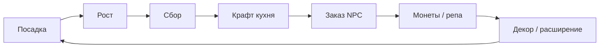

# Уютный Участок — Game Design Document

| Поле | Значение |
|------|----------|
| **Slug** | `cozy-plot` |
| **Название** | Уютный Участок |
| **Жанр** | Cozy farm / life-sim lite |
| **Сегмент** | H — cozy, 20–50 |
| **Приоритет** | P1 |
| **Стек** | Phaser 3 + TypeScript + Vite |
| **Статус дизайна** | `DRAFT` — код запрещён до `CONFIRMED` |
| **Концепт** | `docs/concepts/08-cozy-plot.md` |
| **Арт** | `assets/concepts/08-cozy-farm.png` |

---

## 1. Vision

Игрок восстанавливает заброшенный участок у реки: сажает культуры, готовит простые блюда, выполняет заказы соседей и украшает двор. Тон — тёплый, бездушный таймер-стресс запрещён: дедлайны заказов мягкие (провал = меньше награды, не наказание).

## 2. Pillars

1. **Уют > эффективность** — красота двора так же важна, как доход.  
2. **Мягкие обязательства** — заказы без жёсткого fail-state.  
3. **Ритуал дня** — короткий morning loop (собрать → приготовить → сдать → декор).  
4. **Косметика монетизирует** — pay-for-pretty, не pay-to-progress первой зоны.  
5. **Touch-first сетка** — крупные клетки, drag-drop опционален.

## 3. Core Loop

Сессия 5–15 мин. Цель первой сессии: засадить 4 грядки, сдать 1 заказ, поставить 1 декор.

## 4. Systems

### 4.1 Farm Grid
- Стартовая зона A: 4×3 грядки + дом + пирс.  
- Зона B (expansion): 4×3 за речным мостиком.  
- Клетка: empty / tilled / seeded / ready / blocked.

### 4.2 Cultures (8)
| ID | Имя | Рост | Продажа сырьём | Крафт |
|----|-----|------|----------------|-------|
| carrot | Морковь | 2м | 3 | суп |
| wheat | Пшеница | 3м | 4 | хлеб |
| tomato | Томат | 4м | 5 | салат |
| berry | Ягода | 5м | 6 | пирог |
| pumpkin | Тыква | 8м | 10 | похлёбка |
| herb | Травы | 3м | 4 | чай |
| corn | Кукуруза | 6м | 7 | попкорн-закуска |
| flower | Цветы | 4м | 5 | букет (заказ) |

Таймеры ускоряются меты/RV/удобрениями (не обязательны).

### 4.3 Animals (2)
- Курица → яйца / 6м  
- Коза → молоко / 8м  
Корм из пшеницы. Ласкание = juice + крошечный mood bonus к яйценоскости (+5%).

### 4.4 Kitchen Craft
Верстак 4 слота рецепта. Рецепты MVP: суп, хлеб, салат, пирог, чай, букет, сыр, омлет.

### 4.5 Orders & NPC (3)
| NPC | Характер | Заказы |
|-----|----------|--------|
| Бабушка Лада | тёплая | еда |
| Рыбак Тихон | спокойный | наживка/жареное |
| Почтальон Зоя | бодрая | букеты/посылки-крафт |

Одновременно 2 слота заказов (3-й через RV/IAP). Мягкий таймер 4ч: успел = 100%, просрочка = 60% награды, заказ не исчезает сразу.

### 4.6 Decor (20)
Категории: fence, path, lamp, bush, furniture, riverside, seasonal.  
Placement: grid snap, collision simple AABB.  
Reputation gates: некоторые декоры за репу.

### 4.7 Day/Evening cycle
Косметический цикл 8 мин реального = день→вечер tint. Не гейт контента.

### 4.8 Currencies
- `coin` — soft  
- `rep` — репутация деревни  
- `seed` — премиум-семена (RV/IAP/daily)  
- удобрения `fert` — ускорение

## 5. Progression

| Вехи | Условие | Награда |
|------|---------|---------|
| T1 | 1 заказ | семена томата |
| T2 | репа 20 | животное курица |
| T3 | репа 50 | кухня L2 |
| T4 | репа 80 + coins | **Expansion Zone B без paywall** |
| T5 | 10 декоров | новый NPC диалог |

Контент ≥40 мин осмысленного прогресса до «выдоха».

## 6. Monetization (hybrid + cosmetics)

| Канал | Использование |
|-------|----------------|
| Rewarded | ускорить рост; +слот заказа 1ч; daily rare seed; ×2 заказ |
| Interstitial | редко при входе в «Деревню» (отдельный экран), cooldown |
| Sticky | опционально в меню |
| IAP | decor packs, cozy pass, fert pack, remove ads, expand storage |
| Soft | coins/rep |

**Нельзя:** paywall на Zone B; принудительные таймеры «умри без RV».

## 7. Screens

Boot, Homestead (main), Bag, Kitchen, Orders, Decor Shop, Village (NPC), Expansion map, Settings, Shop IAP.

## 8. KPIs & Risks

| KPI | Цель |
|-----|------|
| D1 | ≥28% |
| Session | ≥8 мин |
| Decor place D3 | ≥40% когорт |
| Zone B F2P | ≥50% к D5 |

Риск: дорогой контент → модульный декор; «ферма как работа» → мягкие заказы.

## 9. Out of Scope
Мультиплеер, брак/дети, полный life-sim calendar, рыбалка-минигейм deep, 3D.

## 10. DoD
40+ мин контента, Zone B без paywall, cloud save, hybrid SDK, touch UX, STORE_CHECKLIST.

**Код не начинать до `CONFIRMED`.** См. `DESIGN_LLM.md`.
