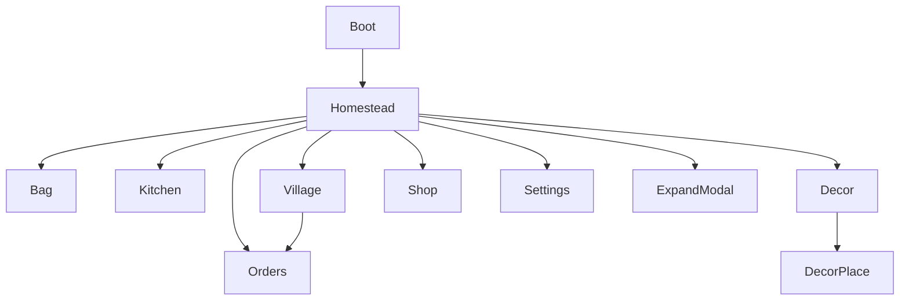
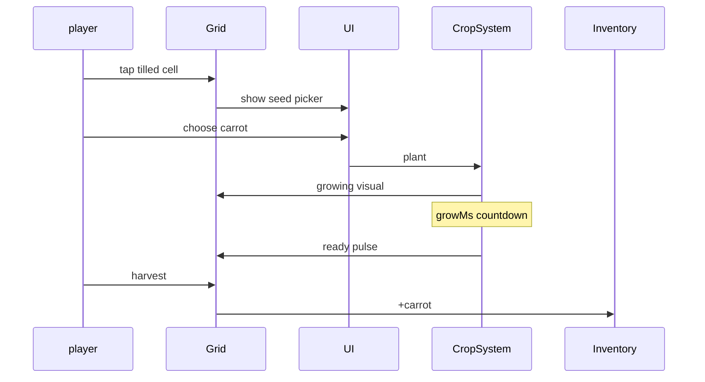

# DESIGN_LLM — cozy-plot (Уютный Участок)

> Исполняемая спека для LLM. Статус: `DRAFT`. **Без кода `src/` до `CONFIRMED`.**

---

## 0. Project Contract

| Ключ | Значение |
|------|----------|
| `slug` | `cozy-plot` |
| `title_ru` | Уютный Участок |
| `title_en` | Cozy Plot |
| `engine` | Phaser 3 + TypeScript + Vite |
| `platform` | Yandex Games HTML5 |
| `base_resolution` | 720×1280 FIT |
| `view` | isometric-lite **OR** orthographic top-down 3/4 — **LOCKED: 3/4 top-down** |
| `tile_size` | 64×64 world px |
| `design_status` | `DRAFT` |
| `coding_allowed` | **`false` until `CONFIRMED`** |
| `key_art_ref` | `refs/art/key-art.png` |

```
⛔ coding_allowed = false
IF design_status != CONFIRMED: FORBIDDEN games/cozy-plot/src/**
✅ Allowed: docs/, prompts/, refs/, STATUS.md updates only
```

### 0.1 Folders
```
games/cozy-plot/
  docs/ DESIGN.md DESIGN_LLM.md
  prompts/
  refs/art|ui|levels|sprites/
  public/assets/{art,sprites,ui,tiles,audio,data}/
  src/{scenes,systems,world,ui,data,util}/
  STATUS.md STORE_CHECKLIST.md README.md DEV_MOCK.md
```

### 0.2 Naming & Asset IDs
`{domain}_{subject}_{variant}`  
domains: `art|char|npc|crop|animal|decor|tile|ui|vfx|audio|data`

Примеры: `crop_carrot_stages`, `npc_lada_sheet`, `tile_grass_set`, `decor_lamp_01`.

### 0.3 Integration paths
| Asset | Path |
|-------|------|
| Key art | `public/assets/art/art_key_cozy.png` |
| Homestead BG | `public/assets/art/env_homestead_base.png` |
| River expansion | `public/assets/art/env_zone_b.png` |
| Tileset | `public/assets/tiles/tile_farm_64.png` |
| Crop sheets | `public/assets/sprites/crop_{id}_sheet.png` |
| Player | `public/assets/sprites/char_player_sheet.png` |
| NPCs | `public/assets/sprites/npc_{id}_sheet.png` |
| Animals | `public/assets/sprites/animal_{chicken\|goat}_sheet.png` |
| Decor | `public/assets/sprites/decor_{id}.png` |
| UI atlas | `public/assets/ui/ui_kit_atlas.png` |
| Data | `public/assets/data/{crops,recipes,orders,decor,npcs}.json` |

---

## 1. Systems + Acceptance Criteria

### 1.1 GridWorld
- Zone A: origin (0,0) size 12×10 walkable; soil plots subset 4×3.  
- Zone B: unlocked flag `expansionB`, offset across bridge.

**AC:**
- [ ] AC-GRID-01: tap cell selects; invalid cell soft shake.
- [ ] AC-GRID-02: plant only on `tilled`.
- [ ] AC-GRID-03: decor cannot overlap soil/NPC path.
- [ ] AC-GRID-04: camera pan+clamp; pinch zoom 0.85–1.2 mobile.

### 1.2 CropSystem
State machine: `empty→tilled→growing→ready→empty`.  
`growing` uses `plantedAt` + `growMs * fertFactor * rvFactor`.

**AC:**
- [ ] AC-CROP-01: 8 культур в data.
- [ ] AC-CROP-02: ready cell pulse outline 1s period.
- [ ] AC-CROP-03: harvest grants inventory stack.
- [ ] AC-CROP-04: RV «Ускорить» снимает 50% оставшегося времени (1×/crop).

### 1.3 AnimalSystem
**AC:** AC-ANI-01/02: chicken+goat; product ready indicator; feed consumes wheat.

### 1.4 Inventory & Kitchen
Slots 30 base. Recipes consume ingredients atomically.

**AC:**
- [ ] AC-KIT-01: нельзя крафтить при нехватке.
- [ ] AC-KIT-02: 8 рецептов MVP.
- [ ] AC-KIT-03: craft time 0–10s cosmetic progress (можно instant MVP).

### 1.5 OrderSystem
```ts
interface Order { id, npcId, needs[], rewardCoin, rewardRep, softDeadlineAt, state }
```
**AC:**
- [ ] AC-ORD-01: 2 slots default; 3rd via RV temporary or IAP.
- [ ] AC-ORD-02: late delivery = 60% coin, 100% rep still (friendly).
- [ ] AC-ORD-03: 15 order templates; 3 NPC.
- [ ] AC-ORD-04: нет hard fail delete without reward window.

### 1.6 DecorSystem
**AC:** AC-DEC-01: 20 items; place/move/sell 50%; persistence in save.

### 1.7 Expansion
**AC:**
- [ ] AC-EXP-01: Zone B unlock price coins+rep only (no IAP required).
- [ ] AC-EXP-02: bridge cutscene ≤3s once.

### 1.8 DayCycle
**AC:** AC-DAY-01: lighting tween only; shops always open MVP.

### 1.9 Save/Cloud/SDK
Аналогично портфелю: autosave, cloud merge max currencies + union decor, RV/interstitial/IAP rules.

**AC-SDK:** no ads during drag placement; interstitial only on Village enter with cooldown ≥3 мин.

---

## 2. Content Grammar

### 2.1 LOOKS
- Палитра пастель+трава, golden hour bias.  
- Река слева/низ экрана как якорь.  
- Дом = читаемый силуэт, не гигантский.  
- NPC speech = bubble мягкий, 1–2 строки.

### 2.2 PLAYS recipes (authoring grammar)

**Grammar:** `ACTION := till|plant|harvest|craft|deliver|feed|place_decor|expand`  
`SESSION := ACTION+` with soft order deadlines; no stamina wall.

#### Concrete recipes (≥5)

| # | Recipe ID | Steps | Outcome |
|---|-----------|-------|---------|
| R1 | `first_5min` | till→plant carrot×2→RV skip once→harvest→kitchen soup→deliver Lada→buy bush | tutorial complete |
| R2 | `session_mix` | mix crops, feed chicken, 2 orders, place path_stone×3 | mid-loop |
| R3 | `expansion_b` | rep≥80 + coins≥200 → bridge cutscene → Zone B pumpkin field | F2P expand |
| R4 | `kitchen_chain` | wheat×3→bread; herb×2→tea; deliver Tikhon fishfry needs | multi-craft |
| R5 | `animal_day` | feed chicken→egg; feed goat→milk→cheese recipe | animals unlocked |
| R6 | `decor_river` | unlock boat_dock + lantern_river after Zone B | riverside set |
| R7 | `soft_late` | accept order, miss soft deadline → 60% coins, full rep | friendly fail |

### 2.3 Difficulty / pacing
Нет combat difficulty. «Сложность» = inventory juggle + optional order soft timers.  
F2P Zone B target: 40–90 мин total play.

### 2.4 Order recipe examples
| Order | Needs | Coin | Rep |
|-------|-------|------|-----|
| o_soup_1 | soup×1 | 25 | 3 |
| o_bread_2 | bread×2 | 40 | 4 |
| o_bouquet | bouquet×1 | 35 | 5 |
| o_omelet | omelet×1 | 45 | 4 |
| o_tea_rush | tea×2 | 30 | 3 |
| o_cheese_gift | cheese×1 | 55 | 6 |

---

## 3. UI Map + Wireframes

Screens: `boot`, `homestead`, `bag`, `kitchen`, `orders`, `decor_catalog`, `decor_place`, `village`, `shop`, `settings`, `expand_modal`, `rewarded_cta`.



### 3.1 Full UI component inventory

| Component ID | Screen | Behavior | Min touch |
|--------------|--------|----------|-----------|
| `ui_hud_coin` | homestead | currency display; tap→shop | 40×40 |
| `ui_hud_rep` | homestead | reputation chip | 40×40 |
| `ui_btn_settings` | homestead | settings | 44×44 |
| `ui_tab_bag` | homestead | open inventory | 48×48 |
| `ui_tab_kitchen` | homestead | open kitchen | 48×48 |
| `ui_tab_orders` | homestead | open orders | 48×48 |
| `ui_tab_decor` | homestead | decor catalog | 48×48 |
| `ui_tab_shop` | homestead | shop/IAP | 48×48 |
| `ui_grid_cursor` | homestead | cell select / shake invalid | 64×64 cell |
| `ui_seed_picker` | homestead | choose crop seed | **56×56** |
| `ui_crop_timer_ring` | homestead | grow progress / ready pulse | display |
| `ui_rv_grow` | homestead | accelerate crop 50% once | **48×48** |
| `ui_order_card` | orders | needs + soft timer + deliver | CTA **48×48** |
| `ui_order_slot_rv` | orders | temp 3rd slot | 48×48 |
| `ui_recipe_card` | kitchen | craft if ingredients OK | 48×48 |
| `ui_decor_thumb` | decor | select item | 56×56 |
| `ui_decor_confirm` | decor_place | place/rotate/remove | **56×56** |
| `ui_npc_bubble` | village | 1–2 line speech | display |
| `ui_expand_banner` | homestead | Zone B unlock CTA | 48×48 |
| `ui_rewarded_chip` | global | labeled RV reward | **48×48** |

### 3.2 Wireframe — Boot
```
+----------------------------------+
|        УЮТНЫЙ УЧАСТОК            |
|            ░ LOAD ░              |
+----------------------------------+
```

### 3.3 Wireframe — Homestead
```
+----------------------------------+
| coin 120  rep 18  seed 2   [⚙️]  |
+----------------------------------+
|                                  |
|   river          house           |
|   [plots 4x3]    chicken         |
|                                  |
+----------------------------------+
| [Сумка][Кухня][Заказы][Декор][🏪]|
+----------------------------------+
```

### 3.4 Wireframe — Bag
```
+-- Сумка -------------------------+
| [carrot x6] [wheat x4] [egg x2]  |
| slots 12/30                      |
| [Закрыть]                        |
+----------------------------------+
```

### 3.5 Wireframe — Kitchen
```
+-- Кухня -----------------------------+
| Инвентарь          | Рецепты         |
| [carrot x6]        | [Суп] [Хлеб]    |
| [wheat x4]         | [Салат] [Пирог] |
|                    | [Скрафтить]     |
+--------------------------------------+
```

### 3.6 Wireframe — Orders
```
+-- Заказы ------------------------+
| NPC Lada  [soup]  1:32  [Сдать]  |
| NPC Tikhon [fishfry] --  [Сдать] |
| [+ слот RV]                      |
+----------------------------------+
```

### 3.7 Wireframe — Decor catalog / place
```
CATALOG: grid thumbs cost/repReq | [Купить]
PLACE:
+--------------------------------------+
| Выбрано: Фонарь   [Повернуть][Убрать]|
| ghost preview на сетке (зелёный/крас)|
|                         [Подтвердить]|
+--------------------------------------+
```

### 3.8 Wireframe — Village / Expand / Shop / Settings
```
VILLAGE: 3 NPC doors + optional sticky inset
EXPAND: «Открыть участок у реки» cost coins+rep [Открыть][Позже]
SHOP: cozy_remove_ads, decor_pack, pass, fert, order_slot_perm
SETTINGS: music/sfx/cloud/credits
```

---

## 4. Art Bible

### Style locks
Wholesome cozy illustration; soft shapes; no grimdark; no horror; no ultra-detailed pores; characters friendly «storybook mobile».

### Palette
| Role | Hex |
|------|-----|
| Grass | `#8CB369` |
| Leaf Dark | `#3A5A40` |
| Dirt | `#B08968` |
| River | `#4EA8DE` |
| Wood | `#D4A373` |
| Sunset | `#F4A261` |
| Flower Pink | `#E5989B` |
| UI Cream | `#FAEDCD` |
| Text | `#344E41` |
| Accent CTA | `#E76F51` |

**Avoid:** purple-indigo AI gradient; terracotta-on-cream newspaper; dark mode default; neon.

### Do/Don't
Do: warm light, chunky props, readable crops at 64px.  
Don't: stress red timers giant; clutter stickers on hero art; real brand logos.

---

## 5. Image Prompts (copy-paste, ≥8)

> Ground truth: `refs/art/key-art.png`, `refs/ui/wireframe-main.png`, `refs/levels/layout-main.png`, `refs/sprites/sheet-main.png`.

### P1 — Key art → `refs/art/key-art.png`
```
Cozy riverside farm game key art matching refs/art/key-art.png, small wooden cottage, vegetable garden plots, chicken and goat, gentle river, golden hour, wholesome storybook casual game illustration, soft pastel greens and warm wood, cinematic 16:9, no text, no UI, no watermark
```

### P2 — UI wireframe → `refs/ui/wireframe-main.png`
```
Mobile portrait 720x1280 cozy farm UI wireframe matching refs/ui/wireframe-main.png, homestead HUD currencies, bottom tabs bag kitchen orders decor shop, cream #FAEDCD wood frames coral CTA #E76F51, label blocks not real text
```

### P3 — Level layout → `refs/levels/layout-main.png`
```
Top-down cozy farm layout sketch matching refs/levels/layout-main.png zone A, river bottom-left, 4x3 plots center-left, cottage right, clear paths, soft pastel, shape labels only no text
```

### P4 — Sprite sheet → `refs/sprites/sheet-main.png`
```
Cozy storybook sprite sheet overview matching refs/sprites/sheet-main.png, farmer 64px walk/sow, chicken goat, crop 4 stages, soft thick outline, transparent, even grid, no text
```

### P5 — Homestead env Zone A
```
Top-down three-quarter game background, cozy farm homestead zone A matching refs/art/key-art.png palette, grass tiles readable, river edge, cottage, empty soil plots, path, soft lighting, no text
```

### P6 — Zone B expansion
```
Top-down three-quarter game background, riverside expansion zone B matching refs/levels/layout-main.png bridge, wildflowers, wooden bridge, slightly overgrown then tidy potential, same style, no text
```

### P7 — Characters / NPCs
```
Game character sprite friendly farmer protagonist full body transparent; NPC busts Lada grandmother scarf, Tikhon fisherman, Zoya mail carrier; cozy storybook; locked to refs/sprites/sheet-main.png
```

### P8 — Crops + decor
```
Crop growth strips carrot wheat tomato berry pumpkin herb corn flower 4 stages 64x64; decor stills fence lamp bush bench; transparent; match refs/sprites/sheet-main.png
```

### P9 — VFX
```
VFX sparkle harvest stars soft gold, order complete confetti, bridge unlock swell, sprite sheets transparent, casual cozy game, refs/sprites/sheet-main.png consistent
```

### P10 — UI kit
```
Cozy farm mobile UI kit matching refs/ui/wireframe-main.png, cream panels #FAEDCD, wood frames, coral CTA #E76F51, soft shadows light, 9-slice, order/recipe cards, no text labels
```

---

## 6. Sprite Sheets + Timing

### 6.1 Sheet registry

| Sheet | Cell | Anim | Frames | FPS | Loop |
|-------|------|------|--------|-----|------|
| `char_player_sheet` | 64×64 | idle_*/walk_* | 2 / 4 per dir | 4 / 8 | yes |
| `char_player_sheet` | 64×64 | sow / harvest | 4 / 4 | 10 | no |
| `npc_{id}_sheet` | 64×64 | idle bob / talk | 2 / 3 | 3 / 6 | yes / no |
| `animal_chicken_sheet` | 48×48 | idle / peck / happy | 4 / 4 / 3 | 6 / 8 / 8 | yes / no |
| `animal_goat_sheet` | 64×48 | idle / walk | 4 / 4 | 5 / 8 | yes |
| `crop_{id}_sheet` | 64×64 | stages 0–3 | 4 static | — | — |
| `vfx_harvest_sheet` | 32×32 | sparkle | 6 | 16 | no |
| `vfx_order_done_sheet` | 64×64 | confetti | 8 | 14 | no |
| `vfx_expand_bridge_sheet` | 128×128 | swell | 10 | 12 | no |

### 6.2 Runtime juice (ms)

| Juice | ms | Notes |
|-------|-----|-------|
| Plant pop | 180 | scale |
| Harvest burst | 300 | +VFX |
| Seed picker in | 150 | sheet |
| Order complete confetti | 900 | |
| Soft deadline warn tint | last 10% | color `#E76F51` |
| Bridge unlock | 2000 | ≤3s cutscene |
| Day→evening tint | 4000 | cosmetic only |
| Decor ghost snap | 80 | grid |
| Invalid cell shake | 200 | |

---

## 7. Prompt packs
См. `games/cozy-plot/prompts/*.md`.

---

## 8. Data schemas
`crops.json`: id, growMs, sell, stages, icon  
`recipes.json`: id, needs[], result, coinExtra  
`orders.json`: templates  
`decor.json`: id, cost, size, repReq, category  
`npcs.json`: id, name, schedule bubble lines

---

## 9. IAP SKUs
`cozy_remove_ads`, `cozy_decor_pack_river`, `cozy_pass_s1`, `cozy_fert_pack`, `cozy_order_slot_perm`

---

## 10. Tutorial ≤120s
Move camera tip → till → plant → skip wait with free first fert → harvest → kitchen → deliver to Lada → place 1 decor → end.

---

## 11. Definition of Ready
- [ ] Zone B economy без IAP утверждена
- [ ] 8 crops / 8 recipes / 15 orders / 20 decor финальны
- [ ] Soft deadline math утверждена
- [ ] Palette & style locks подписаны
- [ ] Wireframes всех экранов есть
- [ ] Prompt packs path-совместимы
- [ ] **No coding until CONFIRMED**

## 12. Gate
⛔ Нет `src/` до CONFIRMED.

---

## 13. Полный каталог декора (20) — normative

| id | name_ru | cat | cost | repReq | size |
|----|---------|-----|------|--------|------|
| decor_fence_wood | Заборчик | fence | 20 | 0 | 1×1 |
| decor_path_stone | Каменная дорожка | path | 15 | 0 | 1×1 |
| decor_lamp_warm | Тёплый фонарь | lamp | 40 | 5 | 1×1 |
| decor_bush_round | Круглый куст | bush | 25 | 0 | 1×1 |
| decor_bench_pine | Сосновая лавка | furniture | 55 | 10 | 2×1 |
| decor_scarecrow | Пугало | yard | 70 | 15 | 1×1 |
| decor_well_small | Колодец | yard | 120 | 25 | 2×2 |
| decor_boat_dock | Лодочка у пирса | riverside | 150 | 30 | 2×1 |
| decor_windchime | Музыка ветра | house | 45 | 8 | 1×1 |
| decor_flowerbed | Клумба | bush | 35 | 5 | 1×1 |
| decor_mailbox | Почтовый ящик | house | 30 | 0 | 1×1 |
| decor_bridge_flowers | Цветы на мосту | riverside | 80 | 40 | 1×1 |
| decor_lantern_river | Речной фонарь | riverside | 90 | 45 | 1×1 |
| decor_table_tea | Чайный столик | furniture | 100 | 35 | 2×2 |
| decor_cat_statue | Садовый кот | yard | 110 | 50 | 1×1 |
| decor_hammock | Гамак | furniture | 140 | 60 | 2×1 |
| decor_flag_village | Флажок деревни | house | 60 | 20 | 1×1 |
| decor_mushroom_ring | Грибной круг | bush | 95 | 55 | 2×2 |
| decor_firefly_jar | Банка светлячков | lamp | 130 | 70 | 1×1 |
| decor_sign_home | Табличка «Дом» | house | 25 | 0 | 1×1 |

## 14. Рецепты кухни (8) — normative

| id | needs | result | timeMs |
|----|-------|--------|--------|
| recipe_soup | carrot×2, herb×1 | soup | 3000 |
| recipe_bread | wheat×3 | bread | 4000 |
| recipe_salad | tomato×2, herb×1 | salad | 2000 |
| recipe_pie | berry×3, wheat×1 | pie | 5000 |
| recipe_tea | herb×2 | tea | 2000 |
| recipe_bouquet | flower×3 | bouquet | 1500 |
| recipe_cheese | milk×2 | cheese | 4000 |
| recipe_omelet | egg×2, herb×1 | omelet | 3000 |

## 15. Доп. wireframes

### Kitchen
```
+-- Кухня -----------------------------+
| Инвентарь          | Рецепты         |
| [carrot x6]        | [Суп] [Хлеб]    |
| [wheat x4]         | [Салат] [Пирог] |
|                    | [Скрафтить]     |
+--------------------------------------+
```

### Decor placement
```
+--------------------------------------+
| Выбрано: Фонарь   [Повернуть][Убрать]|
| ghost preview на сетке (зелёный/крас)|
|                         [Подтвердить]|
+--------------------------------------+
```



## 16. Save schema v1
```json
{
  "v": 1,
  "coins": 0,
  "rep": 0,
  "seeds": {},
  "inv": {},
  "plots": [],
  "decor": [],
  "animals": [],
  "orders": [],
  "expansionB": false,
  "tutorialStep": 0,
  "lastSeenAt": 0
}
```

## 17. Аудио матрица
| Event | Cue |
|-------|-----|
| plant | soft soil pat |
| harvest | sparkle chime |
| order done | warm bell |
| expand | river swell |
| bgm day | acoustic folk loop |
| bgm evening | softer guitar |

## 18. Agent handoff protocol

**Locks:** slug `cozy-plot`; 3/4 top-down; Zone B F2P (no IAP paywall); **`coding_allowed: false` until CONFIRMED**.

### 18.1 Exact message templates

#### → Art agent
```text
ROLE: Art agent for cozy-plot.
READ: games/cozy-plot/docs/DESIGN_LLM.md §0,§4,§5,§13 + prompts/ART_PROMPTS.md
GROUND TRUTH: refs/art/key-art.png, refs/ui/wireframe-main.png, refs/levels/layout-main.png, refs/sprites/sheet-main.png
DO: key art, zone A/B envs, portraits, 20 decor stills → refs/art/; paths §0.3.
FORBIDDEN: src/**; neon cyber; purple-indigo UI look; other games.
coding_allowed=false until CONFIRMED.
```

#### → Anim agent
```text
ROLE: Anim agent for cozy-plot.
READ: DESIGN_LLM.md §6 + prompts/SPRITE_ANIM_PROMPTS.md
GROUND TRUTH: refs/sprites/sheet-main.png
DO: player/NPC/animal/crop/VFX sheets per §6.1 → refs/sprites/ → public/assets/sprites/.
FORBIDDEN: src/**; unreadable ready-crop at 64px.
coding_allowed=false until CONFIRMED.
```

#### → UI agent
```text
ROLE: UI agent for cozy-plot.
READ: DESIGN_LLM.md §3,§15 + prompts/UI_PROMPTS.md
GROUND TRUTH: refs/ui/wireframe-main.png
DO: atlas + mocks all screens §3; touch mins §3.1; no ads during decor drag.
FORBIDDEN: giant stress-red timers; src/**.
coding_allowed=false until CONFIRMED.
```

#### → Level agent
```text
ROLE: Content/level agent for cozy-plot.
READ: DESIGN_LLM.md §2,§13–14 + prompts/LEVEL_PROMPTS.md
GROUND TRUTH: refs/levels/layout-main.png
DO: zone cards, 15 orders, rep milestones, decor sets → refs/levels/; Zone B no paywall.
FORBIDDEN: stamina energy wall; src/**.
coding_allowed=false until CONFIRMED.
```

#### → Code agent
```text
ROLE: Code agent for cozy-plot.
READ: DESIGN_LLM.md + prompts/CODE_AGENT_PROMPT.md + DESIGN.md
IF design_status != CONFIRMED: STOP. No src/**.
AFTER CONFIRMED: grid 64px, crops, kitchen, orders soft deadlines, decor, Zone B, SDK.
SCOPE: games/cozy-plot/ only.
```

### 18.2 Handoff checklist
- [ ] Pack linked  
- [ ] Refs cited  
- [ ] Output paths named  
- [ ] coding_allowed=false restated  

---

## 19. Asset ID registry (sample)

| asset_id | domain | path (final) | notes |
|----------|--------|--------------|-------|
| `art_key_cozy` | art | `public/assets/art/art_key_cozy.png` | refs/art/key-art.png |
| `env_homestead_base` | art | `public/assets/art/env_homestead_base.png` | Zone A |
| `env_zone_b` | art | `public/assets/art/env_zone_b.png` | expansion |
| `tile_farm_64` | tile | `public/assets/tiles/tile_farm_64.png` | tileset |
| `char_player_sheet` | char | `public/assets/sprites/char_player_sheet.png` | |
| `npc_lada_sheet` | npc | `public/assets/sprites/npc_lada_sheet.png` | |
| `crop_carrot_sheet` | crop | `public/assets/sprites/crop_carrot_sheet.png` | 4 stages |
| `animal_chicken_sheet` | animal | `public/assets/sprites/animal_chicken_sheet.png` | |
| `decor_lamp_warm` | decor | `public/assets/sprites/decor_lamp_warm.png` | §13 |
| `ui_kit_atlas` | ui | `public/assets/ui/ui_kit_atlas.png` | |
| `data_crops` | data | `public/assets/data/crops.json` | |
| `data_recipes` | data | `public/assets/data/recipes.json` | |
| `data_orders` | data | `public/assets/data/orders.json` | |
| `data_decor` | data | `public/assets/data/decor.json` | |

---

## 20. Integration acceptance tests

### 20.1 Design gate
- [ ] `coding_allowed: false` until CONFIRMED
- [ ] UI inventory + wireframes all major screens (§3)
- [ ] ≥5 play recipes (§2.2)
- [ ] ≥8 image prompts with refs paths (§5)
- [ ] Anim timing tables (§6)
- [ ] 20 decor / 8 recipes / order soft math signed (§13–14)
- [ ] Zone B economy without IAP
- [ ] Prompt packs ready
- [ ] Asset registry unique (§19)

### 20.2 Post-CONFIRMED smoke
- [ ] Till→plant→harvest on tilled only
- [ ] RV grow 50% remaining once/crop
- [ ] Late order 60% coins, full rep
- [ ] No ads during decor drag; interstitial village cooldown ≥3 мин
- [ ] Zone B unlock coins+rep only
- [ ] Save/cloud restores plots+decor+inv

### 20.3 Coding ban
```
⛔ DO NOT START CODING until design status is CONFIRMED.
⛔ coding_allowed: false
```

---

## Visual Ground Truth (обязательные референсы)

См. также `docs/REFS.md`.

| Тип | Путь |
|-----|------|
| Key art | `refs/art/key-art.png` |
| UI wireframe | `refs/ui/wireframe-main.png` |
| Level layout | `refs/levels/layout-main.png` |
| Sprite sheet | `refs/sprites/sheet-main.png` |

Любой арт-агент обязан сверяться с этими файлами перед генерацией финальных ассетов.
