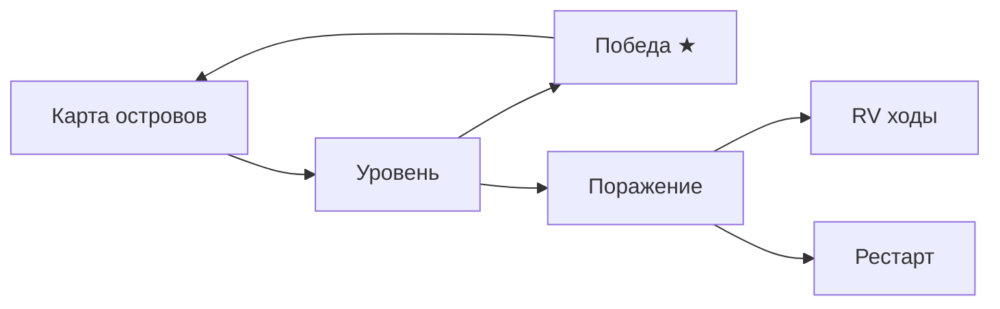

# Кристаллы Архипелага — Design Document (GDD)

| Поле | Значение |
|------|----------|
| **Slug** | `crystal-archipelago` |
| **Название RU** | Кристаллы Архипелага |
| **Название EN** | Crystal Archipelago |
| **Жанр** | Match-3 adventure |
| **Платформа** | Яндекс Игры (HTML5) |
| **Движок** | Phaser 3 + TypeScript + Vite |
| **Сегмент ЦА** | F — классический puzzle, 25–60 |
| **Приоритет** | P0 |
| **Статус дизайна** | `DRAFT` (код запрещён до `CONFIRMED`) |
| **Ключевой арт** | `refs/art/key-art.png` |

---

## 1. One-liner

Классический match-3: очищай уровни на островах архипелага, собирай звёзды и открывай карту мира.

## 2. Видение

«Бессмертный» puzzle-кэшфлоу с гибридной экономикой бустеров/жизней. Differentiator — визуал тропического архипелага + карта островов + weekly challenge, а не изобретение нового match-правил.

### Рамки

| Делать | НЕ делать |
|--------|-----------|
| Классический swap match-3 | Новые правила «hex-match» / RPG бои |
| 50 уровней волны 1 | 500 уровней day-one |
| 5 цветов + спецки + 4 бустера | 12 цветов |
| Карта 3 острова | Открытый 3D мир |
| Lives + RV +5 moves | Pay-only walls на 1–20 |

## 3. Fantasy

Тропические острова, лагуны, храмы, тики, радуга. Уровни = «очистить кристаллы / собрать N / освободить клетки». Кристаллы — гранёные самоцветы (рубин, сапфир, изумруд, аметист, топаз).

## 4. Core loop

1. Карта → выбор уровня (звёзды 0–3).  
2. Старт: цель + лимит ходов (+ пребустеры).  
3. Swap adjacent → match 3+ → cascade → specials.  
4. Win → 1–3★ → soft / прогресс.  
5. Fail → RV +5 ходов / бустер / рестарт (−life).  
6. Мета: жизни, сундуки, pass, daily challenge.

## 5. Механики MVP

### 5.1 Поле
- Базовый грид до **8×8**, формы уровней маской (дыры).  
- Swap соседних ортогонально.  
- Match ≥3 линия; T/L → спецкамни.

### 5.2 Специальные камни
| Форма | Спец | Эффект |
|-------|------|--------|
| 4 в ряд | Ракета | линия ряд/столбец |
| T / L | Бомба | 3×3 |
| 5 в ряд | Радуга/цвет | бьёт весь цвет |
| Ракета+Ракета | крест | 2 линии |
| и т.д. | комбо | по таблице |

### 5.3 Цели уровней
- Собрать N камней цвета.  
- Сломать блоки/кристаллы-оболочки.  
- Освободить клетки / собрать токены.  
- Достичь score (редко в early).

### 5.4 Бустеры (4)
1. Молот — уничтожить 1 клетку.  
2. Веер — перемешать.  
3. Линейный луч — ряд.  
4. Цветовая кисть — покрасить / взорвать цвет (уточнение в LLM doc).

### 5.5 Жизни
- Cap 5; реген 1 / 20–25 мин.  
- RV +1 life / IAP refill.

## 6. Контент

- **50 уровней** wave 1.  
- **3 острова** на карте (≈15–20 / 15–20 / 10–15).  
- Daily challenge = модификатор на seed дня.  
- Цель live: 150+ уровней позже.

## 7. Монетизация (hybrid classic)

| Источник | Как |
|----------|-----|
| Rewarded | +5 ходов, free booster, +life |
| Interstitial | между островами / после fail (не mid-swap) |
| IAP | lives, booster packs, remove ads, pass |
| Soft | монеты за уровни → бустеры |

**Early game:** уровни 1–20 без обязательных бустеров; winrate первой попытки 60–75%.

## 8. UX

- Туториал: swap → match → special за ≤90 с.  
- Крупные клетки под палец; board не меньше safe area.  
- Чёткая цель уровня на престарте.  
- Cloud save прогресса карты/жизней.  
- Портрет.

## 9. MVP → Store

| Входит | Не входит |
|--------|-----------|
| 50 levels, 4 boosters, lives | гильдии, async PvP |
| 3 islands map | meta RPG |
| Daily + pass light | 10 типов блокеров day one |
| Ads + IAP | |

## 10. Риски

| Риск | Митигация |
|------|-----------|
| Высокая конкуренция | арт архипелага + weekly |
| Стена баланса | кривая winrate + QA table |
| Производительность cascade | object pool, 60 FPS target |

## 11. Store criteria

- Winrate early 60–75% first try.  
- Нет стен без бустеров на 1–20.  
- 50 уровней стабильны.  
- 60 FPS mid Android Chrome.  
- Платежи/ads по чеклисту.

## 12. Код

**До `CONFIRMED` — не начинать `src/`.** Спека агентов: `docs/DESIGN_LLM.md`.
