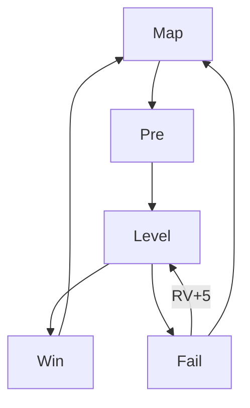

# Кристаллы Архипелага — DESIGN_LLM (исполняемая спецификация)

> **Аудитория:** LLM-агенты. **Код `src/` запрещён** до `CONFIRMED`.  
> GDD: `docs/DESIGN.md`. Промпты: `prompts/*.md`.

---

## 0. Мета-контракт

| Поле | Значение |
|------|----------|
| slug | `crystal-archipelago` |
| title_ru | Кристаллы Архипелага |
| title_en | Crystal Archipelago |
| engine | Phaser 3 + TypeScript + Vite |
| platform | Яндекс Игры |
| orientation | portrait 720×1280 |
| design_status | `DRAFT` |
| coding_allowed | `false` until `CONFIRMED` |
| concept_ref | `docs/concepts/06-crystal-archipelago.md` |
| key_art | `games/crystal-archipelago/refs/art/key-art.png` |

### Запреты
1. Не менять жанр на RPG/shooter.  
2. Не добавлять realtime multiplayer.  
3. Не ставить paywall на уровнях 1–20.  
4. Не запускать interstitial mid-cascade.

---

## 1. Project contract

```text
games/crystal-archipelago/
├── docs/DESIGN.md
├── docs/DESIGN_LLM.md
├── prompts/ART_PROMPTS.md
├── prompts/SPRITE_ANIM_PROMPTS.md
├── prompts/UI_PROMPTS.md
├── prompts/LEVEL_PROMPTS.md
├── prompts/CODE_AGENT_PROMPT.md
├── refs/{art,ui,levels,sprites}/
├── public/assets/{images,atlases,audio,data}/
├── src/  # after CONFIRMED
├── STATUS.md
└── STORE_CHECKLIST.md
```

### Naming

| Entity | Rule | Example |
|--------|------|---------|
| Gem color | `gem_{color}` | `gem_red` |
| Special | `gem_special_{type}` | `gem_special_rocket_h` |
| Blocker | `block_{type}_{hp}` | `block_crystal_2` |
| Level | `lvl_{island}_{nn}` | `lvl_01_07` |
| Booster | `boost_{name}` | `boost_hammer` |
| BG | `bg_island_{id}` | `bg_island_lagoon` |
| UI | `ui_*` | `ui_btn_play` |
| Save | `cra_{key}_v1` | `cra_progress_v1` |

### Asset ID schema

```text
gem_red|gem_blue|gem_green|gem_purple|gem_yellow
gem_special_rocket_h|rocket_v|bomb|rainbow
block_stone_{1,2}|block_vine_{1,2}|block_chest
tile_cell|tile_hole
vfx_match|vfx_explode|vfx_rainbow
ui_goal_*|ui_moves|ui_life
bg_map|bg_island_*|bg_board_frame
```

Logical board cell: **72×72** (8×8 = 576 + frame).

---

## 2. Gameplay systems + AC

### 2.1 Grid & Swap

- Grid up to 8×8; mask `0=hole,1=cell`.  
- Swap orthogonal adjacent only.  
- If no match created → swap back (unless booster mode).

**AC:**
- [ ] AC-GRD-01: invalid swap animates back ≤200ms.  
- [ ] AC-GRD-02: input locked during resolve cascade.  
- [ ] AC-GRD-03: holes never spawn gems.  
- [ ] AC-GRD-04: gravity down; refill from top spawn table.  
- [ ] AC-GRD-05: no infinite cascade softlock (max resolve steps 200 then force settle).

### 2.2 Match detection

- Lines ≥3 horizontal/vertical.  
- Multiple matches same resolve wave OK.  
- T/L shapes detected for bomb.

**AC:**
- [ ] AC-MCH-01: match-3 always clears.  
- [ ] AC-MCH-02: match-4 → rocket (orientation = line axis).  
- [ ] AC-MCH-03: T/L ≥5 cells → bomb at pivot.  
- [ ] AC-MCH-04: match-5 → rainbow.  
- [ ] AC-MCH-05: specials created after clear of their pattern, before gravity (standard order documented in code comments later).

### 2.3 Specials & combos

| Combo | Result |
|-------|--------|
| Rocket + Rocket | row + column cross |
| Rocket + Bomb | 3 rows or fat line |
| Bomb + Bomb | 5×5 |
| Rainbow + Color gem | clear color |
| Rainbow + Rocket/Bomb | upgrade all of color then trigger |
| Rainbow + Rainbow | clear board (cap juice 1s) |

**AC:**
- [ ] AC-SPC-01: double-tap/activate special on tap when moves allow (config).  
- [ ] AC-SPC-02: combos prioritize neighbor swap activation.  
- [ ] AC-SPC-03: VFX ≤1.2s; board readable after.

### 2.4 Blockers

MVP set:
- `block_stone` HP1–2: ломается от соседнего match/special.  
- `block_vine` HP1–2: на клетке с гемом или вместо.  
- `block_crystal_shell`: gem inside, HP1–2.  
- Collector tokens optional island3.

**AC:**
- [ ] AC-BLK-01: blockers defined per-level JSON.  
- [ ] AC-BLK-02: нельзя свапнуть locked cell.  
- [ ] AC-BLK-03: first 10 levels ≤1 blocker type.

### 2.5 Goals & moves

```json
{
  "goals": [
    { "type": "collect_color", "color": "red", "count": 20 },
    { "type": "break_blocker", "blocker": "block_stone", "count": 8 }
  ],
  "moves": 25,
  "starThresholds": [0.6, 0.85, 1.0]
}
```

Stars: based on moves left and/or score ratio (MVP: moves left bands).

**AC:**
- [ ] AC-GOL-01: win when all goals ≤0 and moves≥0.  
- [ ] AC-GOL-02: fail when moves=0 and goals remain (after cascade settle).  
- [ ] AC-GOL-03: prestart panel shows goals icons + moves.  
- [ ] AC-GOL-04: RV +5 moves once per attempt (then IAP/boosters).

### 2.6 Boosters

| ID | Effect | Cost soft | RV |
|----|--------|-----------|-----|
| boost_hammer | destroy 1 cell/blocker hp | 100 | yes free daily |
| boost_fan | shuffle board | 80 | |
| boost_line | clear row or col picker | 150 | |
| boost_chroma | convert 4 gems to color / or clear one color lite | 200 | |

Pre-level slots: up to 3 preboosters (rocket/bomb/rainbow start).

**AC:**
- [ ] AC-BOS-01: booster mode disables normal swap until used/cancel.  
- [ ] AC-BOS-02: cannot use booster during cascade.  
- [ ] AC-BOS-03: inventory persists cloud.

### 2.7 Lives

| Param | Value |
|-------|-------|
| cap | 5 |
| regen | 1 / 22 min |
| fail cost | 1 life (not if RV continue success) |
| RV | +1 life |
| IAP | full refill |

**AC:**
- [ ] AC-LIF-01: 0 lives → modal wait/RV/IAP; map locked start.  
- [ ] AC-LIF-02: offline regen to cap.

### 2.8 Map meta

- 3 islands, nodes linear with small branches optional (MVP linear).  
- Unlock next on ≥1★.  
- Chest every 5 levels.

**AC:**
- [ ] AC-MAP-01: 50 nodes configured.  
- [ ] AC-MAP-02: camera focuses current node.  
- [ ] AC-MAP-03: island complete → interstitial allowed.

### 2.9 Daily / Pass

- Daily: 1 level modifier (fewer moves / extra blocker) seeded by date.  
- Pass light: 20 levels boosters/lives/soft.

**AC:**
- [ ] AC-DAY-01: daily resets 00:00 local or Yandex time config.  
- [ ] AC-PAS-01: XP per win + stars.

### 2.10 Monetization AC

- [ ] AC-PAY-01: RV +5 moves on fail; free booster daily.  
- [ ] AC-PAY-02: interstitial island transit / fail exit — never mid-swap.  
- [ ] AC-PAY-03: IAP lives, booster packs, remove ads, pass.  
- [ ] AC-PAY-04: remove ads keeps RV opt-in.

### 2.11 Save AC

- [ ] AC-SAVE-01: progress stars, lives timestamp, boosters, pass, settings.  
- [ ] AC-SAVE-02: mid-level kill → level not won; lives not double-spent (spend life on fail confirm or on start — **canonical: spend on level start**).

**Life spend rule (canonical):** life списывается при **старте** уровня; RV continue не возвращает life; выход из престарта до старта — free.

---

## 3. Level design grammar

### 3.1 Как уровень LOOKS

- Board frame gold dark rounded (key-art).  
- Gems faceted distinct shapes per color.  
- BG island vista behind board (lagoon/temple/peak).  
- Top: moves + goals. Bottom: boosters.

### 3.2 Как PLAYS

1. Scan goals.  
2. Build specials.  
3. Cascade juice.  
4. Spend last moves on objectives not random.

### 3.3 Level recipe schema

```json
{
  "id": "lvl_01_07",
  "island": 1,
  "index": 7,
  "board": { "w": 8, "h": 8, "mask": ["11111111", "..."] },
  "spawnColors": ["red","blue","green","purple","yellow"],
  "spawnWeights": [1,1,1,1,1],
  "moves": 28,
  "goals": [{ "type": "collect_color", "color": "yellow", "count": 30 }],
  "blockers": [],
  "tutorial": null,
  "difficulty": 1,
  "starMoves": [10, 5, 0]
}
```

### 3.4 Difficulty curve

| Levels | Diff | Moves bias | Blockers | First-try WR target |
|--------|------|------------|----------|---------------------|
| 1–5 | 0 | + | none | 85–95% |
| 6–15 | 1 | normal | stone1 intro | 70–80% |
| 16–30 | 2 | −1–2 | stone2/vine | 60–70% |
| 31–40 | 3 | tighter | shells | 55–65% |
| 41–50 | 4 | spikes | mix | 50–60% |

**Hard rule:** levels 1–20 solvable without boosters by median player (design intent).

### 3.5 Goal recipes

| Goal type | Early | Late |
|-----------|-------|------|
| collect_color | 15–25 | 40–60 |
| break_blocker | — | 8–20 |
| collect_token | island2+ | yes |
| score | rare | optional |

### 3.6 Board shape grammar

- Full 8×8 early.  
- Corners cut / donut / two wells mid.  
- Narrow corridors late (careful with unfair).

### 3.7 Content volume MVP

| Content | Count |
|---------|-------|
| Levels | 50 |
| Islands | 3 |
| Gem colors | 5 |
| Specials | 4 base |
| Blockers | 3 families |
| Boosters | 4 |
| Daily | template |
| Pass levels | 20 |

---

## 4. UI map + wireframes

### Screens

`SC_Boot`, `SC_Map`, `SC_PreLevel`, `SC_Level`, `SC_Win`, `SC_Fail`, `SC_Shop`, `SC_Pass`, `SC_Settings`, `SC_Daily`

### Map

```text
┌────────────────────────────┐
│ ❤️5  💰  💎     [Pass]     │
│     Island 1 Lagoon        │
│   (1)─(2)─(3)─(4)─★chest   │
│              \             │
│               (5)          │
│         [Daily]            │
└────────────────────────────┘
```

### PreLevel

```text
┌────────────────────────────┐
│      Уровень 7             │
│   Goals: 🔴x20  🪨x8       │
│   Ходы: 28                 │
│  Preboosters [ ][ ][ ]     │
│      [ Играть ]            │
└────────────────────────────┘
```

### Level HUD

```text
┌────────────────────────────┐
│ Ходы 24   🔴12/20  🪨3/8   │
│ ┌────────────────────────┐ │
│ │      8x8 BOARD         │ │
│ └────────────────────────┘ │
│ [🔨][🌀][➡️][🎨]            │
└────────────────────────────┘
```

### Fail

```text
┌────────────────────────────┐
│     Ходы закончились       │
│ [▶ +5 ходов реклама]       │
│ [Бустер] [Рестарт] [Карта] │
└────────────────────────────┘
```



### Components

`BtnPlay`, `LifeBar`, `MovesCounter`, `GoalIcons`, `BoosterDock`, `BoardFrame`, `StarRow`, `ModalRV`, `MapNode`, `ChestNode`

---

## 5. Art bible

### Style locks
- High-polish casual match-3; faceted gems; tropical archipelago vistas.  
- Board dark gold frame floating over paradise.  
- Soft lighting, high saturation, cheerful.  
- **Не:** grimdark, pixel, ultra-minimal abstract only, purple-white generic AI UI.

### Palette

| Token | Hex |
|-------|-----|
| lagoon | `#2EC4B6` |
| deep_sea | `#1B7A8F` |
| jungle | `#2F9E44` |
| sand | `#F2D6A0` |
| gold_frame | `#E6C35C` |
| board_dark | `#1A2430` |
| gem_red | `#E23D3D` |
| gem_blue | `#3D7AED` |
| gem_green | `#2FBE6A` |
| gem_purple | `#9B5DE5` |
| gem_yellow | `#F2C14E` |
| sky | `#6EC6FF` |
| text | `#14303D` / `#FFFFFF` on dark |

### Gem shape locks (читаемость)
- Red: hexagon ruby  
- Blue: teardrop sapphire  
- Green: octagon emerald  
- Purple: hex amethyst  
- Yellow: diamond topaz  

### Do/Don't
**Do:** unique gem silhouettes; rainbow accents; readable goals.  
**Don't:** same-shape recolors only; tiny gems; ad during cascade.

---

## 6. Image prompts (канон)

Полный пак: `prompts/ART_PROMPTS.md`.

Key:
```text
Tropical archipelago match-3 scene, floating dark gold-framed 8x8 crystal gem board over turquoise lagoon islands waterfalls tiki statue sailboat thatched hut, faceted colorful gems, yellow column clear VFX shards, bright casual mobile game art, no text no logos
```

Gems:
```text
Five faceted match3 gems on transparent: red hexagon, blue teardrop, green octagon, purple hex, yellow diamond, glossy mobile game icons consistent lighting
```

---

## 7. Sprite sheets + timing

| Anim | Frames | FPS | Size |
|------|--------|-----|------|
| gem_land | 4 | 20 | 72 |
| gem_clear | 6 | 20 | 72 |
| rocket_fly | 8 | 24 | 72 |
| bomb_explode | 10 | 20 | 144 |
| rainbow_beam | 12 | 24 | 256 |
| cascade_spark | 6 | 18 | 64 |
| ui_star_gain | 8 | 16 | 96 |

| Event | ms |
|-------|-----|
| swap | 120 |
| clear | 180 |
| gravity step | 80–100 |
| special explode | 350–500 |

Atlas: `atlas_gems`, `atlas_specials_vfx`, `atlas_ui_fx`.

---

## 8. Prompt packs

| File | Role |
|------|------|
| `prompts/ART_PROMPTS.md` | art |
| `prompts/SPRITE_ANIM_PROMPTS.md` | anim |
| `prompts/UI_PROMPTS.md` | ui |
| `prompts/LEVEL_PROMPTS.md` | 50 levels JSON |
| `prompts/CODE_AGENT_PROMPT.md` | code after CONFIRMED |

---

## 9. Integration paths

```text
public/assets/images/gems/gem_red.png
public/assets/images/gems/gem_blue.png
public/assets/images/gems/gem_green.png
public/assets/images/gems/gem_purple.png
public/assets/images/gems/gem_yellow.png
public/assets/images/gems/gem_special_rocket_h.png
public/assets/images/gems/gem_special_rocket_v.png
public/assets/images/gems/gem_special_bomb.png
public/assets/images/gems/gem_special_rainbow.png
public/assets/images/blockers/block_stone_1.png
public/assets/images/blockers/block_stone_2.png
public/assets/images/blockers/block_vine_1.png
public/assets/images/bg/bg_map.png
public/assets/images/bg/bg_island_lagoon.png
public/assets/images/bg/bg_island_temple.png
public/assets/images/bg/bg_island_peaks.png
public/assets/images/ui/ui_board_frame.png
public/assets/images/ui/ui_btn_play.png
public/assets/images/boosters/boost_hammer.png
public/assets/atlases/atlas_gems.png|.json
public/assets/atlases/atlas_specials_vfx.png|.json
public/assets/data/levels/lvl_01_01.json … lvl_03_xx.json
public/assets/data/levels/index.json
public/assets/data/boosters.json
public/assets/data/economy.json
public/assets/data/pass.json
public/assets/data/i18n/ru.json
public/assets/audio/bgm/bgm_map.mp3
public/assets/audio/bgm/bgm_level.mp3
public/assets/audio/sfx/sfx_match.mp3
public/assets/audio/sfx/sfx_special.mp3
```

### Code modules

`BoardModel`, `MatchResolver`, `SpecialRules`, `LevelController`, `GoalTracker`, `BoosterService`, `LifeService`, `MapService`, `SaveService`, `YgSdkFacade`

### Events

```text
EVT_Swap_Done
EVT_Cascade_Step
EVT_Goal_Progress
EVT_Level_Win
EVT_Level_Fail
EVT_Booster_Used
EVT_Life_Changed
EVT_Cloud_Synced
```

---

## 10. Economy

| Win ★1/2/3 | Soft |
|------------|------|
| 1★ | 20 |
| 2★ | 35 |
| 3★ | 50 |

Booster soft prices §2.6.  
Early grant: hammer×2, fan×2 after tutorial.

---

## 11. Tutorial

| Step | Teach |
|------|-------|
| T1 | Swap 2 gems to match |
| T2 | Make match-4 → rocket |
| T3 | Activate rocket |
| T4 | Goal counter |
| T5 | Map stars |

Levels 1–3 scripted masks.

---

## 12. Performance budget

- Target 60 FPS Chrome Android mid.  
- Pool gem sprites.  
- Max particles 80.  
- Atlas over hundreds of loose PNGs for gems VFX.

---

## 13. Definition of Ready

- [ ] DESIGN.md + this file reviewed  
- [ ] prompts/* present  
- [ ] Level grammar + curve signed  
- [ ] 50 level IDs listed (even if JSON draft)  
- [ ] Gem shape locks approved vs key-art  
- [ ] UI screens wired  
- [ ] Monetization points OK for Yandex  
- [ ] Life spend rule confirmed  
- [ ] Dashboard status → **CONFIRMED**  

**No coding until CONFIRMED.**

---

## 14. Store DoD

- 50 levels  
- Early WR 60–75%  
- No booster wall 1–20  
- Lives/RV/IAP  
- 60 FPS target  
- Cloud save  
- STORE_CHECKLIST  

## 15. Changelog

| Ver | Date | Notes |
|-----|------|-------|
| 0.1 | 2026-07-17 | Initial DESIGN_LLM |

---

## Visual Ground Truth (обязательные референсы)

См. также `docs/REFS.md`.

| Тип | Путь |
|-----|------|
| Key art | `refs/art/key-art.png` |
| UI wireframe | `refs/ui/wireframe-main.png` |
| Level layout | `refs/levels/layout-main.png` |
| Sprite sheet | `refs/sprites/sheet-main.png` |

Любой арт-агент обязан сверяться с этими файлами перед генерацией финальных ассетов.
