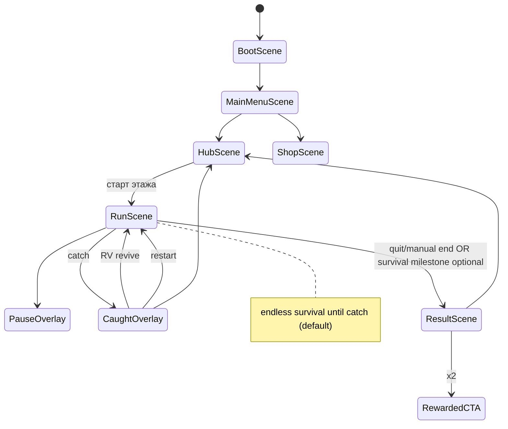
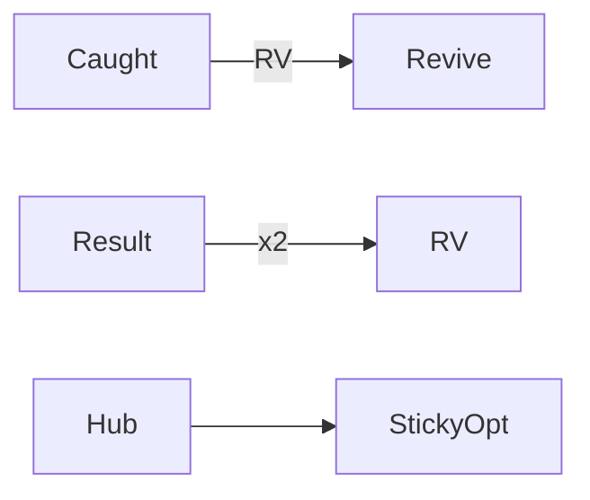

# Работник месяца — DESIGN_LLM (исполняемая спецификация)

> **СТАТУС:** `DRAFT`  
> **⛔ НЕ КОДИРОВАТЬ `src/`, пока статус ≠ CONFIRMED**  
> Source of truth для агентов после CONFIRM.

---

## 0. Project Contract

### 0.1 Identity

| Ключ | Значение |
|------|----------|
| `slug` | `deadline-escape` |
| `displayName.ru` | Работник месяца |
| `displayName.en` | Employee of the Month |
| `engine` | Phaser 3.80+ |
| `language` | TypeScript 5.x strict |
| `bundler` | Vite 5.x |
| `platform` | Yandex Games HTML5 |
| `orientation` | portrait-primary + landscape OK |
| `targetFPS` | 60 |
| `baseResolution` | 720×1280 portrait logical; scale FIT |
| `tileSize` | 32×32 |
| `sessionTarget` | 30–90s |

### 0.2 Folder layout

```
games/deadline-escape/
  docs/DESIGN.md
  docs/DESIGN_LLM.md
  prompts/ART_PROMPTS.md
  prompts/SPRITE_ANIM_PROMPTS.md
  prompts/UI_PROMPTS.md
  prompts/LEVEL_PROMPTS.md
  prompts/CODE_AGENT_PROMPT.md
  refs/art|ui|levels|sprites/
  public/assets/
    textures/{characters,enemies,props,vfx,tiles,ui,keyart}/
    audio/{sfx,music}/
    levels/
  src/{main.ts,game/{scenes,systems,entities,ui,data,sdk}/}
  STATUS.md
  STORE_CHECKLIST.md
  README.md
  package.json
  index.html
```

### 0.3 Naming

| Тип | Правило | Пример |
|-----|---------|--------|
| Asset keys | `domain_subject_variant` | `char_hero_idle`, `boss_hr_chase` |
| Levels | `flr_<biome>_<nn>` | `flr_openspace_01` |
| Powerups | `pu_<name>` | `pu_coffee` |
| Props | `prop_<name>` | `prop_cooler` |
| TS | PascalCase scenes/systems | `ChaseAI.ts` |

### 0.4 Asset ID schema

`{domain}_{subject}_{variant}_{state}`  
Domains: `char`, `boss`, `pu`, `prop`, `tile`, `ui`, `vfx`, `sfx`, `mus`, `flr`

Paths: `public/assets/textures/enemies/boss_manager_sheet.png`

### 0.5 Coding gate

```
IF designStatus != CONFIRMED: FORBIDDEN src/**
```

---

## 1. Scenes & Flow



**Режим рана (MVP):** endless survival на этаже до поимки. Score = f(time, collectibles, distractions).  
Опционально post-MVP: objective «продержись 60с».

---

## 2. Input

| Device | Move | Use gadget | Pause |
|--------|------|------------|-------|
| Desktop | WASD | Space / click prop | Esc |
| Mobile | virtual stick | auto-pickup on overlap; button for active gadget | top-right |

**AC:** deadzone 0.18; pickup radius 28px; tutorial arrows ≤10s.

---

## 3. Gameplay Systems + AC

### 3.1 PlayerController

- Circle body r=10, speed base `160`
- Sprint (если unlocked): `240` for 1.5s, CD 4s
- Collision with `collision` + `cubicle` solid

**AC:** не застревает в 1-tile gaps; delta movement.

### 3.2 BossAI (`ChaseAI`)

```
BossDef {
  id, speed, detectRadius, loseInterestTime,
  visionConeDeg, specialPeriod, specialType
}
```

| id | speed | detect | special |
|----|-------|--------|---------|
| `boss_manager` | 150 | 140 | none |
| `boss_hr` | 130 | 120 | meetingZone every 8s (radius 80, player slow 50% for 2s) |
| `boss_ceo` | 170 | 160 | allHands pull every 12s (impulse toward CEO 200px) |

States: `Roam → Suspect → Chase → Catch`

Detect: distance OR vision cone LOS.  
Hide in cubicle: if player inside `hideZone` and not sprinting → Suspect decay faster.

Catch: overlap player for 0.15s continuous.

**AC:**
- [ ] LOS blocked by walls/cubicles
- [ ] Distraction sets `Investigate(noisePoint)` for 3.5s
- [ ] Max bosses on floor1: 1→2 escalate by time

### 3.3 EscalationCurve

```
t=0s: 1 boss_manager
t=20s: +boss_hr
t=45s: speeds +10%
t=60s: +boss_ceo (floor tier≥2) OR manager clone on floor1 hard
```

**AC:** curve data-driven in `src/data/escalation.json` (после кода).

### 3.4 DistractionSystem

| propId | noiseRadius | investigateTime | cooldown global |
|--------|-------------|-----------------|-----------------|
| `prop_cooler` | 200 | 3.5s | 8s |
| `prop_elevator` | 240 | 4s | 12s |
| `prop_printer` | 160 | 3s | 6s |

Activate: overlap + tap / Space.

**AC:** VFX+SFX; boss pathfinds to point; player not frozen.

### 3.5 PowerUpSystem

| id | effect | dur | spawn weight |
|----|--------|-----|--------------|
| `pu_coffee` | speed ×1.4 | 3s | 1.0 |
| `pu_badge` | undetectable | 2s | 0.7 |
| `pu_vpn` | teleport to `toiletSafe` object | 0 | 0.4 |
| `pu_donut` | nearest boss stun 2s | 0 | 0.25 |

Spawn: every 12–18s at `puSpawn` points, max 2 alive.

**AC:** badge hides from detect+cone; coffee stacks not (refresh).

### 3.6 Collectibles & Score

- `col_pto` «отгул» ticket: +50 score, +1 soft  
- Time score: +10 / sec survived  
- Distraction success: +30  

**AC:** Result показывает breakdown; cloud bestScore per floor.

### 3.7 Revive

- 1 rewarded revive per run  
- On revive: i-frames 1.5s, bosses reset to Roam farthest corner  
- Soft revive currency — нет в MVP (только RV)

### 3.8 Meta Upgrades

| upgradeId | maxLv | effect/lv | cost soft |
|-----------|-------|-----------|-----------|
| `up_speed` | 5 | +4% move | 50×lv |
| `up_sprint` | 3 | unlock then -0.5s CD | 80×lv |
| `up_noise` | 3 | +15% distraction radius | 60×lv |
| `up_luck` | 3 | +8% rare pu weight | 70×lv |

---

## 4. Level Design Grammar

### 4.1 Look & play

**LOOK:** яркий flat office cartoon — серо-голубые кубиклы, жёлтые post-it акценты, зелёные растения, красные папки «СРОЧНО». Не мрачный корпорат. Карикатура > реализм.

**PLAY:** open loops вокруг островков кубиклов; 2–3 hide zones; 1 toiletSafe; distractions на краях путей; collectibles на рискованных mid-lanes.

### 4.2 Palette gameplay

| Role | Hex |
|------|-----|
| Carpet | `#C8D2E0` |
| Cubicle | `#6B7C93` |
| Wall | `#EEF2F6` |
| Accent sticky | `#F4D35E` |
| Danger boss | `#E63946` |
| Safe hide | `#2A9D8F` |
| Player | `#1D3557` |
| UI CTA | `#E9C46A` |
| BG menu | `#F1FAEE` → avoid cream-terracotta cliché: use cool office `#E8EEF5` + yellow accent |

### 4.3 Tile rules

| tile | collision | notes |
|------|-----------|-------|
| `tile_carpet_*` | no | |
| `tile_wall` | yes | |
| `tile_cubicle` | yes | blocks LOS |
| `tile_desk` | yes | |
| `tile_hide_zone` | no | meta trigger |
| doors elevator | interact | |

Map size floor1: 50×40 tiles. Portrait camera follow + mild zoom 1.0–1.1.

### 4.4 Encounter recipes (time-based, not rooms)

| Recipe | When | Content |
|--------|------|---------|
| `warm_up` | 0–20s | 1 manager, dense hide |
| `hr_intro` | 20–45s | +HR meeting zones |
| `crossfire` | 45–70s | 2 chasers opposite sides |
| `ceo_panic` | 70s+ | CEO pull + reduced hide safety |

Floor variants change prop density / sightlines:

| Floor | Trait |
|-------|-------|
| Open Space | wide aisles, easy read |
| Open Space+ | fewer hides, faster escalate |
| Accounting | maze cubicles, good hide, bad sight |
| IT Hell | dark cables props, teleporter jokes (vpn themed) |
| Board | open arena, hard |

### 4.5 Difficulty curve (meta)

Player upgrades vs escalation — keep catch time median ~35–55s for new users after tutorial.

**AC floors MVP:**
- [ ] `flr_openspace_01` полный  
- [ ] `flr_openspace_plus_01`  
- [ ] `flr_accounting_01` упрощённый  

---

## 5. UI Map & Wireframes

### Components

`ui_btn_primary`, `ui_btn_rv`, `ui_hud_timer`, `ui_hud_score`, `ui_boss_arrow` (offscreen indicator), `ui_stick`, `ui_pause`, `ui_result_card`, `ui_shop_card`, `ui_upgrade_row`

### Boot
```
┌─────────────┐
│   РАБОТНИК МЕСЯЦА   │
│  loading…   │
└─────────────┘
```

### Menu
```
┌─────────────────────┐
│      РАБОТНИК МЕСЯЦА        │
│  [full-bleed art]   │
│   [ БЕЖАТЬ ]        │
│   [ Магазин ]       │
│   [ Рекорды ]       │
└─────────────────────┘
```

### Hub
```
┌─────────────────────┐
│ Этажи               │
│ (1) Open ✓          │
│ (2) Open+ ✓         │
│ (3) Бухи 🔒         │
│ Отгулы: 320         │
│ [Daily] [Upgrades]  │
└─────────────────────┘
```

### HUD
```
┌─────────────────────┐
│ ⏱ 0:42   ★ 1280  ❚❚ │
│ ←boss               │
│                     │
│      (office)       │
│ (stick)             │
└─────────────────────┘
```

### Caught
```
┌─────────────────────┐
│ ПОЙМАН! Сверхурочно │
│ Score 1280          │
│ [Рестарт]           │
│ [▶ Ожить — реклама] │
│ [В хаб]             │
└─────────────────────┘
```

### Result / Shop / RV CTA — см. аналогично Neon; shop = upgrades + skins + remove ads.



---

## 6. Art Bible

**Style locks:** cartoon office satire; thick readable shapes; bosses with exaggerated ties/folders; no horror.

**Do:** meme props, clear boss color coding, funny defeat pose.  
**Don't:** realistic corporate photo; dark souls office; purple glow spam; tiny unreadable props.

---

## 7. Image Generation Prompts (canon)

### Key art
```
Vertical mobile game key art "Employee of the Month": cartoon office worker sprinting through cubicles chased by angry caricature managers with urgent folders, satirical bright office colors, yellow sticky notes accents, comedy chase, full-bleed, 1080x1920, no text no logo
```

### Environment
```
Top-down cartoon office tileset 32x32: carpet, cubicle walls, desks, cooler, printer, elevator, plants, bright corporate comedy style, packed sheet, game-ready
```

### Characters
```
Top-down 32x32 cartoon office hero employee, run and panic frames, readable silhouette, blue sweater, transparent background
```

### Enemies / bosses
```
Top-down 32x32 caricature bosses: middle manager, HR with clipboard, CEO with megaphone, chase poses, comedy not horror, transparent
```

### Weapons
```
N/A — instead gadgets: coffee cup powerup, badge, VPN laptop icon, donut, 32x32 icons transparent
```

### VFX
```
Cartoon VFX: sweat drops, speed lines, stun stars, noise exclamation, green hide shimmer, transparent pixel/cartoon hybrid
```

### UI kit
```
Comedy office game UI kit: yellow CTA buttons, timer frame, score stars, revive rewarded button, upgrade rows, cool gray-blue panels #E8EEF5, no cream terracotta cliché, no device mockup
```

---

## 8. Sprite Sheets & Timings

### Hero `char_hero_sheet.png` — 32×32, 8×4

| anim | frames | fps | loop |
|------|--------|-----|------|
| idle | 0–3 | 6 | y |
| run | 4–11 | 12 | y |
| panic | 12–15 | 10 | y |
| caught | 16–20 | 8 | n |

### Bosses — each 32×32 (CEO 48×48), 8×4: idle4, walk8, special4, catch4

| anim | fps |
|------|-----|
| walk | 10 |
| special | 12 |
| catch | 8 |

### Props / PU — static 32×32 + 3-frame activate for cooler/printer @ 10fps

---

## 9. Integration paths

```
public/assets/textures/characters/char_hero_sheet.png
public/assets/textures/enemies/boss_manager_sheet.png
public/assets/textures/enemies/boss_hr_sheet.png
public/assets/textures/enemies/boss_ceo_sheet.png
public/assets/textures/props/prop_cooler.png
public/assets/textures/props/pu_coffee.png
public/assets/textures/tiles/tile_office_sheet.png
public/assets/textures/ui/ui_kit.png
public/assets/textures/keyart/keyart_deadline_escape.png
public/assets/levels/flr_openspace_01.json
public/assets/levels/flr_openspace_plus_01.json
public/assets/levels/flr_accounting_01.json
src/data/upgrades.json
src/data/bosses.json
src/data/escalation.json
```

---

## 10. SDK contract

```
showInterstitial('caught' | 'run_end')
showRewarded('revive' | 'x2' | 'temp_gadget')
purchase('remove_ads' | 'starter_pack' | 'skin_<id>')
leaderboardSet('lb_score_global' | 'lb_floor_<id>', score)
cloudLoad/Save(Progress)
```

Sticky: HubScene bottom safe area only.

---

## 11. Prompt packs

`prompts/ART_PROMPTS.md`, `SPRITE_ANIM_PROMPTS.md`, `UI_PROMPTS.md`, `LEVEL_PROMPTS.md`, `CODE_AGENT_PROMPT.md`

---

## 12. Definition of Ready

- [x] Contract, systems+AC, level grammar, UI wireframes, art bible, prompts, sheets, paths, SDK
- [x] No-code-until-CONFIRMED note
- [ ] Human REVIEW → CONFIRMED in dashboard

---

## 13. Coding ban

**⛔ Do not start coding until design CONFIRMED.**

## Changelog

| 1.0 | 2026-07-17 | Initial |

---

## Visual Ground Truth (обязательные референсы)

См. также `docs/REFS.md`.

| Тип | Путь |
|-----|------|
| Key art | `refs/art/key-art.png` |
| UI wireframe | `refs/ui/wireframe-main.png` |
| Level layout | `refs/levels/layout-main.png` |
| Sprite sheet | `refs/sprites/sheet-main.png` |

Любой арт-агент обязан сверяться с этими файлами перед генерацией финальных ассетов.

---

## Pass-2 — Vector / Feel / Retention (до CONFIRM)

> Источник: сверка с chas-pik + `docs/METHODOLOGY.md`.  
> **coding_allowed:** false until F2 (Feel demo approved) + human CONFIRMED.

### INV (минимум)

| ID | Инвариант |
|----|-----------|
| INV-DE-01 | Portrait-primary 720×1280; playable tiles = top-down square (не diamond isometric) |
| INV-DE-02 | Core verb = grid dodge на колонках 1/3/5 (chas-pik ядро); free-move chase НЕ MVP |
| INV-DE-03 | MVP win = дожить 09:00→18:00 → floor+1; fail = collision с threat |
| INV-DE-04 | No interstitial mid-chase |
| INV-DE-05 | Virtual stick + gadget btn ≥44px; deadzone 0.18; catch overlap ≥0.15s |
| INV-DE-06 | SDK: `LoadingAPI.ready()`, `GameplayAPI.start/stop` as methods |
| INV-DE-07 | Feel Demo (`management/demos/deadline-escape.js`) is ground truth for movement until G1 |

### Open decisions (locked for MVP)

- Timed 09:00→18:00 mode = **post-MVP daily**, not core.
- Do not port chas-pik grid as default.
- Skins count before F1 = **0 in production**; demo uses shapes only.

### Retention contract

| Hook | Spec |
|------|------|
| daily_meeting | reset 00:00 local; reward: 1 free gadget + 50 pto; miss = no punish |
| floor_record | persist best score per floor; show on hub |
| unlock_floor | floor N needs best score ≥ threshold OR soft buy |
| streak_3 | ×1.5 soft for 24h |

### Feel Demo AC

- [ ] Run starts in <1s after Play
- [ ] Player understands chase without text in run 1
- [ ] Hide OR gadget usable in run 1
- [ ] Restart <1s after catch
- [ ] Median life 35–55s on floor 1 shapes
- [ ] Playtester wants retry ≥7/10

### STATUS columns (create `STATUS.md` at F1)

`Loop | Feel | Content | Art | Store` — each: red/yellow/green + one blocker line.
