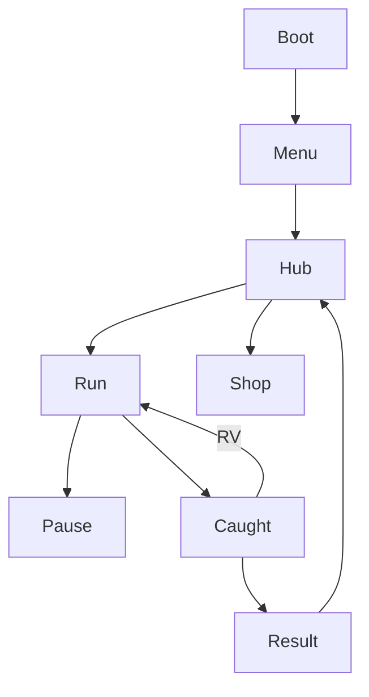

# Работник месяца — UI_PROMPTS

**Канон:** `DESIGN_LLM.md` §5.

## Контекст
```
UI Работник месяца: Phaser canvas, RU copy, portrait-first.
Panels #E8EEF5, CTA #E9C46A, danger #E63946, text #1D3557.
Touch ≥44px. Tutorial without text walls.
Screens: Boot, Menu, Hub, Upgrades, Run HUD, Pause, Caught, Result, Shop, Daily, Settings.
```

## UI kit prompt
```
Comedy office game UI kit: yellow primary buttons, gray-blue panels, timer and score frames, boss offscreen arrow, rewarded revive button with play icon, upgrade list rows, floor select cards, daily badge, no purple gradient, no device mockup
```
→ `public/assets/textures/ui/ui_kit.png`

## Copy RU

| Screen | Strings |
|--------|---------|
| Menu | БЕЖАТЬ / Магазин / Рекорды / Настройки |
| Hub | Этажи / Апгрейды / Ежедневный побег / Отгулы |
| HUD | time / score |
| Pause | Пауза / Дальше / В хаб |
| Caught | ПОЙМАН! Сверхурочно / Рестарт / Ожить (реклама) / В хаб |
| Result | Рекорд / +отгулы / x2 за рекламу / Ещё раз |
| Shop | Отключить рекламу / Стартовый пак / Скины |
| Tutorial hints | (стрелка) Беги / Спрячься / Отвлеки кулер |

## Wireflow



## Component sizes

| id | min |
|----|-----|
| `ui_btn_primary` | 240×56 |
| `ui_btn_rv` | 240×56 |
| `ui_boss_arrow` | 48×48 |
| `ui_stick` | base 120 / knob 56 |

## DoD
All screens copied; RV not fake-close; HUD keeps center clear; sticky only hub.

## Запреты
Interstitial button mimic; English-only UI.
