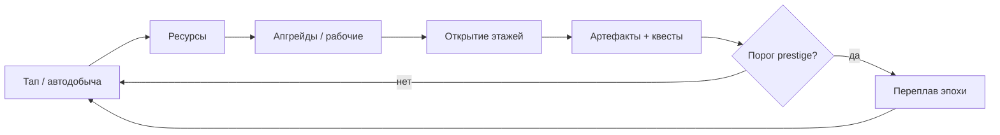

# Кузница Вечности — Game Design Document

| Поле | Значение |
|------|----------|
| **Slug** | `idle-forge` |
| **Рабочее название** | Кузница Вечности |
| **Жанр** | Idle / incremental |
| **Сегмент ЦА** | G — AFK / idle, 18–50 |
| **Приоритет** | P0 |
| **Платформа** | Яндекс Игры (HTML5) |
| **Движок** | Phaser 3 + TypeScript + Vite |
| **Статус дизайна** | `DRAFT` — код не начинать до `CONFIRMED` |
| **Концепт** | `docs/concepts/07-idle-forge.md` |
| **Ключевой арт** | `assets/concepts/07-idle-forge.png` |

---

## 1. Vision

Игрок — мастер подземной кузницы под горой. Рабочие добывают руду, конвейеры тащат металл к наковальням, артефакты копятся в реликварии. Сессия = «зашёл → забрал оффлайн → апгрейднул → поставил цели → ушёл». Возврат мотивируется прозрачным оффлайн-доходом, milestones и prestige «Переплав эпохи».

**Эмоциональный тон:** тёплый тёмно-фэнтезийный уют (не хоррор): оранжевый жар горна, золото слитков, зелёные руны гномов.

## 2. Design Pillars

1. **Честный AFK** — оффлайн-формула видна игроку; никаких скрытых nerf.
2. **Всегда есть следующая кнопка** — апгрейд / этаж / артефакт / квест в ≤10 сек выбора.
3. **Prestige = праздник, не наказание** — «Переплав» даёт ощутимый постоянный буст и новый слой контента.
4. **Гибрид без paywall** — F2P проходит 7-дневную дугу; RV ускоряет, IAP удобствует.
5. **Читаемые big numbers** — K/M/B/T + научная нотация после порога.

## 3. Target Audience & Session

| Параметр | Значение |
|----------|----------|
| Возраст | 18–50 |
| Сессия | 2–8 мин, 4–12 раз/день |
| Первый «вау» | ≤30 сек (тап → руда → апгрейд) |
| Цель удержания | D1 ≥30%, D7 ≥12% (idle-норма) |

## 4. Core Loop



1. Добыча (тап + idle workers).  
2. Покупка апгрейдов скорости/выхода/крита.  
3. Разблокировка этажей шахты (визуальный прогресс).  
4. Крафт/дроп артефактов → пассивные множители.  
5. Оффлайн-сбор (cap 6 ч базово, до 8 ч мета/IAP).  
6. Prestige → постоянный множитель + сброс run-апгрейдов.

## 5. Systems Overview

### 5.1 Ресурсы

| ID | Имя | Роль |
|----|-----|------|
| `ore` | Руда | Базовый soft |
| `ingot` | Слитки | Крафт / mid soft |
| `ember` | Угли духа | Prestige currency |
| `gem` | Самоцветы | Soft premium (RV/IAP/квесты) |

### 5.2 Апгрейды (MVP = 8 линий)

| # | Линия | Эффект | Формула стоимости |
|---|-------|--------|-------------------|
| 1 | Кирка | +tap power | `base * 1.15^n` |
| 2 | Горн | +ore/sec | `base * 1.18^n` |
| 3 | Конвейер | +speed workers | `base * 1.16^n` |
| 4 | Наковальня | ore→ingot rate | `base * 1.2^n` |
| 5 | Бригада | +workers | ступенчато |
| 6 | Руны | crit chance | softcap 50% |
| 7 | Шахтный лифт | этаж unlock discount | линейно |
| 8 | Реликварий | +artifact drop | softcap |

### 5.3 Рабочие

- Старт: 0 auto, 1 тап.  
- Max workers MVP: 12.  
- Каждый worker: `ore/sec = base * (1 + forgeLevel) * artifactMult * prestigeMult * rvMult`.  
- Визуал: маленькие гномы на этаже с loop walk/mine.

### 5.4 Этажи

| Этаж | Название | Условие | Бонус |
|------|----------|---------|-------|
| 1 | Угольный зал | старт | — |
| 2 | Железная жила | ore lifetime 5e4 | +10% ore |
| 3 | Обсидиановые штреки | ingot 2e3 | +15% forge |
| 4 | Рунный колодец | prestige ≥1 | +ember drop |
| 5 | Сердце горы | prestige ≥3 + artifacts 8 | +25% all |

### 5.5 Артефакты (15 MVP)

Редкости: Common / Rare / Epic / Legendary.  
Слоты: 6 экипируемых. Дубликаты → `ember` dust.  
Примеры: «Молот Предков» (+tap), «Кольцо Искры» (+crit), «Сердце Горна» (+offline %).

### 5.6 Prestige — «Переплав эпохи»

- Требование: этаж ≥3 И lifetime ore ≥ порога (растёт).  
- Сброс: ore, ingot, run-апгрейды, этажи (кроме meta).  
- Сохраняется: ember, артефакты, pass, IAP, meta-древо.  
- Награда: `ember = f(lifetime)` + permanent `+2%` all income за эпоху (stack).

### 5.7 Offline

```
offlineGain = rate * min(elapsed, capHours*3600) * offlineEfficiency
```

- `capHours` = 6 (base) / 8 (meta) / 10 (IAP Offline Vault).  
- UI показывает breakdown: время, rate, efficiency, итог.  
- RV: «Забрать ×2» или «Мгновенно заполнить cap».

### 5.8 Квесты / Milestones (7-дневная дуга)

Daily: 3 квеста (добыть X, купить N апгрейдов, скрафтить артефакт).  
Milestones: M1…M20 (lifetime thresholds) → gems + cosmetic forge FX.  
Week goal: «Достигни эпохи 3» / «Собери 10 артефактов».

## 6. Economy & Monetization (Yandex hybrid)

| Канал | Триггер | Награда / продукт | Правила |
|-------|---------|-------------------|---------|
| Rewarded | Кнопка | ×2 income 5 мин; instant offline; skip 30 мин; daily chest ×2 | Только opt-in, текст награды |
| Interstitial | Вход в сессию (cooldown 3 мин) ИЛИ после prestige | — | Не mid-click; пауза звука |
| Sticky | Опционально в хабе кузницы | — | Не перекрывает CTA |
| IAP | Shop | Permanent ×2; Remove Ads; Starter Pack; Forge Pass; Offline Vault | Fair, без P2W wall |
| Soft | Геймплей | ore/ingot/ember/gem | — |

**Starter Pack:** ×2 на 48ч + 200 gems + 1 Rare artifact.  
**Forge Pass (30 уровней):** cosmetic anvil skins, gems, 1 Legendary pity на 30.

**Запрещено:** mid-action ads; скрытый nerf offline для non-payers; paywall на первый prestige.

## 7. Content List (Store Ready)

- [x] 3 ресурса + gems  
- [x] 8 upgrade lines  
- [x] 5 этажей визуала  
- [x] 15 артефактов  
- [x] Prestige + meta tree (8 узлов)  
- [x] Daily quests + 20 milestones  
- [x] Offline claim UI  
- [x] Ads + 4 IAP SKU + pass light  
- [x] Cloud save  
- [x] Tutorial ≤90 сек  

## 8. UX / Screens

Boot → Main Forge (idle stage) → Upgrades sheet → Artifacts → Floors map → Prestige confirm → Shop → Offline Claim modal → Daily Chest → Settings.

Mobile-first: крупные кнопки апгрейдов, число ресурсов всегда видно, тап-зона наковальни ≥120×120 CSS px.

## 9. Audio / Juice

- Loop: low forge ambience + soft anvil hits on tap.  
- Prestige: cinematic rumble + metal choir sting.  
- Number pop + ore particles on tap.  
- Milestone toast with sparkle.

## 10. KPIs & Risks

| KPI | Цель |
|-----|------|
| Tutorial complete | ≥85% |
| Offline claim D1 | ≥60% вернувшихся |
| Prestige reach D7 | ≥25% |
| RV opt-in | ≥30% сессий |
| IAP conv | ≥2% |

**Риски:** скука без целей → quests; инфляция чисел → prestige pacing; токсичный energy-wall → **нет энергии**, только time-gates soft.

## 11. Out of Scope (v1)

Мультиплеер, PvP кузниц, 3D, сложный крафт-дерево >2 шагов, чат, сезонные ивенты beyond pass.

## 12. Definition of Done (продукт)

См. `docs/agents/control-methodology.md` Gate 5 + concept checklist: честный offline, 7-дневные цели, prestige, store checklist.

## 13. Связанные документы

- LLM-спека: `games/idle-forge/docs/DESIGN_LLM.md`  
- Промпты: `games/idle-forge/prompts/*`  
- Статус: `DRAFT` → подтверждение в portfolio dashboard  

**КОД НЕ ПИСАТЬ, пока статус дизайна ≠ `CONFIRMED`.**
