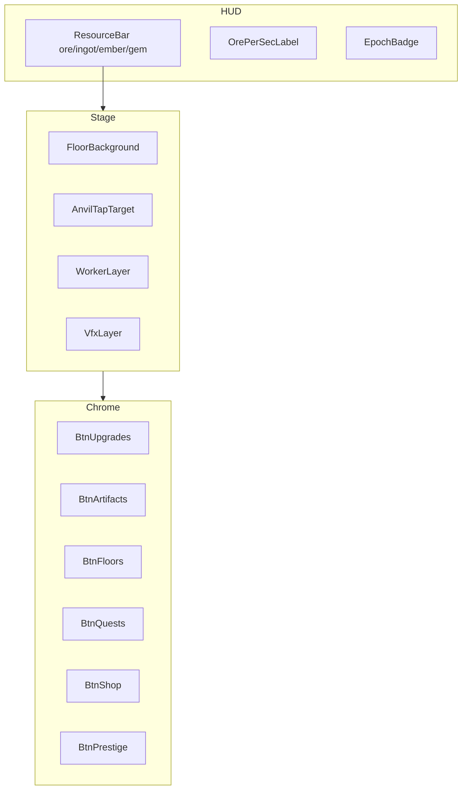
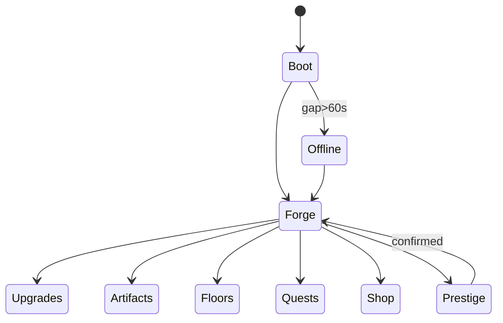

# DESIGN_LLM — idle-forge (Кузница Вечности)

> **Исполняемая спецификация для LLM-агентов.**  
> Статус дизайна: `DRAFT`. **Запрещено писать `src/` до статуса `CONFIRMED`.**  
> Язык документов и UI-копирайта: русский (можно EN ключи в коде).

---

## 0. Project Contract

| Ключ | Значение |
|------|----------|
| `slug` | `idle-forge` |
| `title_ru` | Кузница Вечности |
| `title_en` | Eternal Forge |
| `engine` | Phaser 3.80+ / TypeScript 5.x / Vite 5.x |
| `platform` | Yandex Games HTML5, static `dist/` |
| `orientation` | portrait-primary, landscape supported |
| `base_resolution` | 720×1280 logical (scale FIT) |
| `target_fps` | 60 desktop / 30–60 mid Android |
| `locale_default` | `ru` |

### 0.1 Folder layout (после CONFIRMED)

```
games/idle-forge/
  docs/DESIGN.md
  docs/DESIGN_LLM.md
  prompts/
  refs/art|ui|levels|sprites/
  public/assets/
    art/
    sprites/
    ui/
    audio/
    data/
  src/
    main.ts
    game/Game.ts
    scenes/{Boot,Preload,Menu,Forge,Shop,Prestige}Scene.ts
    systems/{IdleEngine,UpgradeSystem,ArtifactSystem,PrestigeSystem,OfflineSystem,QuestSystem,SaveSystem,SdkFacade}.ts
    ui/
    data/
    util/{BigFormat,Time}.ts
  STATUS.md
  STORE_CHECKLIST.md
  README.md
  DEV_MOCK.md
```

### 0.2 Naming conventions

| Тип | Правило | Пример |
|-----|---------|--------|
| Файлы TS | PascalCase classes, camelCase files ok | `idleEngine.ts` |
| Asset files | `snake_case` | `worker_mine_sheet.png` |
| Texture keys | `domain_name_variant` | `char_worker_a` |
| Data IDs | `snake_case` | `upgrade_pickaxe` |
| Scenes | `*Scene` | `ForgeScene` |
| Events | `DOMAIN:action` | `IDLE:tick`, `SDK:rewarded` |

### 0.3 Asset ID schema

```
{domain}_{subject}_{variant}_{size?}

domains: art|char|env|item|ui|vfx|fx|audio|data|tile
```

Примеры:
- `art_key_forge_16x9`
- `char_worker_pick_64`
- `env_floor_01_bg`
- `item_artifact_hammer_ancestors`
- `ui_btn_primary_9slice`
- `vfx_ore_spark_sheet`
- `data_upgrades_json`

### 0.4 Integration contract — exact paths

| Asset | Path |
|-------|------|
| Key art | `public/assets/art/art_key_forge.png` |
| Forge BG floor1 | `public/assets/env/env_floor_01_bg.png` |
| Worker sheet | `public/assets/sprites/char_worker_sheet.png` |
| Anvil sheet | `public/assets/sprites/prop_anvil_sheet.png` |
| Ore icon | `public/assets/ui/icon_ore.png` |
| Ingot icon | `public/assets/ui/icon_ingot.png` |
| Ember icon | `public/assets/ui/icon_ember.png` |
| Gem icon | `public/assets/ui/icon_gem.png` |
| Artifact icons | `public/assets/ui/artifacts/icon_art_{id}.png` |
| UI atlas | `public/assets/ui/ui_kit_atlas.png` + `.json` |
| Upgrades data | `public/assets/data/upgrades.json` |
| Artifacts data | `public/assets/data/artifacts.json` |
| Quests data | `public/assets/data/quests.json` |
| Meta tree | `public/assets/data/meta_tree.json` |
| Audio SFX | `public/assets/audio/sfx_*.mp3` |
| Music | `public/assets/audio/music_forge_loop.mp3` |
| Refs (design) | `refs/**` — не бандлятся в dist |

---

## 1. Gameplay Systems + Acceptance Criteria

### 1.1 IdleEngine

**Ответственность:** тик дохода, tap, big-number state.

**State (минимум):**
```ts
interface IdleState {
  ore: string;           // decimal string
  ingot: string;
  ember: string;
  gems: number;
  tapPower: string;
  orePerSec: string;
  workers: number;
  floor: number;         // 1..5
  epoch: number;         // prestige count
  prestigeMult: number;  // 1.0+
  rvMultUntil: number;   // unix ms
  upgrades: Record<string, number>;
  artifactsOwned: string[];
  artifactsEquipped: (string|null)[]; // len 6
  lifetimeOre: string;
  lastSeenAt: number;
  tutorialStep: number;
  milestonesClaimed: string[];
}
```

**Tick (каждые 100ms UI, логика 1s accumulate):**
```
dOre = orePerSec * dt * globalMult
globalMult = prestigeMult * artifactMult * rvMult * floorMult * metaMult * iapPermanentX2
```

**AC:**
- [ ] AC-IDLE-01: при 0 workers tap даёт `tapPower` ore за клик ≤16ms feedback.
- [ ] AC-IDLE-02: `orePerSec` пересчитывается при любом апгрейде <1 frame delay.
- [ ] AC-IDLE-03: числа >999 отображаются `1.2K`, `3.4M`, `1.0B`, `2.5T`, затем `1.2e15`.
- [ ] AC-IDLE-04: 60 мин AFK вкладки с throttle не ломает save (используй `lastSeenAt` + wall clock).

### 1.2 UpgradeSystem

Данные `upgrades.json`:
```json
{
  "id": "upgrade_pickaxe",
  "name_ru": "Кирка",
  "currency": "ore",
  "baseCost": "15",
  "costPow": 1.15,
  "effect": { "type": "add_tap", "value": "1" },
  "maxLevel": 0
}
```

**AC:**
- [ ] AC-UPG-01: 8 линий из DESIGN доступны к концу Gate 2.
- [ ] AC-UPG-02: кнопка Buy disabled + grey если `currency < cost`.
- [ ] AC-UPG-03: Hold-to-buy (mobile) покупает пока хватает, max 20/sec.
- [ ] AC-UPG-04: стоимость = `baseCost * costPow^level` с big-decimal.

### 1.3 WorkerSystem

**AC:**
- [ ] AC-WRK-01: визуал worker count = min(owned, 12) на сцене.
- [ ] AC-WRK-02: workers не кликабельны (декор+juice), доход только через IdleEngine.
- [ ] AC-WRK-03: разблокировка 1st worker ≤3 мин F2P fresh save.

### 1.4 FloorSystem

**AC:**
- [ ] AC-FLR-01: смена этажа меняет BG + ambient tint ≤300ms tween.
- [ ] AC-FLR-02: бонусы этажа применяются в `globalMult`.
- [ ] AC-FLR-03: этаж 5 недоступен до epoch≥3 и 8 артефактов.

### 1.5 ArtifactSystem

**AC:**
- [ ] AC-ART-01: 15 артефактов в data; drop/craft через milestone или forge mini-roll.
- [ ] AC-ART-02: 6 слотов; unequip мгновенный.
- [ ] AC-ART-03: duplicate → ember (таблица rarity→ember).
- [ ] AC-ART-04: эффекты только мультипликативные whitelist (нет flat P2W damage — игры нет combat).

### 1.6 PrestigeSystem

**AC:**
- [ ] AC-PRS-01: кнопка активна только при выполнении порога; иначе tooltip «нужно ещё X».
- [ ] AC-PRS-02: confirm modal показывает loss/gain список.
- [ ] AC-PRS-03: после prestige `epoch++`, `prestigeMult *= 1.02` (или +0.02 absolute — зафиксировать: **additive +0.02 per epoch**).
- [ ] AC-PRS-04: interstitial может показаться **после** закрытия prestige fanfare, не до.

### 1.7 OfflineSystem

**AC:**
- [ ] AC-OFF-01: при boot если `now-lastSeenAt > 60s` → OfflineClaimModal.
- [ ] AC-OFF-02: UI: «Вас не было: Hh Mm», «Доход/с», «Кап», «Итого».
- [ ] AC-OFF-03: RV ×2 удваивает итог один раз за claim.
- [ ] AC-OFF-04: cap не скрыт; текст «Макс. оффлайн: 6ч».

### 1.8 QuestSystem

**AC:**
- [ ] AC-QST-01: 3 daily quests реролл в 00:00 локали игрока (или UTC+3 фикс — **UTC+3**).
- [ ] AC-QST-02: claim даёт gems/ore; toast.
- [ ] AC-QST-03: week milestone track виден в Quests sheet.

### 1.9 SaveSystem + Cloud

**AC:**
- [ ] AC-SAV-01: autosave каждые 15s + onHide.
- [ ] AC-SAV-02: localStorage key `yg.idle-forge.v1`.
- [ ] AC-SAV-03: cloud merge = max(lifetimeOre), union artifacts, max epoch (документировать в DEV_MOCK).
- [ ] AC-SAV-04: kill tab → reopen восстанавливает ресурсы с offline calc.

### 1.10 SdkFacade (Yandex)

Методы: `showFullscreen()`, `showRewarded(): Promise<'rewarded'|'closed'|'error'>`, `payments.purchase(id)`, `cloud.save/load`, `leaderboard.setScore('embers')` optional.

**AC:**
- [ ] AC-SDK-01: DEV_MOCK вне Яндекса, тот же API.
- [ ] AC-SDK-02: нет interstitial во время hold-buy.
- [ ] AC-SDK-03: RV кнопки всегда с подписью награды.

---

## 2. Content Design Grammar

### 2.1 Как контент LOOKS

- **Камера:** side-view diorama кузницы, parallax 3 слоя (rock / machines / foreground lamps).
- **Этажи:** каждый этаж = смена mid-layer + цвет Tint:
  - F1 `#3A2A22` warm brown
  - F2 `#2E3038` iron grey
  - F3 `#1C1A28` obsidian purple-black
  - F4 `#14241C` rune green
  - F5 `#401810` magma heart
- **Читаемость:** ресурсы — огромный top bar; апгрейды — bottom sheet 40% высоты.
- **Не делать:** UI поверх лица гнома; particle spam >40 simultaneous.

### 2.2 Как контент PLAYS (recipes)

**Recipe R1 — Early dopamine (0–10 мин):**
```
tap ×20 → buy pickaxe → tap → buy forge L1 → unlock worker → AFK 30s → claim feel
```

**Recipe R2 — Mid session (10–40 мин):**
```
upgrade loop → floor2 unlock → first artifact → daily quest complete
```

**Recipe R3 — Prestige teach (первая эпоха ~45–90 мин F2P):**
```
milestone toast → prestige button glow → confirm → fanfare → stronger start
```

**Recipe R4 — Daily return:**
```
offline modal → RV optional → daily chest → 3 quests → short upgrade burst → leave
```

### 2.3 Progression curve

| Время F2P | Цель | ore/sec order | Эмоция |
|-----------|------|---------------|--------|
| 0–5м | Tutorial + first upgrades | 1–20 | ясность |
| 5–30м | Floor 2, worker 3+ | 1e2–1e4 | рост |
| 30–90м | Floor 3, 1st prestige ready | 1e5–1e7 | предвкушение |
| D2–D3 | Epoch 2–3, artifacts 5 | 1e8+ | мастерство |
| D7 | Epoch 5+, floor 5 path | 1e12+ | коллекция |

**Softcap rule:** если игрок упирается >15 мин без buy → снизить costPow на 0.02 или добавить quest ore grant (баланс-флаг `CATCHUP=true` в data).

### 2.4 Artifact drop table (craft roll)

| Source | Cost | Weights C/R/E/L |
|--------|------|-----------------|
| Forge Roll | 500 ingot | 70/22/7/1 |
| Daily Chest | free/RV | 50/35/12/3 |
| Milestone | — | fixed ID |
| Pass Lv30 | — | Legendary pity |

---

## 3. UI Component Map + Wireframes

### 3.1 Screen inventory

| Screen ID | Описание |
|-----------|----------|
| `boot` | логотип + loading bar |
| `menu` | Play / Shop / Settings (можно слить с Forge) |
| `forge` | главный idle |
| `upgrades` | sheet |
| `artifacts` | grid + slots |
| `floors` | vertical map |
| `prestige` | confirm |
| `offline` | modal |
| `quests` | daily/week |
| `shop` | RV + IAP |
| `settings` | audio, credits, cloud |
| `rewarded_cta` | унифицированная кнопка |

### 3.2 Component map



### 3.3 Wireframe — Forge (portrait)

```
+----------------------------------+
| [ore 12.4K] [ingot 320] [gem 5]  |
|   доход: 48.2/с     Эпоха 1      |
+----------------------------------+
|                                  |
|         (parallax forge)         |
|            [ANVIL]               |
|         workers x3               |
|                                  |
+----------------------------------+
| [Апгрейды] [Артефакты] [Этажи]   |
| [Квесты]   [Магазин]   [Переплав]|
+----------------------------------+
```

### 3.4 Wireframe — Offline modal

```
+------------------------------+
|     С возвращением, кузнец!  |
|  Вас не было: 3ч 12м         |
|  Доход: 120/с × 3.2ч         |
|  Кап: 6ч  | Эфф: 100%        |
|  Итого: 1.38M руды           |
|                              |
| [Забрать]  [Забрать x2 RV]   |
+------------------------------+
```

### 3.5 Wireframe — Shop

```
+------------------------------+
| Магазин кузницы              |
| --- Ускорения (RV) ---       |
| [x2 доход 5м] [Оффлайн сейф] |
| --- Инапы ---                |
| [Навсегда x2] [Без рекламы]  |
| [Стартовый] [Кузнечный Pass] |
+------------------------------+
```

### 3.6 Flow



---

## 4. Art Bible

### 4.1 Style locks

- **Стиль:** stylized fantasy illustration, soft cel-shade, readable silhouettes; **не** ultra-realistic; **не** horror gore.
- **Камера кузницы:** 2.5D diorama / side view.
- **Персонажи:** chibi-proportion dwarves ~1.5 head ratio для workers; мастер-кузнец может быть на key art.
- **UI:** stone+bronze frames, rune inlays, rounded 12–16px corners, **не** glassmorphism iOS.

### 4.2 Palette (hex)

| Роль | Hex | Использование |
|------|-----|---------------|
| Magma Primary | `#E85D04` | горн, CTA |
| Ember Deep | `#9B2226` | accents |
| Bronze | `#BC6C25` | frames |
| Gold Soft | `#EE9B00` | currency |
| Rock Dark | `#1A1423` | BG |
| Rock Mid | `#3D2C2E` | panels |
| Rune Green | `#52B788` | prestige/magic |
| Iron | `#8D99AE` | machines |
| Text | `#F8F0E3` | UI text |
| Text Dim | `#C9B8A8` | secondary |

### 4.3 Do / Don't

**Do:** тёплый свет от горна; читаемые иконки 128px source; толстый outline 2–3px на спрайтах.  
**Don't:** кровь/расчленёнка; неон-киберпанк; фиолетовый «AI default» gradient UI; текст на ключевом арте; watermark.

### 4.4 Typography (runtime)

- Display: `Rubik` или `Manrope` (подключить Google Fonts / self-host).  
- Numbers: tabular lining, bold.

---

## 5. Image Generation Prompts (copy-paste)

### 5.1 Key art
```
Game key art, underground dwarven forge empire idle game, vast cavern smithy with glowing orange magma forge, conveyor belts, cute stylized dwarf workers mining and crafting, piles of gold ingots and glowing artifacts, warm dark fantasy cozy atmosphere, cinematic 16:9, polished casual game illustration, no text, no UI, no watermark, no logo
```

### 5.2 Environment floors
```
Side-view game background diorama, dwarven mine floor level 1 coal hall, wooden scaffolds, warm forge light, parallax-friendly layers, 720x1280 portrait safe center, stylized fantasy casual game art, no text, no UI
```
```
Side-view game background, dwarven iron vein mine floor 2, grey iron ore veins, carts, cooler metal lighting, same camera and style as cozy dark fantasy forge game, no text
```
```
Side-view game background, obsidian tunnels floor 3, purple-black crystal walls, lava cracks, readable silhouette space in center for characters, no text
```
```
Side-view game background, rune well floor 4, green glowing runes carved in stone, mystical underground shrine forge hybrid, no text
```
```
Side-view game background, heart of the mountain floor 5, massive magma core, epic but cute idle game style, orange red glow, no text
```

### 5.3 Characters / items
```
Game character sprite sheet source, cute dwarf blacksmith worker, chibi proportions, pickaxe, idle-friendly design, flat lighting, transparent background, full body, centered, no text
```
```
Game item icon set, fantasy forge resources: raw ore chunk, gold ingot, spirit ember coal, green gem, consistent 128x128 style, thick outline, dark fantasy cozy, transparent background, no text
```
```
Game artifact icon, ancestral hammer relic, ornate dwarven metal, legendary glow, 128x128 icon, transparent background, no text
```

### 5.4 VFX
```
Game VFX sprite sheet, orange sparks and ember particles for forge hits, additive-friendly on black background, 8 frames strip, casual fantasy game, no text
```

### 5.5 UI kit
```
Mobile game UI kit, dark fantasy forge theme, stone panels with bronze borders and green rune accents, buttons primary orange secondary bronze, resource bars, 9-slice friendly, portrait HUD elements, no text labels, no fake numbers
```

---

## 6. Sprite Sheet Layout + Animation Timing

### 6.1 `char_worker_sheet.png`

- Frame size: **64×64** px  
- Columns: 8, rows: 3  
- Padding: 0, margin: 0  
- Anchor: bottom-center

| Animation | Frames | Row | FPS | Loop |
|-----------|--------|-----|-----|------|
| idle | 0–3 | 0 | 6 | yes |
| walk | 0–5 | 1 | 10 | yes |
| mine | 0–5 | 2 | 12 | yes |

### 6.2 `prop_anvil_sheet.png`

- Frame: **96×96**  
| Anim | Frames | FPS | Loop |
|------|--------|-----|------|
| idle | 0–1 | 2 | yes |
| hit | 0–3 | 16 | no |

### 6.3 `vfx_ore_spark_sheet.png`

- Frame: **32×32**, 8 frames, 20 fps, no loop (pool).

### 6.4 Timing juice table

| Event | Duration | Ease | Notes |
|-------|----------|------|-------|
| Tap squash anvil | 80ms | back.out | scale 1→0.92→1 |
| Ore text float | 600ms | sine.out | +fade |
| Upgrade buy flash | 150ms | — | button |
| Floor transition | 300ms | cubic | crossfade BG |
| Prestige fanfare | 2200ms | — | block input |
| Offline modal in | 200ms | quad | — |
| Milestone toast | 2200ms | — | queue max 3 |

---

## 7. Standalone Prompt Packs (for other agents)

> Эти же тексты продублированы/расширены в `games/idle-forge/prompts/`.

### 7.1 Art agent stub
См. `prompts/ART_PROMPTS.md` — генерировать в `refs/art/` затем финал в `public/assets/...` по контракту путей.

### 7.2 Sprite agent stub
См. `prompts/SPRITE_ANIM_PROMPTS.md`.

### 7.3 UI agent stub
См. `prompts/UI_PROMPTS.md`.

### 7.4 Content/level agent stub
См. `prompts/LEVEL_PROMPTS.md` (этажи, milestones, quest tables).

### 7.5 Code agent stub
См. `prompts/CODE_AGENT_PROMPT.md` — **только после CONFIRMED**.

---

## 8. Data Schemas (normative)

### upgrades.json entry
`id, name_ru, desc_ru, currency, baseCost, costPow, effect{type,value}, maxLevel, icon`

### artifacts.json entry
`id, name_ru, rarity, slot, effect{type,value}, icon, dropWeight`

### quests.json entry
`id, type, target, reward{currency,amount}, daily:true`

### meta_tree.json entry
`id, cost_ember, effect, requires[]`

---

## 9. Monetization SKU IDs

| SKU | yg product id | Effect |
|-----|---------------|--------|
| Permanent ×2 | `idle_forge_x2_perm` | `iapPermanentX2=2` |
| Remove Ads | `idle_forge_no_ads` | flag |
| Starter | `idle_forge_starter` | bundle |
| Offline Vault | `idle_forge_offline_10h` | cap=10h |
| Pass | `idle_forge_pass_s1` | battle pass |

---

## 10. Tutorial Script (≤90s)

1. Spotlight anvil: «Нажми, чтобы добыть руду».  
2. After 10 ore: open upgrades, force buy pickaxe.  
3. Show ore/sec label.  
4. Unlock worker via cheap upgrade.  
5. Point to quests.  
6. End — free input. Soft tip offline on first hide.

---

## 11. Definition of Ready (дизайн)

Чеклист перед `CONFIRMED`:

- [ ] DESIGN.md и DESIGN_LLM.md согласованы, без противоречий
- [ ] Палитра и style locks утверждены человеком
- [ ] Список 15 артефактов с эффектами финален
- [ ] 8 апгрейдов + формулы стоимости финальны
- [ ] Offline cap и prestige math утверждены
- [ ] SKU список и ad placements утверждены
- [ ] UI wireframes покрывают все экраны
- [ ] Промпт-паки в `prompts/` полные и path-совместимы
- [ ] Asset ID schema не конфликтует с другими играми портфеля
- [ ] Явно зафиксировано: **no coding until CONFIRMED**
- [ ] Статус в `management/portfolio-dashboard.html` = REVIEW→CONFIRMED

---

## 12. Explicit Gate

```
⛔ DO NOT CREATE src/, package.json gameplay, or production assets pipeline
   UNTIL design status == CONFIRMED.
✅ Allowed now: refs placeholders, prompt iteration, design review notes.
```

---

## 13. Open Questions (закрыть до CONFIRMED)

1. Leaderboard metric: epoch vs lifetime ember? **Proposal: lifetime ember.**  
2. Pass — отдельный сезон или вечный? **Proposal: Season 1 eternal for MVP.**  
3. Artifact craft vs pure drop? **Proposal: both (roll + milestones).**

---

## Visual Ground Truth (обязательные референсы)

См. также `docs/REFS.md`.

| Тип | Путь |
|-----|------|
| Key art | `refs/art/key-art.png` |
| UI wireframe | `refs/ui/wireframe-main.png` |
| Level layout | `refs/levels/layout-main.png` |
| Sprite sheet | `refs/sprites/sheet-main.png` |

Любой арт-агент обязан сверяться с этими файлами перед генерацией финальных ассетов.
