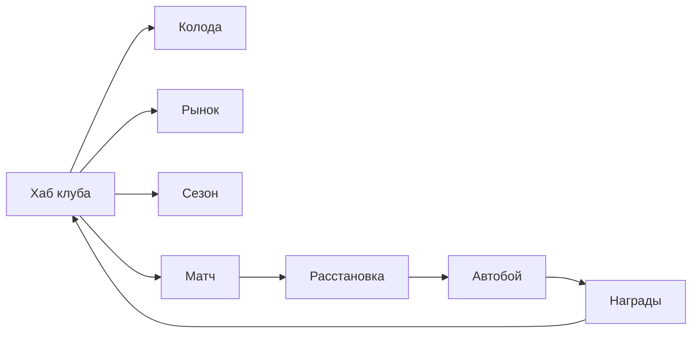

# Легенды Поля — Design Document (GDD)

| Поле | Значение |
|------|----------|
| **Slug** | `legends-of-the-pitch` |
| **Название RU** | Легенды Поля |
| **Название EN** | Legends of the Pitch |
| **Жанр** | Football CCG × Autochess × Club Management Lite |
| **Платформа** | Яндекс Игры (HTML5) |
| **Движок** | Phaser 3 + TypeScript + Vite |
| **Сегмент ЦА** | D — спорт + коллекционеры, 16–45 |
| **Приоритет** | P1 (флагман LTV) |
| **Статус дизайна** | `DRAFT` (код запрещён до `CONFIRMED`) |
| **Ключевой арт** | `refs/art/key-art.png` |

---

## Pass-2 — Feel lock (F1 демка)

> SoT feel: `management/demos/legends-pitch-demo.js` → `FEEL_DEMOS["legends-of-the-pitch"]`  
> Старый код намеренно не восстанавливать из history.

| Поле | Значение |
|------|----------|
| **Core verb** | Собери тактику из амплуа → стекни ★ в магазине → **смотри матч** |
| **Формат** | **6v6** на сетке **3×5** (core; не 11v11) |
| **Пространство** | Top-down; кружки с «ручками»; **вся сетка** для игрока и соперника |
| **Win** | Больше голов после **7** сегментов |
| **Fail** | Меньше голов к финалу |
| **Ввод** | Lineup (карта→любая клетка) → shop → fight → shop… ×7; кнопка ×2 |
| **Анти-вектор** | Старый код; телепорт мяча; пинг-понг паса; стак в центре клетки; скрытый pity; FM-Excel |

### Карта и комбо (ядро)

| Ось | Что это | Пример |
|-----|---------|--------|
| **Позиция** | любая клетка 3×5 (без «своей половины») | (0,0)…(2,4) |
| **Амплуа** | 1 на карте → веса действий | Сейвер, Отборщик, Плеймейкер, Вингер, Браконьер |
| **Тактика** | 1 TFT-трейт на карте | Пресс / Тики / Автобус / Контра / Бровки |
| **Статы** | PAC / SHT / PAS / DEF + ★ + COST | — |

**Тактика включается набором на поле** (не меню): ×2 / ×3 / ×4.  
Матч: пас / навес / отбор / перехват / удар / сейв (+ контроль); мяч **летит** (lerp+дуга); beat 0.4–1.5с на момент; без A↔B пинг-понга.

### Экономика демки (прозрачная)

| Число | Значение |
|-------|----------|
| Колода | **18** имён |
| Копий имени в мешке | **3** |
| Витрина | **3** |
| Скамейка | **7** |
| Поле | **6** |
| Merge | **3→★** |
| Ролл | равномерно из мешка (без bias / pity) |
| Тактик в колоде | ≥ **4** разных |
| Фазы | lineup → shop → fight → shop … ×7 → итог |

---

## 1. One-liner

Собери колоду футбольных героев, расставь их на поле как в autochess, досмотри зрелищный автобой со скиллами — а между матчами управляй клубом и колодой.

## 2. Видение продукта

На CIS футбол — сильный эмоциональный хук без лицензии (вымышленная Arena League). CCG даёт коллекционирование и IAP, autochess — короткую зрелищную сессию 3–6 мин, менеджмент — причину возвращаться завтра.

### Жёсткие рамки скоупа

| Делать | НЕ делать |
|--------|-----------|
| Абстрактный автобой по тикам на 5–8 слотах | Физический футбол / траектории мяча |
| Карты, синергии тегов, скиллы | Полный Football Manager / Excel-симулятор |
| 2–3 экрана межматчевого менеджмента | Календарь контрактов, зарплаты, скауты |
| Косметика стадиона/формы | Реальные клубы, имена звёзд, гербы |

## 3. Fantasy / сеттинг

- **Мир:** вымышленная лига **Arena League** — ночные стадионы, голографические карточки-игроки на газоне, неоновые линии синергий.
- **Тон:** cyber-fantasy sports — кинематографичный матч + тактический планшет менеджера.
- **Герои:** карточки с редкостью N / R / SR / UR, позициями GK / DEF / MID / FWD / FLEX и активными скиллами.
- **Косметика:** формы клуба, эффекты входа на поле, скин стадиона, рамки карт.

## 4. Целевая аудитория и мотивации

| Мотивация | Как закрываем |
|-----------|---------------|
| Коллекционирование | Паки, pity, витрина UR |
| Соревнование | MMR / сезон / лидерборд |
| Зрелище | Автобой со скиллами и VFX |
| Прогресс «моего клуба» | Форма, мораль, календарь сезона |
| Короткие сессии | Матч 3–6 мин + быстрый бот |

## 5. Двойной цикл

### A. Матч-луп (3–6 мин) — ядро удержания

1. Выбор режима (Быстрый матч / Рейтинг / Турнир).
2. Предматч: состав из колоды → расстановка на 5–8 слотах поля.
3. Добор/замена (ограниченные рероллы).
4. Автобой по тикам: линии, синергии, каст скиллов, 1 ручное вмешательство за тайм.
5. Итог → награды, MMR, прогресс сезона / pass.

### B. Межматчевый менеджмент (2–4 мин) — daily hook

1. Колода: прокачка, распыление дубликатов в пыль.
2. Клуб: форма + мораль (1–2 параметра, не симулятор).
3. Трансферный рынок (soft + hard валюта).
4. Календарь сезона: 5–10 матчей, награды за этап.

## 6. Механики MVP

### 6.1 Карты

- **Пул MVP:** 40 карт (по 8 на роль: GK, DEF, MID, FWD, FLEX).
- **Редкости:** N 50% / R 30% / SR 15% / UR 5% (pity на UR).
- **Статы:** ATK, DEF, SPD, SKL (скилл-сила), COST (очки состава).
- **Теги синергий:** Pressing, Possession, Counter, Wall, Wings, Star.

### 6.2 Поле и слоты

- Сетка слотов: типично **2–3–2** или **3–3–1** на 5–8 активных слотах.
- Слоты привязаны к зонам: DEF / MID / FWD (+ GK отдельный).
- Несовпадение роли и зоны → штраф синергии / статов.

### 6.3 Синергии

| Синергия | 2 | 3 | 4+ |
|----------|---|---|-----|
| Прессинг | +SPD линии | +шанс перехвата | глобальный темп |
| Владение | +энергия скиллов | снижение кулдауна | контроль темпа |
| Контры | +ATK после обороны | крит контр | доп. волна атаки |
| Стена | +DEF GK/DEF | блок скилла | иммунитет 1 тик |

### 6.4 Автобой

- Два тайма по N тиков (абстрактно, без физики).
- Счёт «голов» через успешные атаки линий.
- До 3 активных скиллов за матч на команду (энергия копится в бою).
- **1 ручное вмешательство за тайм:** тайм-аут / замена / форс-скилл.

### 6.5 Режимы

| Режим | Описание |
|-------|----------|
| Обучение | 1 матч vs слабого бота |
| Быстрый | vs AI, без MMR |
| Рейтинг | MMR, сезон |
| Турнир (live) | еженедельный, лидерборд |

## 7. Прогрессия и LiveOps

- **Сезон:** 4–6 недель, ранги, сезонные награды.
- **Battle Pass light:** бесплатная + премиум дорожка (карты, косметика, валюта).
- **Daily:** 3 матча с бонусом / логин / контракт клуба.
- **Weekly:** турнир на лидерборде Яндекса.

## 8. Экономика и монетизация (hybrid, IAP-heavy)

### Валюты

| Валюта | Источник | Траты |
|--------|----------|-------|
| Soft (монеты) | матчи, daily | прокачка, рынок soft |
| Hard (гемы) | IAP, pass, редкие награды | паки, удобство |
| Пыль | распыление дубликатов | крафт/ап карт |
| Энергия матча (опц.) | реген / RV | вход в рейтинг (если введём soft gate) |

### Таблица монетизации

| Источник | Триггер | Ограничения |
|----------|---------|-------------|
| Rewarded | бесплатный пак дня, реролл, +энергия | не в середине автобоя |
| Interstitial | после матча / возврат в хаб | лимиты платформы, cooldown |
| IAP | паки карт, pass, remove ads, косметика, слот колоды | без «гарантии победы» |
| Soft | прокачка, рынок | F2P темп 1-й недели проходим |

### Анти-токсик / модерация Яндекс Игр

- Pity на UR (гарантия после N паков).
- Дубликаты → пыль.
- P2W ограничен скоростью и косметикой, не «непробиваемым» статом.
- Формулировки паков без азартной лексики («шанс», «лотерея» → «набор карт», «гарантированная редкость по pity»).

### Стартовый IAP MVP

1. Стартовый пак (N/R фокус).
2. Премиум пак (SR фокус + pity progress).
3. Mega пак (UR pity progress).
4. Battle Pass.
5. Remove Ads.
6. Косметика стадиона / формы (1–2 скина).

## 9. UX / мобильный

- Онбординг: 1 учебный матч, подсказки синергий иконками.
- Крупные hit-area под палец (≥44 CSS px).
- Автобой можно ускорить ×2 (не пропускать скиллы в MVP без кнопки skip late-game).
- Облачные сохранения обязательны.
- Портрет + ландшафт: приоритет **портрет**; ландшафт — опциональный polish.

## 10. Скоуп MVP → Store Ready

| Входит | Не входит в MVP |
|--------|-----------------|
| 40 карт, data-driven JSON | 100+ карт |
| Бот + рейтинг + 1 лига | Мультиплеер realtime |
| Battle pass light | Кланы / чат |
| 3 пака + remove ads + pass | Полноценный трансферный AI |
| Лидерборд сезона | Физика мяча, 11v11 |

## 11. Технический контур (высокий уровень)

- Phaser 3 scenes: Boot → Preload → Hub → Deck → Market → MatchPrep → Autobattle → Results.
- Данные карт/синергий/паков — JSON в `src/data/`.
- SDK: init, auth, cloud save, payments, ads (RV/IS), leaderboard.
- Save: колода, прогресс карт, сезон, pass, настройки, pity counters.

## 12. Риски

| Риск | Митигация |
|------|-----------|
| Scope creep → FM | Чеклист «не делать» в DESIGN_LLM + DoR |
| Баланс карт | Тиры + data-driven + playtest table |
| Юридика IP | Только вымышленные имена/клубы |
| Модерация «азарта» | Copy pack review |
| Перегруз UI | 2–3 экрана менеджмента max |

## 13. KPI и критерии стора

- Tutorial completion ≥70%.
- 50+ матчей vs бот без краша.
- Синергии понятны за 1 матч (иконки + 1 строка).
- F2P экономика 1-й недели проходима без hard wall.
- Pass и паки проходят модерацию формулировок.
- Cloud restore после kill tab.
- Рейтинг стора цель ≥4.2.

## 14. Definition of Ready (дизайн)

Дизайн считается готовым к Gate 0 разработки только при статусе **`CONFIRMED`** в портфельном дашборде и выполнении чеклиста в `docs/DESIGN_LLM.md` § Definition of Ready.

**До `CONFIRMED` код `src/` не пишется.**
