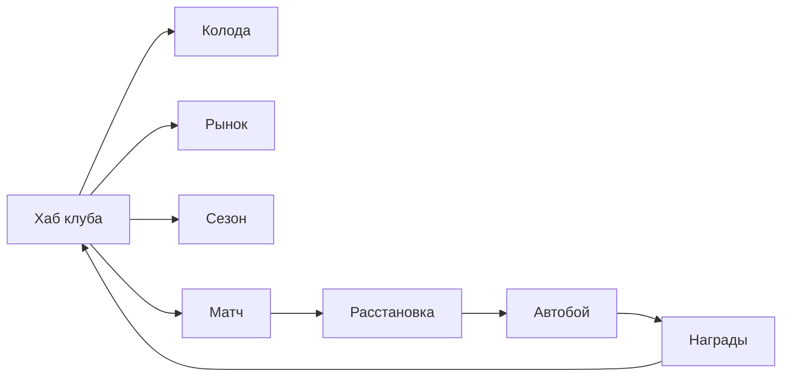

# Легенды Поля — Design Document (GDD)

| Поле | Значение |
|------|----------|
| **Slug** | `legends-of-the-pitch` |
| **Название RU** | Легенды Поля |
| **Название EN** | Legends of the Pitch |
| **Жанр** | Football CCG × Autochess × Club Management Lite |
| **Платформа** | Яндекс Игры (HTML5) |
| **Движок** | Phaser 3 + TypeScript + Vite |
| **Сегмент ЦА** | D — спорт + коллекционеры, 16–45 |
| **Приоритет** | P1 (флагман LTV) |
| **Статус дизайна** | `DRAFT` (код запрещён до `CONFIRMED`) |
| **Ключевой арт** | `refs/art/key-art.png` |

---

## Pass-2 — Feel lock (F1 демка)

> SoT feel: `management/demos/legends-pitch-demo.js` → `FEEL_DEMOS["legends-of-the-pitch"]`  
> Старый код намеренно не восстанавливать из history.

| Поле | Значение |
|------|----------|
| **Core verb** | Собери тактику из амплуа → стекни ★ в магазине → **смотри матч** |
| **Формат** | **6v6** на сетке **3×5** (core; не 11v11) |
| **Пространство** | Top-down; кружки с «ручками»; **вся сетка** для игрока и соперника |
| **Win** | Больше голов после **9** раундов (таймер 0'–90') |
| **Fail** | Меньше голов к финалу |
| **Ввод** | Lineup → **закупка** → fight → **закупка** → … ×9; соперник скрыт до свистка (1 из 5 пресетов); ×2 |
| **Анти-вектор** | Старый код; телепорт мяча между эпизодами; пинг-понг паса; стак в центре клетки; скрытый pity; FM-Excel |

### Карта и комбо (ядро)

| Ось | Что это | Пример |
|-----|---------|--------|
| **Позиция** | любая клетка 3×5 (без «своей половины») | (0,0)…(2,4) |
| **Амплуа** | 1 на карте → веса действий | Сейвер, Отборщик, Плеймейкер, Вингер, Браконьер |
| **Тактика** | 1 TFT-трейт на карте | Пресс / Тики / Автобус / Контра / Бровки |
| **Статы** | PAC / SHT / PAS / DEF + ★ + COST | — |

**Тактика включается набором на поле** (не меню): ×2 / ×3 / ×4.  
Матч: пас / навес / отбор / перехват / удар / сейв (+ контроль); мяч **летит** (lerp+дуга); beat 0.4–1.5с на момент; без A↔B пинг-понга.

### Экономика демки (кратко)

См. **§ Economy Lock** ниже — SoT для feel и будущего матч-лупа.  
Колода 18 · витрина 3 · скамейка 7 · поле 6 · 3 копии · 3→★ · равномерный мешок · ≥4 тактики.

---

## Economy Lock — матч-банк (SoT)

> Зафиксировано 2026-07-20. Источник правды для feel-демки и матч-экономики autochess-слоя.  
> **Мета-паки / IAP / pity UR** — отдельно в §8; в матч-магазине **скрытого pity нет**.

### A. Режимы и ширина колоды

| Режим | Поле | Колода (уникальных имён) | Статус |
|-------|------|--------------------------|--------|
| 4v4 | 4 | 12 | разлок ранний / обучение |
| **6v6 (core)** | **6** | **18** | **feel + MVP default** |
| 8v8 | 8 | 24 | mid progress |
| 11v11 | 11 | 30+ | late / fantasy mode |

Шире режим → шире колода и мешок. Числа ниже — для **6v6 core**, пока не сказано иначе.

### B. Матч-магазин (6v6) — жёсткие числа

| Параметр | Значение | Зачем |
|----------|----------|-------|
| Уникальных имён в колоде | **18** | читаемый пул на сессию |
| Копий каждого имени в мешке | **3** | merge 3→★ без бездонного спама |
| Размер мешка | **54** (= 18×3) | прозрачная математика |
| Витрина | **3** слота | мобильный тап |
| Скамейка | **7** | запас под свапы / merge |
| На поле | **6** | формат 6v6 |
| Merge | **ровно 3 одинаковых ★1 → одна ★2** | TFT-стек, без скрытых ступеней |
| Ролл витрины | **равномерно** из текущего мешка | без owned-bias, без hidden pity |
| Тактик в колоде | **≥ 4** разных | чтобы TFT-стаки были выбором, не автопилотом |
| Реролл | **2 soft** за обновление витрины | давление на золото |
| Старт soft (сегмент) | **10** | хватает на 1–2 реролла + покупки |
| Доход между раундами | **+3 + номер раунда** | темп **9** раундов |
| Раундов матча | **9** (таймер **0'→90'**, по 10' на раунд) | win/fail по голам; **закупка между раундами** |

**Покупка:** карта уходит из мешка (копия имени снимается).  
**Продажа:** soft назад (обычно `cost−1`, min 1); в мешок **не возвращаем** (анти-эксплойт реролла).

### C. Вероятность (целевая)

При полном мешке 54 и 3 копиях имени:

- P(конкретное имя в **одном** слоте витрины) = `3/54` ≈ **5.6%**
- P(конкретное имя **хотя бы в одном** из 3 слотов) ≈ `1 − (51/54)³` ≈ **15.7% ≈ 16%**

Это и есть целевой feel «вижу нужного героя достаточно часто, но не гарантированно».  
Любой bias / pity / «умная витрина» **ломает** этот контракт — запрещены в матч-лупе.

### D. Банк контента (имена / амплуа / тактики)

Два слоя:

| Слой | Что | Объём (lock) |
|------|-----|----------------|
| **Match deck** | имена, попавшие в мешок этой сессии | ровно **18** (6v6) |
| **Content bank** | полный пул вымышленных героев для набора колоды / прогрессии | старт **~24** имени → рост к 40+ в MVP |

**Тактики (TFT-трейты), старт — 6:**

| id | RU | Feel на поле |
|----|-----|--------------|
| press | Пресс / Gegenpress | отборы, перехваты |
| tiki | Тики / Tiki-Taka | короткие пасы |
| bus | Автобус / Park Bus | блок, выносы, меньше ударов |
| counter | Контра | пас вперёд → удар |
| wing | Бровки / Wing Play | навесы |
| route | Route One | длинные подачи + удар (опц. в банке) |

Feel-демка может стартовать с **5** тактик на поле, но в колоде сессии всё равно **≥4**.

**Амплуа (1 на карте) → веса действий**, минимум:

| Амплуа | Роль | Акцент |
|--------|------|--------|
| Сейвер | GK | сейв / вынос |
| Отборщик | DEF/MID | отбор / перехват |
| Плеймейкер | MID | пас |
| Вингер | WING | навес / дриблинг |
| Браконьер | FWD | удар |
| Бокс-мид | MID | пас + отбор (гибрид) |

**Оси карты (lock):** `имя · амплуа · тактика · PAC/SHT/PAS/DEF · ★ · COST`.  
Ульта / скилл-кнопка — не обязательны для feel; amp+tactic уже задают картинку матча.

**Стартовый content bank (~24 имени, вымысел):**  
Мороз, Холм, Круз, Риф, Нова, Кип, Клык, Коста, Рей, Окафор, Брант, Ила, Волк, Дрейк, Ларс, Найт, Сато, Бриз, Рока, Феликс, Аида, Шрам, Юна, Мира.  
Feel может подставить короткий alias-набор (18 из банка) — **правила мешка не меняются**.

### E. Что НЕ делать в матч-экономике

| Запрет | Почему |
|--------|--------|
| Hidden pity / «гарантия на N-м реролле» | ломает прозрачность и P≈16% |
| Bias витрины к уже купленным | форсит merge раньше тактики |
| Возврат проданного в мешок | реролл-эксплойт |
| Случайный COST в витрине вне карты | игрок не читает цену с карты |
| Магазин как gacha-пак | матч ≠ мета-пак (§8) |

### F. Связь с метой (§8)

- **Матч-мешок** = runtime-экономика одного матча (этот раздел).  
- **Мета-коллекция** = owned cards, паки, пыль, UR pity — §8.  
- Паки наполняют **content bank / owned**, но **не** подменяют правила ролла витрины внутри матча.

---

## 1. One-liner

Собери колоду футбольных героев, расставь их на поле как в autochess, досмотри зрелищный автобой со скиллами — а между матчами управляй клубом и колодой.

## 2. Видение продукта

На CIS футбол — сильный эмоциональный хук без лицензии (вымышленная Arena League). CCG даёт коллекционирование и IAP, autochess — короткую зрелищную сессию 3–6 мин, менеджмент — причину возвращаться завтра.

### Жёсткие рамки скоупа

| Делать | НЕ делать |
|--------|-----------|
| Абстрактный автобой по тикам на 5–8 слотах | Физический футбол / траектории мяча |
| Карты, синергии тегов, скиллы | Полный Football Manager / Excel-симулятор |
| 2–3 экрана межматчевого менеджмента | Календарь контрактов, зарплаты, скауты |
| Косметика стадиона/формы | Реальные клубы, имена звёзд, гербы |

## 3. Fantasy / сеттинг

- **Мир:** вымышленная лига **Arena League** — ночные стадионы, голографические карточки-игроки на газоне, неоновые линии синергий.
- **Тон:** cyber-fantasy sports — кинематографичный матч + тактический планшет менеджера.
- **Герои:** карточки с редкостью N / R / SR / UR, позициями GK / DEF / MID / FWD / FLEX и активными скиллами.
- **Косметика:** формы клуба, эффекты входа на поле, скин стадиона, рамки карт.

## 4. Целевая аудитория и мотивации

| Мотивация | Как закрываем |
|-----------|---------------|
| Коллекционирование | Паки, pity, витрина UR |
| Соревнование | MMR / сезон / лидерборд |
| Зрелище | Автобой со скиллами и VFX |
| Прогресс «моего клуба» | Форма, мораль, календарь сезона |
| Короткие сессии | Матч 3–6 мин + быстрый бот |

## 5. Двойной цикл

### A. Матч-луп (3–6 мин) — ядро удержания

1. Выбор режима (Быстрый матч / Рейтинг / Турнир).
2. Предматч: состав из колоды → расстановка на 5–8 слотах поля.
3. Добор/замена (ограниченные рероллы).
4. Автобой по тикам: линии, синергии, каст скиллов, 1 ручное вмешательство за тайм.
5. Итог → награды, MMR, прогресс сезона / pass.

### B. Межматчевый менеджмент (2–4 мин) — daily hook

1. Колода: прокачка, распыление дубликатов в пыль.
2. Клуб: форма + мораль (1–2 параметра, не симулятор).
3. Трансферный рынок (soft + hard валюта).
4. Календарь сезона: 5–10 матчей, награды за этап.

## 6. Механики MVP

### 6.1 Карты и матч-банк

SoT чисел и мешка: **§ Economy Lock**. Кратко:

- Карта = **1 амплуа + 1 тактика** + PAC/SHT/PAS/DEF + ★ + COST.
- Content bank старт ~24 имени / 6 тактик → рост к **40+** в MVP.
- Match deck 6v6 = **18** имён × **3** копии в мешке; витрина 3; скамейка 7; merge 3→★.
- Редкости N/R/SR/UR и pity — только для **мета-паков** (§8), не для витрины матча.

### 6.2 Поле и позиции

- Feel/core: сетка **3×5**, **вся сетка** доступна обеим командам (не «своя половина»).
- Формат поля: **6v6** core; разлок 4v4 → 6v6 → 8v8 → 11v11 (§ Economy Lock A).
- Зона роли (GK/DEF/MID/WING/FWD) — ярлык амплуа; клетка выбирается свободно.

### 6.3 Синергии (тактики TFT)

Тактика на карте стакается набором на поле: **×2 / ×3 / ×4** (не меню).

| Тактика | ×2 | ×3 | ×4 |
|---------|----|----|-----|
| Пресс | +отборы | +перехваты | глобальный темп пресса |
| Тики | +короткие пасы | контроль темпа | реже потери |
| Автобус | +блок/вынос | меньше ударов соперника | «стена» |
| Контра | +пас вперёд | +удар после отбора | быстрая волна |
| Бровки | +навесы | +удар с фланга | доминирование флангов |

### 6.4 Автобой

- Два тайма по N тиков (абстрактно, без физики).
- Счёт «голов» через успешные атаки линий.
- До 3 активных скиллов за матч на команду (энергия копится в бою).
- **1 ручное вмешательство за тайм:** тайм-аут / замена / форс-скилл.

### 6.5 Режимы

| Режим | Описание |
|-------|----------|
| Обучение | 1 матч vs слабого бота |
| Быстрый | vs AI, без MMR |
| Рейтинг | MMR, сезон |
| Турнир (live) | еженедельный, лидерборд |

## 7. Прогрессия и LiveOps

- **Сезон:** 4–6 недель, ранги, сезонные награды.
- **Battle Pass light:** бесплатная + премиум дорожка (карты, косметика, валюта).
- **Daily:** 3 матча с бонусом / логин / контракт клуба.
- **Weekly:** турнир на лидерборде Яндекса.

## 8. Экономика и монетизация (hybrid, IAP-heavy)

### Валюты

| Валюта | Источник | Траты |
|--------|----------|-------|
| Soft (монеты) | матчи, daily | прокачка, рынок soft |
| Hard (гемы) | IAP, pass, редкие награды | паки, удобство |
| Пыль | распыление дубликатов | крафт/ап карт |
| Энергия матча (опц.) | реген / RV | вход в рейтинг (если введём soft gate) |

### Таблица монетизации

| Источник | Триггер | Ограничения |
|----------|---------|-------------|
| Rewarded | бесплатный пак дня, реролл, +энергия | не в середине автобоя |
| Interstitial | после матча / возврат в хаб | лимиты платформы, cooldown |
| IAP | паки карт, pass, remove ads, косметика, слот колоды | без «гарантии победы» |
| Soft | прокачка, рынок | F2P темп 1-й недели проходим |

### Анти-токсик / модерация Яндекс Игр

- Pity на UR (гарантия после N паков).
- Дубликаты → пыль.
- P2W ограничен скоростью и косметикой, не «непробиваемым» статом.
- Формулировки паков без азартной лексики («шанс», «лотерея» → «набор карт», «гарантированная редкость по pity»).

### Стартовый IAP MVP

1. Стартовый пак (N/R фокус).
2. Премиум пак (SR фокус + pity progress).
3. Mega пак (UR pity progress).
4. Battle Pass.
5. Remove Ads.
6. Косметика стадиона / формы (1–2 скина).

## 9. UX / мобильный

- Онбординг: 1 учебный матч, подсказки синергий иконками.
- Крупные hit-area под палец (≥44 CSS px).
- Автобой можно ускорить ×2 (не пропускать скиллы в MVP без кнопки skip late-game).
- Облачные сохранения обязательны.
- Портрет + ландшафт: приоритет **портрет**; ландшафт — опциональный polish.

## 10. Скоуп MVP → Store Ready

| Входит | Не входит в MVP |
|--------|-----------------|
| 40 карт, data-driven JSON | 100+ карт |
| Бот + рейтинг + 1 лига | Мультиплеер realtime |
| Battle pass light | Кланы / чат |
| 3 пака + remove ads + pass | Полноценный трансферный AI |
| Лидерборд сезона | Физика мяча, 11v11 |

## 11. Технический контур (высокий уровень)

- Phaser 3 scenes: Boot → Preload → Hub → Deck → Market → MatchPrep → Autobattle → Results.
- Данные карт/синергий/паков — JSON в `src/data/`.
- SDK: init, auth, cloud save, payments, ads (RV/IS), leaderboard.
- Save: колода, прогресс карт, сезон, pass, настройки, pity counters.

## 12. Риски

| Риск | Митигация |
|------|-----------|
| Scope creep → FM | Чеклист «не делать» в DESIGN_LLM + DoR |
| Баланс карт | Тиры + data-driven + playtest table |
| Юридика IP | Только вымышленные имена/клубы |
| Модерация «азарта» | Copy pack review |
| Перегруз UI | 2–3 экрана менеджмента max |

## 13. KPI и критерии стора

- Tutorial completion ≥70%.
- 50+ матчей vs бот без краша.
- Синергии понятны за 1 матч (иконки + 1 строка).
- F2P экономика 1-й недели проходима без hard wall.
- Pass и паки проходят модерацию формулировок.
- Cloud restore после kill tab.
- Рейтинг стора цель ≥4.2.

## 14. Definition of Ready (дизайн)

Дизайн считается готовым к Gate 0 разработки только при статусе **`CONFIRMED`** в портфельном дашборде и выполнении чеклиста в `docs/DESIGN_LLM.md` § Definition of Ready.

**До `CONFIRMED` код `src/` не пишется.**
