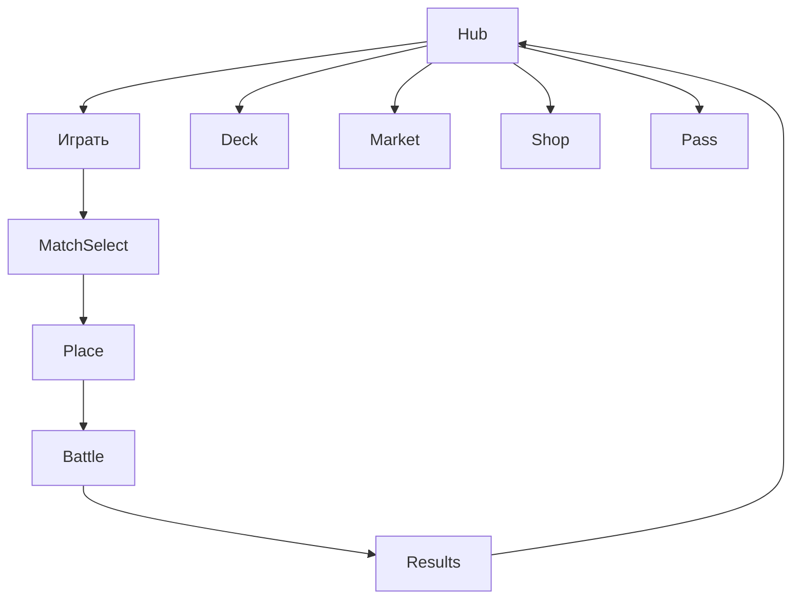

# Легенды Поля — DESIGN_LLM (исполняемая спецификация)

> **Аудитория файла:** LLM-агенты (арт, UI, уровни, код).  
> **Язык:** русский.  
> **Правило:** разработка кода (`src/`) **запрещена**, пока статус дизайна ≠ `CONFIRMED`.  
> **Классический GDD:** `docs/DESIGN.md`.  
> **Атомарные промпты:** `prompts/*.md` (вырезки; при конфликте побеждает этот файл).

---

## 0. Мета-контракт

| Поле | Значение |
|------|----------|
| slug | `legends-of-the-pitch` |
| title_ru | Легенды Поля |
| title_en | Legends of the Pitch |
| engine | Phaser 3 + TypeScript + Vite |
| platform | Яндекс Игры |
| orientation_primary | portrait (720×1280 logical) |
| design_status | `DRAFT` |
| coding_allowed | `false` until `CONFIRMED` |
| concept_ref | `docs/concepts/04-legends-of-the-pitch.md` |
| key_art | `games/legends-of-the-pitch/refs/art/key-art.png` |

### 0.1 Запреты скоупа (жёстко)

1. Нет физической симуляции мяча / 11v11 / камеры за мячом.  
2. Нет полноценного Football Manager (зарплаты, скауты, травмы сезона, переговоры).  
3. Нет realtime PvP в MVP.  
4. Нет реальных клубов, имён игроков, гербов, лицензий.  
5. Автобой = тиковая абстракция на **5–8 слотах**.

---

## 1. Project contract — структура репозитория игры

```text
games/legends-of-the-pitch/
├── docs/
│   ├── DESIGN.md
│   └── DESIGN_LLM.md          ← этот файл
├── prompts/
│   ├── ART_PROMPTS.md
│   ├── SPRITE_ANIM_PROMPTS.md
│   ├── UI_PROMPTS.md
│   ├── LEVEL_PROMPTS.md
│   └── CODE_AGENT_PROMPT.md
├── refs/
│   ├── art/
│   ├── ui/
│   ├── levels/
│   └── sprites/
├── public/
│   └── assets/                ← финальные ассеты для рантайма
│       ├── images/
│       ├── atlases/
│       ├── audio/
│       └── data/
├── src/                       ← НЕ создавать до CONFIRMED
│   ├── main.ts
│   ├── scenes/
│   ├── systems/
│   ├── ui/
│   ├── data/
│   └── sdk/
├── index.html
├── package.json
├── tsconfig.json
├── vite.config.ts
├── STATUS.md
└── STORE_CHECKLIST.md
```

### 1.1 Naming conventions

| Сущность | Правило | Пример |
|----------|---------|--------|
| Файлы TS | `PascalCase` классы, `camelCase` файлы сцен | `autobattleScene.ts` |
| JSON data | `kebab-case` | `cards-roster.json` |
| Asset ID | `{domain}_{name}_{variant}` | `card_fwd_blaze_n` |
| Texture key Phaser | = Asset ID | `card_fwd_blaze_n` |
| Atlas | `atlas_{domain}_{pack}` | `atlas_cards_n` |
| Scene key | `SC_{Name}` | `SC_Hub` |
| Event bus | `EVT_{Domain}_{Action}` | `EVT_Match_Goal` |
| Save keys | `lotp_{snake}` | `lotp_deck_v1` |

### 1.2 Asset ID schema (канон)

```text
{domain}_{subject}_{qualifier?} _{tier?}

domains:
  ui_     — UI chrome, кнопки, панели
  bg_     — фоны экранов
  pitch_  — поле, слоты, линии
  card_   — портреты/рамки карт
  syn_    — иконки синергий
  vfx_    — эффекты боя
  fx_ui_  — UI-частицы
  ico_    — мелкие иконки валют/ролей
  char_   — менеджер / NPC (если есть)
  sfx_    — звуки
  bgm_    — музыка
```

Примеры:
- `card_gk_aegis_sr`
- `pitch_slot_active`
- `syn_pressing_3`
- `vfx_skill_snooker_shot`
- `ui_btn_primary_up`
- `ico_currency_gems`

### 1.3 Logical resolution

- Design canvas: **720×1280**.  
- Safe area insets: top 48 / bottom 64 / sides 24.  
- UI scale: все hit-targets ≥ 64×64 logical (палец).

---

## 2. Gameplay systems (с Acceptance Criteria)

### 2.1 Card System

**Описание:** карта = юнит состава с ролью, редкостью, статами, тегами, скиллом.

**Данные (`public/assets/data/cards-roster.json`):**

```json
{
  "id": "card_fwd_blaze_sr",
  "name_ru": "Блейз",
  "role": "FWD",
  "rarity": "SR",
  "cost": 3,
  "tags": ["Counter", "Star"],
  "base": { "atk": 12, "def": 4, "spd": 9, "skl": 8 },
  "skillId": "skill_snooker_shot",
  "portrait": "card_fwd_blaze_sr",
  "frame": "ui_card_frame_sr"
}
```

**AC:**
- [ ] AC-CARD-01: ровно 40 карт в MVP (8×5 ролей).  
- [ ] AC-CARD-02: каждая карта валидируется схемой (role/rarity/tags/skillId).  
- [ ] AC-CARD-03: дубликат карты увеличивает `copies`, не создаёт второй entity.  
- [ ] AC-CARD-04: прокачка 1→10 меняет статы по таблице `card-level-curve.json`.  
- [ ] AC-CARD-05: распыление даёт пыль по rarity table.

### 2.2 Deck & Squad Cost

**Описание:** колода до 20 карт; на матч выбирается состав с лимитом COST (базовый 18).

> **SoT матч-банка / витрины / мешка:** `DESIGN.md` → **Economy Lock — матч-банк**  
> (6v6: 18 имён × 3 копии, витрина 3, скамейка 7, merge 3→★, равномерный ролл, P≈16%).  
> Meta-паки и UR pity сюда не смешивать.

**AC:**
- [ ] AC-DECK-01: нельзя выйти на поле при сумме cost > limit.  
- [ ] AC-DECK-02: минимум 1 GK в составе (если слот GK активен).  
- [ ] AC-DECK-03: сохранение колоды в cloud save в течение 1 с после изменения.  
- [ ] AC-DECK-04: 2 пресета колод в MVP (3-й — IAP «слот колоды»).
- [ ] AC-BAG-01: витрина матча роллится равномерно из мешка без bias/pity.  
- [ ] AC-BAG-02: P(имя хотя бы в 1/3 слотов) ≈ 16% при полном мешке 54.  
- [ ] AC-BAG-03: продажа не возвращает копию в мешок.

### 2.3 Pitch Placement (Autochess board)

**Описание:** сетка 3×5, вся сетка для обеих команд; core формат 6v6 (см. DESIGN Economy Lock).

**Каноническая схема слотов MVP (7 слотов + GK):**

```text
        [FWD1]  [FWD2]
   [MID1] [MID2] [MID3]
        [DEF1]  [DEF2]
            [GK]
```

Слоты имеют `zone`, `slotId`, `allowedRoles[]`.

**AC:**
- [ ] AC-PLACE-01: drag-and-drop карты на слот с валидацией роли.  
- [ ] AC-PLACE-02: невалидный дроп = snap-back + toast.  
- [ ] AC-PLACE-03: реролл состава: 2 бесплатных / матч, далее RV или soft.  
- [ ] AC-PLACE-04: таймер подготовки рейтинга 45 с (бот — без таймера).  
- [ ] AC-PLACE-05: кнопка «Авторасстановка» заполняет по роли/cost жадно.

### 2.4 Synergy System

**Теги:** `Pressing`, `Possession`, `Counter`, `Wall`, `Wings`, `Star`.

**Пороги:** 2 / 3 / 4+.

**AC:**
- [ ] AC-SYN-01: панель синергий обновляется live при расстановке.  
- [ ] AC-SYN-02: бонусы применяются только при старте боя (snapshot).  
- [ ] AC-SYN-03: иконка синергии читаема без текста на расстоянии UI.  
- [ ] AC-SYN-04: тултип 1 строка + числа бонуса.

### 2.5 Autobattle Tick Engine

**Модель:** не физика. Тики = дискретные раунды.

Параметры MVP:
- Тайм = 12 тиков.  
- Матч = 2 тайма.  
- Каждый тик: initiative sort by SPD → resolve actions → skills → score check.  
- Гол: атака линии FWD vs DEF/GK по формуле:

```text
chance = clamp(0.05, 0.65,
  0.25 + 0.03*(ATK_line - DEF_line) + synergyMods + skillMods)
```

**Ручное вмешательство (1 / тайм):**
- `Timeout` — пауза 5 с UI + небольшой бафф следующей атаки.  
- `Sub` — замена 1 карты из скамейки (скамейка 2 карты).  
- `ForceSkill` — мгновенно заряжает 30% энергии скилла.

**AC:**
- [ ] AC-BAT-01: бой детерминирован при фиксированном seed (replay debug).  
- [ ] AC-BAT-02: скилл кастуется только при energy ≥ cost.  
- [ ] AC-BAT-03: вмешательство недоступно, если уже использовано в тайме.  
- [ ] AC-BAT-04: скорость ×1 / ×2; UI не ломает hit-targets.  
- [ ] AC-BAT-05: при голе — VFX + SFX + счётчик; бой не зависает.  
- [ ] AC-BAT-06: полный матч ≤ 90 с wall-clock на ×2.  
- [ ] AC-BAT-07: нет softlock при 0–0 после 2 таймов → penalty mini-resolve (3 удара абстрактно).

### 2.6 Skills

Пул MVP: 12 скиллов (переиспользуются картами).

| skillId | Имя RU | Эффект |
|---------|--------|--------|
| skill_snooker_shot | Снукер-удар | +гол chance FWD 1 тик |
| skill_wall | Стена | +DEF линии 2 тика |
| skill_counter | Контратака | если пропустили атаку — ответный шанс |
| skill_press | Прессинг | −SPD врага 2 тика |
| skill_maestro | Маэстро | +энергия всем MID |
| skill_aegis | Эгида | GK блок следующего гола (50%) |

**AC:**
- [ ] AC-SKL-01: визуальный телеграф 0.3 с до каста.  
- [ ] AC-SKL-02: текст скилла ≤ 90 символов.  
- [ ] AC-SKL-03: скилл не может зациклить бой (hard cap 1 каст / карта / 3 тика).

### 2.7 AI Opponent

- Тiers: Easy / Normal / Hard.  
- Бот собирает состав из пула по budget и предпочитает 1 синергию.  
- Hard добавляет UR-weight и правильные зоны.

**AC:**
- [ ] AC-AI-01: Easy winrate новичка ≥ 80% в туториале.  
- [ ] AC-AI-02: Normal winrate F2P week1 ≈ 45–55%.  
- [ ] AC-AI-03: бот всегда валидный состав (cost/GK).

### 2.8 Club Management Lite

Параметры:
- `form` 0–100 (влияет на ATK ±5%).  
- `morale` 0–100 (влияет на SKL energy gain ±5%).  
- Daily contract: сыграй N матчей → soft reward.

**AC:**
- [ ] AC-CLUB-01: экраны менеджмента ≤ 3 (Club, Deck, Market).  
- [ ] AC-CLUB-02: form/morale меняются предсказуемо (таблица, не скрытый RNG).  
- [ ] AC-CLUB-03: нет экранов зарплат/травм/переговоров.

### 2.9 Transfer Market

- Ежедневный оффер 3–5 карт за soft/hard.  
- Refresh: 1 free / day, далее RV.

**AC:**
- [ ] AC-MKT-01: нельзя купить за soft карту UR (UR только hard/packs/pass).  
- [ ] AC-MKT-02: покупка идемпотентна (двойной тап не списывает дважды).

### 2.10 Season / MMR / Pass

- MMR start 1000; K-factor 24.  
- Season length config 42 days.  
- Pass: 20 уровней light, free + premium tracks.

**AC:**
- [ ] AC-SEA-01: лидерборд сезона через Yandex Leaderboard API.  
- [ ] AC-SEA-02: pass XP за матч + daily.  
- [ ] AC-SEA-03: premium pass — one-time IAP per season.

### 2.11 Packs / Pity / Monetization Hooks

Pity: UR гарантирован на 40-м премиум-паке (counter persistent).

**AC:**
- [ ] AC-PAY-01: copy паков без слов « ass / лотерея / ставка».  
- [ ] AC-PAY-02: RV daily pack 1/day.  
- [ ] AC-PAY-03: interstitial только post-match / hub enter, с cooldown.  
- [ ] AC-PAY-04: remove ads отключает interstitial, RV остаётся opt-in.  
- [ ] AC-PAY-05: mock payments работают в dev без SDK.

### 2.12 Save / Cloud

Save payload v1:
- deck, ownedCards, currencies, pity, season, pass, settings, tutorialFlags, clubStats.

**AC:**
- [ ] AC-SAVE-01: kill tab mid-battle → результат не начисляется дважды; прогресс prep сохраняется.  
- [ ] AC-SAVE-02: cloud sync на pause/visibilitychange/match end.  
- [ ] AC-SAVE-03: миграция версии save (`v1` → future).

---

## 3. Level / content design grammar

> «Уровни» = матчи/сиды/календарь сезона + туториальные сценарии.  
> Доска = pitch slots; контент описывается декларативно.

### 3.1 Как матч LOOKS

1. Фон стадиона ночь (`bg_stadium_night_01`).  
2. Газон с неоновыми линиями синергий.  
3. Карточки стоят в слотах (вертикальные, glow по rarity).  
4. HUD: счёт, тайм, энергия скиллов, кнопка вмешательства.  
5. Мяч — **декоративный VFX-токен**, не физический объект геймплея.

### 3.2 Как матч PLAYS

1. Prep → подтверждение.  
2. Kickoff cinematic ≤ 1.5 с.  
3. Тики считываются игроком через: движение glow линий, pop ATK/DEF, skill banners.  
4. Гол = camera punch 0.15 с + crowd SFX.  
5. Half-time sheet 2 с.  
6. Full-time → Results.

### 3.3 Match recipes (грамматика)

```yaml
match_recipe:
  id: season_w1_m3
  mode: ranked|quick|tutorial|tournament
  seed: number
  opponent_tier: easy|normal|hard
  opponent_synergy_bias: [Pressing]
  board_layout: layout_732_gk
  modifiers: []          # future: rain = -SPD
  rewards:
    soft: [80, 120]
    xp_pass: 20
    card_chance: 0.1
```

### 3.4 Tutorial script (обязательный)

| Step | Экран | Цель | Fail condition |
|------|-------|------|----------------|
| T1 | Hub | Нажать «Матч» | — |
| T2 | Place | Поставить FWD в FWD-слот | timeout 60s → auto |
| T3 | Place | Увидеть синергию 2 | — |
| T4 | Battle | Использовать вмешательство | skipable after 10s |
| T5 | Results | Забрать награду | — |

**AC:** tutorial completable ≤ 4 мин; skip доступен после T3 для returning users.

### 3.5 Difficulty curve (недели 1–4)

| Неделя | Opponent | Цель winrate | Unlock |
|--------|----------|--------------|--------|
| W0 tutorial | Easy fixed | ≥90% | — |
| W1 | Easy→Normal | 60–70% | Market |
| W2 | Normal | 50–60% | Synergy Wall/Wings |
| W3 | Normal+bias | 45–55% | Ranked |
| W4 | Hard spikes | 40–50% | Tournament |

### 3.6 Season calendar grammar

- 8 матчей сезона PvE ladder + ranked infinite.  
- Каждый 3-й матч = «derby» (бонус soft, harder bias).  
- Финал сезона = boss-bot с 2 синергиями 3+.

### 3.7 Content volume MVP

| Контент | Кол-во |
|---------|--------|
| Карты | 40 |
| Скиллы | 12 |
| Синергии | 6 |
| Layouts поля | 2 (`layout_732_gk`, `layout_532`) |
| Стадионы BG | 2 |
| Формы косметика | 2 |
| Pack definitions | 3 + daily RV |
| Pass levels | 20 |
| Tutorial matches | 1 |
| Season scripted | 8 |

---

## 4. UI component map + wireframes

### 4.1 Screen inventory

| Screen ID | Имя | Входы | Выходы |
|-----------|-----|-------|--------|
| SC_Boot | Boot | start | SC_Preload |
| SC_Preload | Preload | Boot | SC_Hub |
| SC_Hub | Хаб клуба | many | Match/Deck/Market/Pass/Shop |
| SC_Deck | Колода | Hub | Hub / CardDetail |
| SC_CardDetail | Карточка | Deck | Deck |
| SC_Market | Рынок | Hub | Hub |
| SC_Pass | Battle Pass | Hub | Hub |
| SC_Shop | Магазин | Hub | Hub |
| SC_MatchSelect | Выбор режима | Hub | SC_Place |
| SC_Place | Расстановка | MatchSelect | SC_Battle / Hub |
| SC_Battle | Автобой | Place | SC_Results |
| SC_Results | Итог | Battle | Hub / MatchSelect |
| SC_Settings | Настройки | Hub | Hub |

### 4.2 Wireframe — Hub

```text
┌────────────────────────────┐
│ ☰  Легенды Поля    💰 💎  │
│ ┌────────────────────────┐ │
│ │   CLUB BANNER / FORM   │ │
│ │   morale ●●●○○         │ │
│ └────────────────────────┘ │
│  [ Сезон ]  MMR 1240       │
│  [ Pass  ]  Lv 7           │
│                            │
│     ┌──────────────┐       │
│     │   ИГРАТЬ ▶   │       │
│     └──────────────┘       │
│ [Колода][Рынок][Магазин]   │
└────────────────────────────┘
```



### 4.3 Wireframe — Placement

```text
┌────────────────────────────┐
│ Назад   Состав 12/18  ⟳×2  │
│ ┌────────────────────────┐ │
│ │   FWD  FWD             │ │
│ │ MID MID MID            │ │
│ │   DEF  DEF             │ │
│ │      GK                │ │
│ └────────────────────────┘ │
│ Синергии: [Press 2][★ 1]   │
│ ┌────┬────┬────┬────┐      │
│ │card│card│card│card│ hand │
│ └────┴────┴────┴────┘      │
│      [ В БОЙ ]             │
└────────────────────────────┘
```

### 4.4 Wireframe — Autobattle

```text
┌────────────────────────────┐
│ 2:1   Тайм 1  Тик 7/12     │
│ ┌────────────────────────┐ │
│ │   cards on pitch+VFX   │ │
│ └────────────────────────┘ │
│ SKL [====----] ⚡          │
│ [Тайм-аут][Замена][Скилл]  │
│              ×1 / ×2       │
└────────────────────────────┘
```

### 4.5 Wireframe — Results

```text
┌────────────────────────────┐
│      ПОБЕДА  3:2           │
│   MMR +18 → 1258           │
│   +110💰  +20 Pass XP      │
│   [Карта?] [OK]            │
│   (ad slot interstitial)   │
└────────────────────────────┘
```

### 4.6 UI components (атомы)

| Component | Asset IDs | Поведение |
|-----------|-----------|-----------|
| `BtnPrimary` | `ui_btn_primary_{up,down,dis}` | CTA |
| `BtnSecondary` | `ui_btn_secondary_*` | secondary |
| `CurrencyBar` | `ico_currency_{soft,hard,dust}` | tap → shop |
| `CardView` | frame+portrait+role badge | tap detail / drag |
| `SlotView` | `pitch_slot_{empty,valid,invalid}` | drop target |
| `SynergyChip` | `syn_{tag}_{2,3,4}` | tooltip |
| `SkillBanner` | `ui_skill_banner` | 0.8s show |
| `ModalDialog` | `ui_modal_panel` | confirm RV/IAP |
| `Toast` | — | 2s message |
| `PassTrack` | `ui_pass_node_*` | scroll horizontal |
| `PackCard` | `ui_pack_{daily,premium,mega}` | buy/open |

### 4.7 Navigation rules

- Back всегда сохраняет state.  
- Во время Battle системная «назад» → confirm forfeit (ranked: поражение).  
- Магазин доступен из Hub и Results soft-prompt (не hard gate).

---

## 5. Art bible

### 5.1 Style locks

- **Жанр визуала:** cyber-fantasy sports, cinematic night stadium.  
- **Камеры:** low-angle hero для key art; in-game — top-ish isometric lite / orthographic pitch.  
- **Карты:** вертикальные голографические, rarity glow.  
- **UI:** holographic glass panels, тонкие neon edges, высокая контрастность текста.  
- **НЕ:** cartoon chibi, пиксель-арт, реалистичный фотоколлаж реальных лиц, дневной «любительский» стадион.

### 5.2 Palette (hex)

| Token | Hex | Использование |
|-------|-----|---------------|
| `night_navy` | `#0B1B33` | фон UI |
| `pitch_green` | `#1F6B3A` | газон base |
| `pitch_neon` | `#3DFF9A` | линии синергий |
| `crowd_silhouette` | `#050A12` | толпа |
| `glow_cyan` | `#3DE7FF` | мяч/энергия |
| `glow_gold` | `#FFC84A` | UR / CTA |
| `glow_purple` | `#A85CFF` | SR / magic |
| `glow_red` | `#FF4B5C` | атака / Counter |
| `glow_blue` | `#4B7BFF` | Possession |
| `text_primary` | `#F2F7FF` | заголовки |
| `text_muted` | `#9AA8C2` | secondary |
| `danger` | `#FF5A5A` | ошибки |
| `success` | `#3DFF9A` | победа |

### 5.3 Rarity colors

| Rarity | Glow |
|--------|------|
| N | `#8A9BB5` |
| R | `#4B7BFF` |
| SR | `#A85CFF` |
| UR | `#FFC84A` + particle |

### 5.4 Do / Don't

**Do:**
- Читаемые силуэты ролей на портретах.  
- Neon accents на тёмном фоне.  
- Единые рамки карт.  
- VFX короткоживущие (≤1 с), не перекрывают HUD.

**Don't:**
- Реальные бренды/логотипы.  
- Красный текст на зелёном газоне без обводки.  
- Перегруженные particle walls.  
- Мелкий текст < 22 px logical.

### 5.5 Typography

- Display: geometric sans с «спорт-кибер» характером (не Inter/Roboto как бренд-лок).  
- Рекомендация ассета шрифта: подключить `Font_ArenaDisplay` + `Font_ArenaBody` (лицензия свободная / собственная вырезка).  
- Числа счёта — tabular lining.

---

## 6. Copy-paste image generation prompts (ключевые)

> Полный набор — в `prompts/ART_PROMPTS.md`. Здесь канон.

### 6.1 Key art (уже есть референс)

```text
Cinematic night football stadium, low angle, glowing holographic player cards standing on green pitch as tactical units, neon synergy lines connecting positions, cyber-fantasy sports, crowd silhouettes in foreground, manager holding holographic tablet mini-map, cyan energy football trail, volumetric stadium lights, highly detailed, mobile game key art, no real team logos, no readable trademarks
```

### 6.2 Environment — pitch battle BG

```text
Top-down slight perspective football pitch at night for mobile game background, dark green grass, subtle neon tactical grid, stadium lights bloom, empty of players, space in center for card slots UI, cyber sports aesthetic, 9:16, no text, no logos
```

### 6.3 Character card portrait template

```text
Vertical football hero portrait for collectible card, {ROLE} pose, fictional athlete, {RARITY} aura {COLOR}, cyber-fantasy jersey, dramatic rim light, clean readable silhouette, centered composition, no real person likeness, no club crest, solid dark backdrop
```

### 6.4 VFX stills

```text
Mobile game VFX sheet on transparent background: neon goal burst, synergy link pulse, skill cast runes around card, cyan ball streak, soft particles, for football card autobattle, no text
```

### 6.5 UI kit

```text
Mobile game holographic UI kit, dark navy glass panels, neon cyan and gold edges, primary CTA button, currency icons coins gems dust, card frames N R SR UR, synergy chips, football management aesthetic, transparent PNG style presentation, no text labels
```

---

## 7. Sprite sheet layout + animation timing

> Детали и промпты: `prompts/SPRITE_ANIM_PROMPTS.md`.

### 7.1 Card idle / rarity shimmer

| Anim | Frames | FPS | Frame size | Atlas |
|------|--------|-----|------------|-------|
| `card_idle_shimmer_sr` | 8 | 12 | 256×384 | `atlas_cards_fx` |
| `card_idle_shimmer_ur` | 12 | 12 | 256×384 | `atlas_cards_fx` |
| `card_place_drop` | 6 | 16 | 256×384 | `atlas_cards_fx` |
| `card_damage_flash` | 4 | 20 | 256×384 | `atlas_cards_fx` |

### 7.2 Pitch / ball token

| Anim | Frames | FPS | Size |
|------|--------|-----|------|
| `vfx_ball_streak` | 8 | 24 | 128×128 |
| `vfx_goal_burst` | 10 | 20 | 256×256 |
| `pitch_syn_pulse` | 8 | 10 | 512×128 |

### 7.3 UI buttons

| Anim | Frames | Notes |
|------|--------|-------|
| `ui_btn_primary` | up/down/disabled | static states, no loop |
| `ui_pack_open` | 12 @ 16fps | pack reveal |

### 7.4 Sheet packing rules

- Power-of-two atlas ≤ 2048×2048.  
- 2 px padding, no rotation.  
- Pivot: cards center; VFX center; buttons center.

### 7.5 Timing table — battle juice

| Event | Duration | Ease |
|-------|----------|------|
| Skill telegraph | 300 ms | linear |
| Skill banner | 800 ms | outCubic |
| Goal punch | 150 ms | outBack |
| Half-time sheet | 2000 ms | — |
| Synergy activate pop | 400 ms | outBack |

---

## 8. Standalone prompt packs (интеграция агентов)

Каждый файл самодостаточен, но **обязан** ссылаться на этот DESIGN_LLM:

| Файл | Агент | Вход | Выход |
|------|-------|------|-------|
| `prompts/ART_PROMPTS.md` | Art LLM | style locks + prompts | PNG в `refs/art/` → `public/assets/images/` |
| `prompts/SPRITE_ANIM_PROMPTS.md` | Anim LLM | sheet specs | atlases |
| `prompts/UI_PROMPTS.md` | UI LLM | wireframes | UI kit + layout notes |
| `prompts/LEVEL_PROMPTS.md` | Content LLM | recipes | JSON matches/season |
| `prompts/CODE_AGENT_PROMPT.md` | Code LLM | systems AC | `src/` после CONFIRMED |

**Контракт передачи:**
1. Агент читает §1 (paths) + свой prompt pack.  
2. Кладёт артефакты в указанные пути.  
3. Обновляет манифест `public/assets/data/asset-manifest.json`.  
4. Не меняет скоуп систем без обновления DESIGN_LLM.

---

## 9. Integration contracts (точные пути)

### 9.1 Runtime asset paths

```text
public/assets/images/bg/bg_stadium_night_01.png
public/assets/images/bg/bg_hub_club_01.png
public/assets/images/ui/ui_btn_primary_up.png
public/assets/images/ui/ui_card_frame_{n,r,sr,ur}.png
public/assets/images/ico/ico_currency_{soft,hard,dust}.png
public/assets/images/syn/syn_{pressing,possession,counter,wall,wings,star}_{2,3,4}.png
public/assets/images/cards/{cardId}.png
public/assets/atlases/atlas_cards_fx.json
public/assets/atlases/atlas_cards_fx.png
public/assets/atlases/atlas_vfx_battle.json
public/assets/atlases/atlas_vfx_battle.png
public/assets/audio/bgm/bgm_hub.mp3
public/assets/audio/bgm/bgm_battle.mp3
public/assets/audio/sfx/sfx_goal.mp3
public/assets/audio/sfx/sfx_ui_click.mp3
public/assets/data/cards-roster.json
public/assets/data/skills.json
public/assets/data/synergies.json
public/assets/data/packs.json
public/assets/data/season-calendar.json
public/assets/data/card-level-curve.json
public/assets/data/asset-manifest.json
public/assets/data/i18n/ru.json
```

### 9.2 Code module contracts (после CONFIRMED)

| Module | Path | Responsibility |
|--------|------|----------------|
| `MatchFlow` | `src/systems/matchFlow.ts` | state machine prep→battle→results |
| `TickEngine` | `src/systems/tickEngine.ts` | autobattle |
| `SynergyService` | `src/systems/synergyService.ts` | counts/bonuses |
| `DeckService` | `src/systems/deckService.ts` | deck/cost |
| `EconomyService` | `src/systems/economyService.ts` | currencies |
| `PityService` | `src/systems/pityService.ts` | pack pity |
| `SaveService` | `src/systems/saveService.ts` | local+cloud |
| `YgSdkFacade` | `src/sdk/ygSdkFacade.ts` | ads/pay/lb |

### 9.3 Event bus contracts

```text
EVT_Place_Changed
EVT_Synergy_Updated
EVT_Battle_Tick
EVT_Battle_SkillCast
EVT_Battle_Goal
EVT_Battle_Finished
EVT_Pack_Opened
EVT_IAP_Success
EVT_Cloud_Synced
```

### 9.4 SDK hooks

| Hook | Когда |
|------|-------|
| `GameplayAPI.start/stop` | battle start/end |
| `Ads.showRewarded` | daily pack / reroll / energy |
| `Ads.showInterstitial` | results → hub |
| `Payments.purchase` | packs/pass/remove ads |
| `Leaderboard.setScore` | ranked match end |
| `Player.getData/setData` | cloud save |

---

## 10. Экономика — таблицы (исполняемые)

### 10.1 Soft rewards

| Результат | Soft | Pass XP |
|-----------|------|---------|
| Win quick | 100 | 15 |
| Lose quick | 40 | 8 |
| Win ranked | 120 | 20 |
| Lose ranked | 50 | 10 |
| Daily first 3 matches bonus | +30 each | +5 |

### 10.2 Upgrade costs (card level)

| Level | Soft | Dust |
|-------|------|------|
| 1→2 | 50 | 0 |
| 2→3 | 100 | 0 |
| … | … | … |
| 9→10 | 1200 | 20 |

(полная таблица в `card-level-curve.json` при контент-пасе)

### 10.3 Pack expected value (design intent)

| Pack | Price | Pity progress | Notes |
|------|-------|---------------|-------|
| Daily RV | free 1/day | +0 | N/R focus |
| Starter | soft/hard mix | +1 | |
| Premium | hard | +3 | SR chance |
| Mega | hard | +8 | UR chance |

---

## 11. Localization & copy rules

- UI язык MVP: RU.  
- Все строки в `i18n/ru.json`.  
- Имена карт — вымышленные, проверять на совпадение с реальными звёздами.  
- Магазин: «Набор карт», «Гарантия редкой карты по шкале удачи» (pity), не «гача/лутбокс/ ass».

---

## 12. Audio direction (кратко)

| ID | Роль |
|----|------|
| `bgm_hub` | уверенный mid-tempo electronic sports |
| `bgm_battle` | pulse, builds on goals |
| `sfx_goal` | crowd + neon hit |
| `sfx_skill` | whoosh + chime |
| `sfx_ui_click` | soft UI |

---

## 13. Definition of Ready (дизайн → CONFIRMED)

Чеклист для перевода `DRAFT` → `REVIEW` → `CONFIRMED`:

### 13.1 Документы
- [ ] `DESIGN.md` согласован продюсером.  
- [ ] `DESIGN_LLM.md` полный (этот файл) без TBD-критичных дыр.  
- [ ] Все `prompts/*.md` созданы и согласованы с §8–9.  
- [ ] Скоуп «НЕ делать» подтверждён.

### 13.2 Контент-спеки
- [ ] Список 40 card IDs финализирован.  
- [ ] 12 skills + 6 synergies таблицы готовы.  
- [ ] Season calendar 8 матчей описан.  
- [ ] Pack + pity + IAP SKU список готов.  
- [ ] Tutorial script утверждён.

### 13.3 Арт/UI готовность к производству
- [ ] Palette + style locks утверждены по key-art.  
- [ ] UI wireframes всех major screens есть.  
- [ ] Asset ID schema понятна арт-агенту.  
- [ ] Sprite timing tables достаточно для аниматора.

### 13.4 Тех-готовность (без кода игры)
- [ ] Folder layout зафиксирован.  
- [ ] Integration paths финальны.  
- [ ] Save schema v1 описана.  
- [ ] SDK hook list описан.  
- [ ] AC по системам измеримы.

### 13.5 Монетизация / модерация
- [ ] Copy паков проверен на правила Яндекс Игр.  
- [ ] RV/IS точки не ломают бой.  
- [ ] F2P week1 симулирован таблицей (winrate/soft).

**Только после `CONFIRMED` разрешён Gate 0 (скелет Vite+Phaser).**

---

## 14. Definition of Done (Store Ready) — ориентир коду

- 50+ матчей vs bot без краша.  
- Tutorial ≥70% completable в playtest.  
- Cloud restore OK.  
- Payments mock + real path.  
- Leaderboard season.  
- STORE_CHECKLIST заполнен.  
- Нет softlock / no red console на smoke.

---

## 15. CHANGELOG дизайна

| Ver | Date | Notes |
|-----|------|-------|
| 0.1 | 2026-07-17 | Первичный полный DESIGN_LLM |

---

**КОНЕЦ ИСПОЛНЯЕМОЙ СПЕЦИФИКАЦИИ.**  
Любое расширение скоупа = новый REVIEW, не «тихо в коде».

---

## Visual Ground Truth (обязательные референсы)

См. также `docs/REFS.md`.

| Тип | Путь |
|-----|------|
| Key art | `refs/art/key-art.png` |
| UI wireframe | `refs/ui/wireframe-main.png` |
| Level layout | `refs/levels/layout-main.png` |
| Sprite sheet | `refs/sprites/sheet-main.png` |

Любой арт-агент обязан сверяться с этими файлами перед генерацией финальных ассетов.
