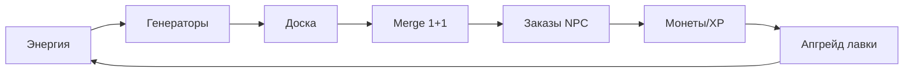

# Базар Слияний — Design Document (GDD)

| Поле | Значение |
|------|----------|
| **Slug** | `merge-bazaar` |
| **Название RU** | Базар Слияний |
| **Название EN** | Merge Bazaar |
| **Жанр** | Merge-tycoon / merge puzzle |
| **Платформа** | Яндекс Игры (HTML5) |
| **Движок** | Phaser 3 + TypeScript + Vite |
| **Сегмент ЦА** | E — уютный казуал, 25–55 |
| **Приоритет** | P0 |
| **Статус дизайна** | `DRAFT` (код запрещён до `CONFIRMED`) |
| **Ключевой арт** | `refs/art/key-art.png` |

---

## 1. One-liner

Сливай товары на торговом прилавке, открывай новые цепочки предметов и развивай свой сказочный базар.

## 2. Видение продукта

Уютный merge-tycoon с сильным daily hook: энергия, заказы NPC, расширение доски, декор лавки. Женская + широкая казуальная ЦА; hybrid monetization (RV энергия + IAP удобство/pass).

### Рамки скоупа

| Делать | НЕ делать |
|--------|-----------|
| Доска merge 6×5→7×6 | Боевая RPG / данжи |
| 3–4 цепочки 8–10 тиров | 20+ цепочек в MVP |
| Генераторы + заказы + энергия | PvP, трейд между игроками |
| Декор лавки как мета | Полный city-builder |

## 3. Fantasy / сеттинг

- **Место:** восточный/сказочный базар — фрукты, амулеты, сладости, растения, зелья.
- **Героиня:** молодая торговка + рыжий кот (маскот).
- **Тон:** cozy fantasy, тёплый свет, пурпурно-золотая витрина.
- **Прогресс фантазии:** от лотка → полноценная лавка с декором и NPC-заказчиками.

## 4. Core loop

1. Тратишь энергию → активируешь генераторы / получаешь предметы.  
2. Мёрджишь 1+1 одинаковых → следующий тир.  
3. Сдаёшь заказы → монеты / XP / ключи декора.  
4. Расширяешь доску, открываешь генераторы и цепочки.  
5. Ставишь декор, коллекционируешь max-tier витрину.

## 5. Механики MVP

### 5.1 Доска
- Старт **6×5** (30 клеток).  
- Апгрейд до **7×6** (42) за soft / IAP-ускорение.  
- Drag item на item того же `chainId+tier` → merge.  
- Занятость 100% без ходов = «тупик» → инструменты: sell, bubble RV, stash (1 слот).

### 5.2 Цепочки (MVP)
1. **Фрукты** (яблоко → корзина → золотая чаша) — 8–10 тиров.  
2. **Зелья** (флакон → лунный кувшин) — 8–10 тиров.  
3. **Растения** (росток → spirit bonsai) — 8–10 тиров.  
4. (Опционально wave1.5) **Сладости** или **Амулеты**.

### 5.3 Генераторы
- 2–3 генератора с кулдауном и лимитом зарядов.  
- Спавн предметов низких тиров своей цепочки.  
- Ускорение: RV / hard.

### 5.4 Энергия
- Трата на tap генератора / некоторые действия.  
- Реген: 1 энергия / N минут, cap комфортный для F2P.  
- RV: +энергия пакет.

### 5.5 Заказы
- Очередь 2–3 заказа.  
- Требуют предметы конкретных тиров.  
- Мягкий таймер (бонус за скорость, не жёсткий fail).  
- Награды: soft, XP игрока лавки, иногда декор-токен.

### 5.6 Декор и коллекции
- 10 предметов декора MVP.  
- Max-merge тир открывает «витринный» экспонат.  
- Декор даёт малые пассивные бонусы (опц. +1% soft) или чисто косметику (предпочтительно косметика в MVP).

## 6. Прогрессия

| Слой | Содержание |
|------|------------|
| XP лавки | уровни → слоты/генераторы/цепочки |
| Цепочки | анлок тиров и новых generators |
| Заказы | 20+ в MVP |
| Daily | логин, daily order, RV энергия |
| Pass | light track: энергия, декор, soft |

## 7. Монетизация (hybrid)

| Источник | Как |
|----------|-----|
| Rewarded | +энергия, ускорение генератора, убрать мусор-предмет, доп. слот заказа |
| Interstitial | возврат в хаб / после крупного заказа |
| IAP | энергия паки, pass, слоты доски, косметика лавки, remove ads |
| Soft | монеты, материалы декора |

**Анти-токсик:** F2P энергия не должна бить «стену боли» в первые 30–40 минут; тупик доски решаем инструментами, не только paywall.

### IAP MVP
1. Energy Small / Medium.  
2. Battle Pass light.  
3. Board slot unlock.  
4. Remove Ads.  
5. Awning / décor pack (косметика).

## 8. UX

- Туториал merge за ≤60 с (два яблока → корзина).  
- Крупный drag под палец, магнит к соседней клетке.  
- Подсветка валидных merge-целей при drag.  
- Облачный сейв доски обязателен.  
- Портрет primary.

## 9. Скоуп MVP → Store Ready

| Входит | Не входит |
|--------|-----------|
| 2–3 полные цепочки | 10 цепочек |
| 20 заказов | сезонные ивенты full |
| Энергия + 2 генератора | авто-merge бот |
| Декор 10 | мультиплеер |
| Daily + 3–5 IAP | гильдии |

## 10. Риски

| Риск | Митигация |
|------|-----------|
| Жёсткий energy paywall | кривая регена + RV щедрый early |
| Тупик доски | sell, bubble, stash, board upgrade |
| Скучный midgame | заказы с разнообразием + декор goals |

## 11. KPI / Store

- 30+ минут слияния без жёсткого тупика.  
- Туториал merge ≤1 мин.  
- Энергия предсказуема (UI таймер регена).  
- Cloud save доски.  
- D1 цель ≥25%.

## 12. Статус кода

**До `CONFIRMED` — `src/` не создаём.** Детали для агентов: `docs/DESIGN_LLM.md`.
