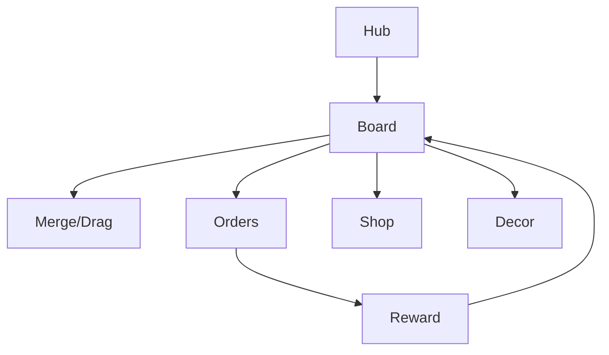

# Базар Слияний — DESIGN_LLM (исполняемая спецификация)

> **Аудитория:** LLM-агенты (арт, UI, контент, код).  
> **Правило:** `src/` **не писать**, пока дизайн ≠ `CONFIRMED`.  
> **GDD:** `docs/DESIGN.md`. **Промпты:** `prompts/*.md`.

---

## 0. Мета-контракт

| Поле | Значение |
|------|----------|
| slug | `merge-bazaar` |
| title_ru | Базар Слияний |
| title_en | Merge Bazaar |
| engine | Phaser 3 + TypeScript + Vite |
| platform | Яндекс Игры |
| orientation_primary | portrait 720×1280 |
| design_status | `DRAFT` |
| coding_allowed | `false` until `CONFIRMED` |
| concept_ref | `docs/concepts/05-merge-bazaar.md` |
| key_art | `games/merge-bazaar/refs/art/key-art.png` |

### Запреты
1. Нет боёвки/данжей.  
2. Нет PvP/трейда.  
3. Нет city-builder карты города (только лавка + доска).  
4. Не делать paywall энергии «в ноль без RV» в первые 30 мин.

---

## 1. Project contract

```text
games/merge-bazaar/
├── docs/DESIGN.md
├── docs/DESIGN_LLM.md
├── prompts/{ART,SPRITE_ANIM,UI,LEVEL,CODE_AGENT}_PROMPTS.md  (CODE = CODE_AGENT_PROMPT.md)
├── refs/{art,ui,levels,sprites}/
├── public/assets/{images,atlases,audio,data}/
├── src/   # after CONFIRMED
├── STATUS.md
└── STORE_CHECKLIST.md
```

### Naming

| Сущность | Правило | Пример |
|----------|---------|--------|
| Item ID | `item_{chain}_{tier}` | `item_fruit_03` |
| Generator | `gen_{chain}` | `gen_fruit` |
| Order | `ord_{nnn}` | `ord_012` |
| Decor | `decor_{name}` | `decor_purple_awning` |
| UI | `ui_{elem}_{state}` | `ui_btn_energy_rv` |
| Scene | `SC_{Name}` | `SC_Board` |
| Save | `mbz_{key}_v1` | `mbz_board_v1` |

### Asset ID schema

```text
bg_shop_{variant}
item_{chain}_{tier}
item_{chain}_{tier}_max   # optional glow variant
gen_{chain}_{state}       # idle/empty/ready
npc_{name}
decor_{id}
ui_*
vfx_merge_{tierband}
ico_energy / ico_coin / ico_gem / ico_key
sfx_* / bgm_*
```

Chains MVP: `fruit`, `potion`, `plant` (+ optional `sweet`).

---

## 2. Gameplay systems + Acceptance Criteria

### 2.1 Board System

- Grid `cols×rows`, cell size 96 logical.  
- Start 6×5; max 7×6.  
- Each cell: `null | ItemRef | GeneratorRef | Bubble | Blocked`.

**AC:**
- [ ] AC-BRD-01: merge только одинаковых `chain+tier`, результат `tier+1` на целевой клетке, источник очищается.  
- [ ] AC-BRD-02: max tier не мёрджится дальше; вместо этого sparkle + toast «Коллекция».  
- [ ] AC-BRD-03: drag показывает ghost + highlight валидных целей.  
- [ ] AC-BRD-04: состояние доски сейвится на каждый merge/move (debounce 300ms) + cloud.  
- [ ] AC-BRD-05: при полной доске и отсутствии merge — предлагается sell/bubble/RV, нет softlock.  
- [ ] AC-BRD-06: апгрейд 6×5→7×6 добавляет клетки справа/снизу без потери items.

### 2.2 Item / Chain System

```json
{
  "chainId": "fruit",
  "tiers": [
    { "tier": 1, "id": "item_fruit_01", "name_ru": "Яблоко", "sellSoft": 1 },
    { "tier": 2, "id": "item_fruit_02", "name_ru": "Пара яблок", "sellSoft": 3 }
  ],
  "maxTier": 10,
  "unlockPlayerLevel": 1
}
```

**AC:**
- [ ] AC-ITM-01: 3 цепочки ≥8 тиров каждая в MVP (рекоменд. 10/10/8).  
- [ ] AC-ITM-02: визуальный silhouette читаем на 64×64.  
- [ ] AC-ITM-03: sell возвращает soft по таблице, подтверждение для tier≥5.

### 2.3 Generator System

```json
{
  "id": "gen_fruit",
  "chargesMax": 8,
  "cooldownSec": 20,
  "spawnTable": [
    { "itemId": "item_fruit_01", "w": 70 },
    { "itemId": "item_fruit_02", "w": 25 },
    { "itemId": "item_fruit_03", "w": 5 }
  ],
  "energyCostPerTap": 1
}
```

**AC:**
- [ ] AC-GEN-01: tap при charges>0 и energy≥cost спавнит в ближайшую пустую клетку.  
- [ ] AC-GEN-02: нет пустой клетки → toast, заряд не тратится.  
- [ ] AC-GEN-03: cooldown UI кольцо видно.  
- [ ] AC-GEN-04: RV skip cooldown 1/charge bundle.  
- [ ] AC-GEN-05: generator занимает 1 клетку (или 2×1 только если явно в данных — MVP = 1).

### 2.4 Energy System

| Param | MVP value |
|-------|-----------|
| cap | 50 (ранний), 100 (поздний ап) |
| regen | 1 / 90 sec |
| start | 50 |
| RV pack | +25, cap 5 ads/day soft limit UX |
| action cost | 1 per generator tap |

**AC:**
- [ ] AC-EN-01: таймер до следующей энергии на HUD.  
- [ ] AC-EN-02: при 0 энергии — modal: ждать / RV / IAP; доска остаётся usable для merge без энергии.  
- [ ] AC-EN-03: merge **не** тратит энергию.  
- [ ] AC-EN-04: offline regen capped at cap (не бесконечный склад).

### 2.5 Orders System

```json
{
  "id": "ord_003",
  "npc": "npc_traveler",
  "needs": [{ "itemId": "item_fruit_04", "count": 1 }],
  "rewardSoft": 40,
  "rewardXp": 15,
  "timeBonusSec": 180
}
```

**AC:**
- [ ] AC-ORD-01: сдача = авто-снятие items с доски при tap на заказ, если есть.  
- [ ] AC-ORD-02: очередь 2 слота (+1 IAP/pass).  
- [ ] AC-ORD-03: мягкий таймер даёт +25% soft если успели; провал таймера не удаляет заказ.  
- [ ] AC-ORD-04: 20 заказов в пуле MVP с прогрессией нужд.

### 2.6 Player Shop Level / Unlock

XP → level → unlocks: chain tiers, generators, board upgrade, décor slots.

**AC:**
- [ ] AC-LVL-01: таблица уровней 1–20 в JSON.  
- [ ] AC-LVL-02: unlock popup с иллюстрацией.  
- [ ] AC-LVL-03: нельзя получить item locked chain с генератора (spawn table фильтр).

### 2.7 Decor / Collection

**AC:**
- [ ] AC-DEC-01: 10 décor items placeable on shop backdrop hotspots.  
- [ ] AC-DEC-02: max-tier first obtain → collection album entry.  
- [ ] AC-DEC-03: décor MVP косметика (бонусы статов — optional flag off).

### 2.8 Bubbles / Junk / Tools

- Bubble: предмет в пузыре, RV/hard чтобы раскрыть или свайп dismiss за soft.  
- Junk: редкий мусор блокирует клетку, убрать RV/soft.

**AC:**
- [ ] AC-TOL-01: всегда есть путь расчистить доску без hard currency (медленно через sell).  
- [ ] AC-TOL-02: stash 1 cell temporary (unlock level 5).

### 2.9 Monetization hooks

**AC:**
- [ ] AC-PAY-01: RV точки — energy, gen boost, bubble, junk clear.  
- [ ] AC-PAY-02: interstitial только hub return / big order complete, не mid-drag.  
- [ ] AC-PAY-03: IAP energy/pass/slots/remove ads/décor.  
- [ ] AC-PAY-04: remove ads ≠ remove RV.

### 2.10 Save

Board grid, gens cooldowns, energy timestamp, orders, level/xp, décor, pass, IAP flags.

**AC:**
- [ ] AC-SAVE-01: kill tab mid-drag — предмет не дублируется и не пропадает (commit on pointer up).  
- [ ] AC-SAVE-02: cloud sync on pause + every 60s dirty.

---

## 3. Content design grammar

### 3.1 Как доска LOOKS

- Деревянный прилавок / полки как рамка.  
- Клетки мягко читаемые, не «Excel».  
- Предметы: тёплый cozy lighting, max-tier с золотым glow.  
- Сверху/сбоку — энергия и заказы.  
- Фон: площадь базара (как key-art).

### 3.2 Как PLAYS

1. Игрок смотрит заказы → планирует merges.  
2. Тратит энергию на gen.  
3. Строит «пирамиду» тиров.  
4. Сдаёт заказ → juice VFX монет.  
5. Расширяет / декор.

### 3.3 Merge recipe grammar

```text
2 × item(chain, t) → 1 × item(chain, t+1)
Special: 2 × max → reject + toast
```

### 3.4 Chain recipes (визуальная лестница)

**Fruit:** apple → 2apples → basket_s → basket_m → basket_l → ornate_bowl → glowing_bowl → golden_chalice → ...  
**Potion:** small_blue → med_blue → large_charm → moon_jar → ...  
**Plant:** sprout → flower_bowl → lush → spirit_bonsai → ...

Каждый тир = +20–30% visual complexity, не только scale.

### 3.5 Difficulty / pacing curve

| Player min | Focus | Energy feel |
|------------|-------|-------------|
| 0–5 | Tutorial fruit to t4 | щедро |
| 5–20 | Orders easy, plant unlock | комфорт |
| 20–45 | Board space pressure | первый RV soft ask |
| 45–90 | Potion chain + décor | midgame |
| 90+ | max tiers + pass | retention |

**Anti-stuck rules:**
- Если 3 мин нет merge и board >90% full → hint highlight.  
- Daily free bubble pop.

### 3.6 Order grammar

```yaml
order:
  need_tier_band: early|mid|late
  item_count: 1-3
  diversity: single_chain|multi
  reward_scale: f(player_level)
```

### 3.7 MVP content volume

| Content | Count |
|---------|-------|
| Chains | 3 |
| Tiers total | ≥26 |
| Generators | 2–3 |
| Orders | 20 |
| Decor | 10 |
| Shop levels | 20 |
| Tutorial steps | ≤6 |

---

## 4. UI map + wireframes

### Screens

| ID | Name |
|----|------|
| SC_Boot | Boot |
| SC_Hub | Лавка (вид декора) |
| SC_Board | Merge доска (основной) |
| SC_Orders | (может быть панелью на Board) |
| SC_Collection | Альбом |
| SC_Decor | Редактор декора |
| SC_Shop | IAP |
| SC_Pass | Pass |
| SC_Settings | Settings |

### Board wireframe

```text
┌────────────────────────────┐
│ ⚡42/50  1:12   💰 1200 💎  │
│ ┌──────┐ ┌──────┐          │
│ │Заказ1│ │Заказ2│   [Альбом]│
│ └──────┘ └──────┘          │
│ ┌────────────────────────┐ │
│ │  . a  .  g  .  p  .    │ │
│ │  a .  b  .  .  .  .    │ │ board 6x5
│ │  ...                   │ │
│ └────────────────────────┘ │
│ [Ген][Ген][Склад][Магазин] │
└────────────────────────────┘
```



### Hub / Decor

```text
┌────────────────────────────┐
│     Витрина лавки          │
│   (фон + decor hotspots)   │
│     [К прилавку ▶]         │
│  [Декор][Pass][Настройки]  │
└────────────────────────────┘
```

### Energy empty modal

```text
┌────────────────────────────┐
│     Запас энергии пуст     │
│  [▶ Реклама +25]           │
│  [Купить пакет]            │
│  [Подождать 01:12]         │
└────────────────────────────┘
```

### Components

| Comp | Assets |
|------|--------|
| EnergyBar | `ico_energy`, `ui_bar_energy` |
| OrderCard | `ui_order_panel`, npc portrait |
| BoardCell | subtle |
| ItemSprite | `item_*` |
| GenWidget | `gen_*` |
| BtnRV | `ui_btn_rv` |
| ShopTile | décor |

---

## 5. Art bible

### Style locks
- Cozy fantasy bazaar, warm sunlight, purple-gold accents.  
- Polished 2D mobile, soft shading, clean edges.  
- Merchant girl + ginger cat mascot consistent.  
- **Не:** мрачный dark fantasy, ultra-realistic photo, cluttered cyber neon (это другая игра).

### Palette

| Token | Hex |
|-------|-----|
| awning_purple | `#6B3FA0` |
| gold_trim | `#E6B35A` |
| wood | `#8B5A2B` |
| leaf | `#3F8F4E` |
| potion_blue | `#3D6FE8` |
| apple_red | `#D63A3A` |
| sky_warm | `#F3C98B` |
| ui_cream | `#FFF6E8` |
| text_ink | `#2A1B12` |
| energy_teal | `#2EC4B6` |

### Do/Don't
**Do:** читаемые merge-тиры; тёплый свет; максимум уюта.  
**Don't:** фиолетовый «AI default» градиент на белом без дерева/ткани; мелкие предметы без силуэта; кровь/horror.

---

## 6. Image generation prompts (канон)

Полный набор: `prompts/ART_PROMPTS.md`.

Key:
```text
Cozy fantasy bazaar shop, cheerful young merchant woman purple vest gold trim, ginger cat, wooden shelves showing merge item progressions fruit potion plants, purple white striped awning, sunny village square fountain, warm polished mobile game art, no text
```

Item sheet:
```text
Mobile game merge item icon set on transparent, fruit chain 10 tiers from single apple to ornate golden glowing bowl, consistent isometric-lite lighting, cozy fantasy, clear silhouette each tier
```

---

## 7. Sprite sheets + timing

| Anim | Frames | FPS | Size | Notes |
|------|--------|-----|------|-------|
| vfx_merge_pop | 8 | 16 | 128 | tiers1-4 |
| vfx_merge_magic | 10 | 16 | 192 | tiers5+ |
| gen_ready_pulse | 6 | 8 | 128 | loop |
| energy_refill | 6 | 12 | 64 | |
| order_complete | 10 | 16 | 256 | coins fly |
| cat_idle | 6 | 6 | 128 | hub mascot |
| cat_happy | 8 | 10 | 128 | on order done |

Atlas: `atlas_merge_vfx`, `atlas_mascot`.

---

## 8. Prompt packs

| File | Agent |
|------|-------|
| `prompts/ART_PROMPTS.md` | Art |
| `prompts/SPRITE_ANIM_PROMPTS.md` | Anim |
| `prompts/UI_PROMPTS.md` | UI |
| `prompts/LEVEL_PROMPTS.md` | Chains/orders |
| `prompts/CODE_AGENT_PROMPT.md` | Code after CONFIRMED |

---

## 9. Integration contracts — paths

```text
public/assets/images/bg/bg_shop_square_01.png
public/assets/images/bg/bg_board_wood_01.png
public/assets/images/items/item_fruit_01.png … item_fruit_10.png
public/assets/images/items/item_potion_01.png … 
public/assets/images/items/item_plant_01.png …
public/assets/images/gen/gen_fruit_idle.png
public/assets/images/gen/gen_fruit_ready.png
public/assets/images/npc/npc_traveler.png
public/assets/images/decor/decor_purple_awning.png
public/assets/images/char/char_merchant.png
public/assets/images/char/char_cat.png
public/assets/images/ui/...
public/assets/atlases/atlas_merge_vfx.png|.json
public/assets/atlases/atlas_mascot.png|.json
public/assets/data/chains.json
public/assets/data/generators.json
public/assets/data/orders.json
public/assets/data/shop-levels.json
public/assets/data/decor.json
public/assets/data/economy.json
public/assets/data/i18n/ru.json
public/assets/audio/bgm/bgm_bazaar.mp3
public/assets/audio/sfx/sfx_merge.mp3
```

### Code modules (post-CONFIRM)

`BoardModel`, `MergeService`, `GeneratorService`, `EnergyService`, `OrderService`, `ShopLevelService`, `DecorService`, `SaveService`, `YgSdkFacade`.

### Events

```text
EVT_Board_Changed
EVT_Merge_Done
EVT_Energy_Changed
EVT_Order_Completed
EVT_Gen_Spawned
EVT_Level_Up
EVT_Cloud_Synced
```

---

## 10. Economy tables

### Energy early game feel
- 50 energy ≈ 40–50 gen taps.  
- With merges free, session 8–12 min до первого empty при активной игре.  
- Regen full 50 empty → ~75 min; RV bridges.

### Sell values
`sellSoft = round(1.6^(tier-1))`

### Order rewards
`rewardSoft = 20 + 8*maxNeedTier + 5*playerLevel`

---

## 11. Tutorial script

| Step | Teach |
|------|-------|
| T1 | Drag apple onto apple |
| T2 | See basket spawn + VFX |
| T3 | Tap generator once |
| T4 | Complete first order |
| T5 | Show energy |

≤60–90s to first merge success.

---

## 12. Definition of Ready

- [ ] DESIGN.md + DESIGN_LLM approved  
- [ ] prompts/* complete  
- [ ] 3 chains tier lists named  
- [ ] 20 orders drafted  
- [ ] Energy numbers signed off  
- [ ] UI wireframes all major screens  
- [ ] Art palette locked to key-art  
- [ ] Asset paths final  
- [ ] Monetization points listed  
- [ ] Status → CONFIRMED in dashboard  

**No coding until CONFIRMED.**

---

## 13. Store DoD (code later)

- 30+ min no hard stuck  
- Cloud board restore  
- Tutorial ≤1 min  
- RV/IAP/IS paths  
- 60 FPS mid Android target  

## 14. Changelog

| Ver | Date | Notes |
|-----|------|-------|
| 0.1 | 2026-07-17 | Initial DESIGN_LLM |

---

## Visual Ground Truth (обязательные референсы)

См. также `docs/REFS.md`.

| Тип | Путь |
|-----|------|
| Key art | `refs/art/key-art.png` |
| UI wireframe | `refs/ui/wireframe-main.png` |
| Level layout | `refs/levels/layout-main.png` |
| Sprite sheet | `refs/sprites/sheet-main.png` |

Любой арт-агент обязан сверяться с этими файлами перед генерацией финальных ассетов.
