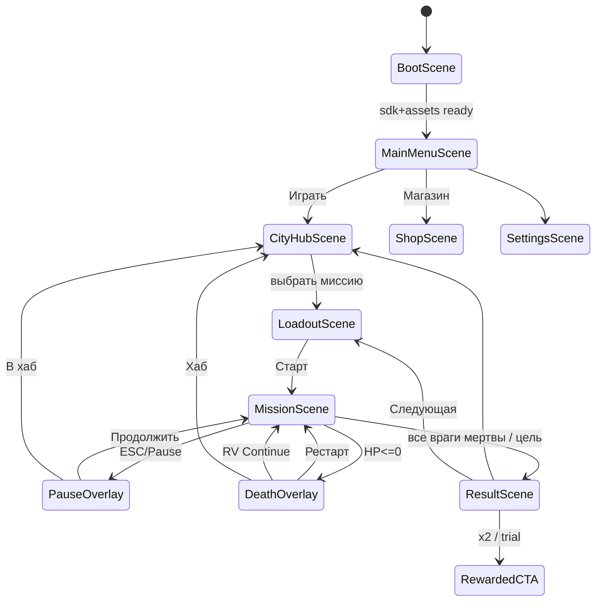
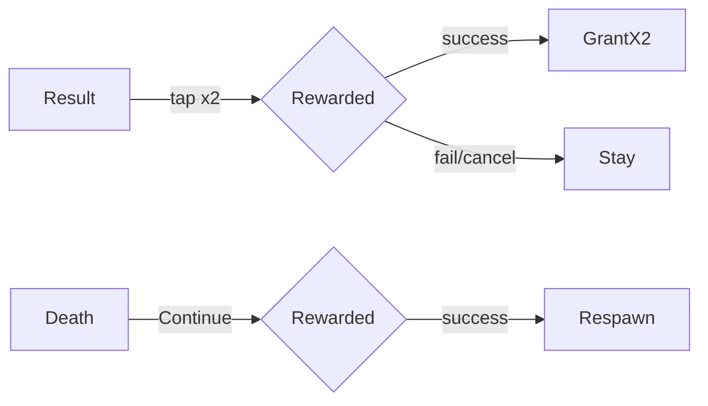

# Neon Bullet — DESIGN_LLM (исполняемая спецификация)

> **СТАТУС:** `DRAFT`  
> **ЯЗЫК:** русский (UI-копирайт и ID — как указано)  
> **ПРАВИЛО:** не начинать кодирование `src/`, пока дизайн не **CONFIRMED** в `management/portfolio-dashboard.html`.  
> **ДЛЯ:** арт-агентов, level-агентов, code-агентов, UI-агентов. Этот файл — единственный source of truth после CONFIRM.

---

## 0. Project Contract

### 0.1 Identity

| Ключ | Значение |
|------|----------|
| `slug` | `neon-bullet` |
| `displayName.ru` | Neon Bullet |
| `displayName.en` | Neon Bullet |
| `engine` | Phaser 3.80+ |
| `language` | TypeScript 5.x (strict) |
| `bundler` | Vite 5.x |
| `platform` | Yandex Games HTML5 |
| `orientation` | landscape preferred; portrait supported with virtual sticks |
| `targetFPS` | 60 |
| `baseResolution` | 1280×720 logical; scale FIT |
| `tileSize` | 32×32 px |
| `pixelsPerUnit` | 1 px = 1 world unit |

### 0.2 Folder layout (обязательный)

```
games/neon-bullet/
  docs/
    DESIGN.md
    DESIGN_LLM.md          ← этот файл
  prompts/
    ART_PROMPTS.md
    SPRITE_ANIM_PROMPTS.md
    UI_PROMPTS.md
    LEVEL_PROMPTS.md
    CODE_AGENT_PROMPT.md
  refs/
    art/ ui/ levels/ sprites/
  public/
    assets/
      textures/
        characters/
        enemies/
        weapons/
        vfx/
        tiles/
        ui/
        keyart/
      audio/
        sfx/
        music/
      levels/              # JSON tilemaps
  src/
    main.ts
    game/
      scenes/
      systems/
      entities/
      ui/
      data/
      sdk/
    styles/
  STATUS.md
  STORE_CHECKLIST.md
  README.md
  package.json
  index.html
```

### 0.3 Naming conventions

| Тип | Правило | Пример |
|-----|---------|--------|
| Файлы TS | `PascalCase` для классов/сцен, `camelCase` для утилит | `MissionScene.ts`, `mathUtils.ts` |
| Asset keys Phaser | `snake_case` с префиксом домена | `char_player_idle`, `en_gunner_walk` |
| Level IDs | `lvl_<district>_<nn>` | `lvl_apt_01` |
| Data JSON | `camelCase` keys | `{ "enemyId": "en_thug" }` |
| CSS / DOM | не использовать (canvas-only UI) | — |
| Commits | conventional, scope `neon-bullet` | `feat(neon-bullet): ...` |

### 0.4 Asset ID schema

Формат: `{domain}_{subject}_{variant}_{state}`

| Domain | Значения |
|--------|----------|
| `char` | игрок, маски overlay |
| `en` | враги |
| `wpn` | оружие world/HUD |
| `vfx` | эффекты |
| `tile` | тайлы |
| `ui` | интерфейс |
| `bg` | фоны/параллакс |
| `sfx` / `mus` | аудио |

Примеры:
- `char_player_body_idle`
- `char_mask_ghost_equip`
- `en_brute_walk`
- `wpn_shotgun_muzzle`
- `vfx_blood_splatter_a`
- `tile_apt_floor_01`
- `ui_btn_primary`
- `lvl_club_03`

Путь на диске зеркалит domain:
`public/assets/textures/enemies/en_gunner_sheet.png`

### 0.5 Coding gate

```
IF designStatus != CONFIRMED:
  FORBIDDEN: create/edit games/neon-bullet/src/**
  ALLOWED: docs, prompts, refs, STATUS.md notes
```

---

## 1. Scenes & Flow Graph



### Scene acceptance

| Scene | Must |
|-------|------|
| BootScene | logo ≤1.5s, SDK init, asset pack load, cloud pull |
| MainMenuScene | CTA Играть, Магазин, лидерборд, настройки |
| CityHubScene | карта районов, lock/unlock, daily badge |
| LoadoutScene | маска + оружие + preview статов |
| MissionScene | gameplay 60fps, HUD, pause |
| ResultScene | rank, coins, buttons, interstitial hook |
| ShopScene | soft/hard tabs, IAP buttons |

---

## 2. Input Contract

### Desktop
- Move: `W A S D`
- Aim: mouse world position
- Fire: LMB
- Melee/knife: `F` or RMB if knife equipped
- Pause: `Esc`
- Interact/door: `E` (если нужно)

### Mobile
- Left virtual stick: move
- Right half-screen drag: aim; fire button bottom-right OR auto-fire when aim held
- Pause: top-right button 48×48
- **Soft aim assist (mobile default ON):** snap ±12° к ближайшему врагу в радиусе 220px

### Acceptance
- [ ] Туториал показывает controls без стены текста
- [ ] Deadzone стика 0.15
- [ ] Fire не срабатывает от UI tap

---

## 3. Gameplay Systems (детально + Acceptance Criteria)

### 3.1 PlayerController

**Spec:**
- Body: circle collider r=10 на tile 32
- Max speed base `moveSpeed = 180`
- Acceleration `1200`, drag `800`
- Facing = aim angle (radians)
- Invuln frames: 0 (one-hit) unless mask Armor → 2 HP + 0.4s i-frames после удара

**AC:**
- [ ] Игрок не проходит сквозь `collision` layer
- [ ] Скорость стабильна на 60 и 30 fps (delta-based)
- [ ] Маска Speed даёт ровно +15% к moveSpeed

### 3.2 WeaponSystem

```
WeaponDef {
  id, displayName, fireRate, pelletCount, spreadDeg,
  damage, projectileSpeed, range, reloadTime,
  melee: boolean, noiseRadius
}
```

| id | fireRate(/s) | damage | ammo | noise |
|----|--------------|--------|------|-------|
| `wpn_knife` | 2.0 melee | 999 | ∞ | 40 |
| `wpn_pistol` | 4.0 | 1 | 12 | 280 |
| `wpn_shotgun` | 1.2 | 1×6 pellets | 6 | 360 |
| `wpn_smg` | 10.0 | 1 | 40 | 320 |

Pickup на уровне: `pickup_ammo`, `pickup_wpn_smg` (временный, сбрасывается после миссии).

**AC:**
- [ ] Нож убивает `en_thug`/`en_gunner` с 1 удара в радиусе 28px
- [ ] Дробовик: 6 лучей, spread 30°, каждый pellet = 1 dmg
- [ ] Пустой магазин → click SFX, нельзя fire до reload (auto reload on empty)

### 3.3 EnemyAI

States: `Idle | Patrol | Suspicious | Alert | Combat | Dead`

| enemyId | visionCone | visionRange | hearRadius | HP | attack |
|---------|------------|-------------|------------|-----|--------|
| `en_thug` | 90° | 160 | 120 | 1 | melee CD 0.8s dmg 1 |
| `en_gunner` | 70° | 220 | 200 | 1 | shoot CD 1.1s |
| `en_brute` | 60° | 140 | 100 | 2 | melee CD 1.2s + knockback 200 |

Patrol: waypoints из level JSON.  
Alert cascade: любой gunshot в `noiseRadius` → все враги в той же `roomId` → Alert.

**AC:**
- [ ] Враг не видит сквозь `collision` (raycast)
- [ ] Смерть врага → drop chance ammo 25%
- [ ] Brute требует 2 пули пистолета / 1 shotgun point-blank (≥3 pellets)

### 3.4 RoomGraph & Stealth-lite

Level JSON содержит `rooms[]` с `id`, `bounds`, `doors[]`.  
Stealth не обязателен: маска Ghost уменьшает `playerFootstepNoise` с 90 до 45.

**AC:**
- [ ] Выстрел в room A не алертит room B без открытой двери (опциональное упрощение MVP: алерт по радиусу noise — допустимо; зафиксировать в level: `alertMode: "radius"`)

### 3.5 ComboSystem

- `comboWindowMs = 2500`
- +1 combo за kill
- Multipliers at end:
  - timeUnderPar: +0.2
  - noDamage: +0.3
  - meleeKills≥3: +0.2
  - comboMax≥8: +0.2
- Rank thresholds (score = kills*100 * multipliers - deaths*50):  
  S≥900, A≥700, B≥500, else C

**AC:**
- [ ] Combo UI обновляется в HUD
- [ ] Death сбрасывает combo
- [ ] Rank пишется в cloud `bestRank[levelId]`

### 3.6 MissionFlow

Win: `enemiesAlive == 0` OR `objective == "extract"` и игрок в zone (боссы).  
Fail: HP≤0.

**AC:**
- [ ] Win → ResultScene ≤0.5s после последнего kill (камера hold + stinger)
- [ ] Restart перезагружает level state без утечки listeners

### 3.7 Meta / Unlock

```
Progress {
  coins: number
  neon: number
  unlockedLevels: string[]
  unlockedMasks: string[]
  unlockedWeapons: string[]
  bestRank: Record<string, 'S'|'A'|'B'|'C'>
  daily: { dateISO, levelId, completed }
  removeAds: boolean
}
```

Unlock chain: `lvl_apt_01` free → clear → unlock next.  
Mask prices: 200 / 350 / 500 soft; premium masks 40 neon or IAP.

**AC:**
- [ ] Cloud save merge: max ranks, max currencies, OR unlocks
- [ ] Daily resets 00:00 MSK

---

## 4. Level Design Grammar

### 4.1 Visual grammar (как уровни ВЫГЛЯДЯТ)

- **Пол:** тёмный асфальт/ковёр `#0B0B12`–`#1A1220`
- **Стены:** `#1E1A2E` + neon trim `#FF2BD6` / `#00F0FF`
- **Мебель:** силуэтные пропсы (диван, бар, машины) — коллизия прямоугольниками
- **Освещение:** baked neon blobs на тайлах; динамический light optional post-MVP
- **Читаемость врагов:** контур `#FFFFFF` 1px или яркая одежда vs тёмный пол
- **Двери:** контрастный cyan frame
- **Не делать:** фотореализм, грязный brown noir без неона, UI-элементы на тайлах

### 4.2 Tile rules

| Tile ID | layer | collision | notes |
|---------|-------|-----------|-------|
| `tile_floor_*` | ground | no | вариации 4+ |
| `tile_wall_*` | collision | yes | autotile 16-set preferred |
| `tile_door_closed` | interaction | yes until open | |
| `tile_door_open` | ground | no | |
| `tile_cover_*` | props | yes half | блокирует пули врагов 50% (MVP: full block) |
| `tile_spawn_player` | meta | no | object |
| `tile_spawn_enemy` | meta | no | object + enemyId |
| `tile_pickup_*` | meta | no | |

Карта: Phaser Tilemap JSON (Tiled). Grid 32. Миссия размер: 40×28 … 64×40 тайлов.

### 4.3 Encounter recipes

Формат комнаты:

```
RoomBudget {
  areaTiles: number
  enemyPoints: number   // thug=1, gunner=2, brute=3
  maxEnemies: number
  pickups: 0..2
  coverDensity: low|med|high
}
```

| Миссия tier | enemyPoints | rooms | parTimeSec |
|-------------|-------------|-------|------------|
| T1 (1–3) | 4–6 | 3 | 45 |
| T2 (4–7) | 7–10 | 4–5 | 70 |
| T3 (8–12) | 11–16 | 5–7 | 90 |
| Boss | special arena | 1–2 | 120 |

**Рецепты:**
- `recipe_ambush`: 2 gunner за cover у входа + 1 thug
- `recipe_patrol_cross`: 3 thug waypoints пересекаются
- `recipe_brute_guard`: 1 brute + 1 gunner на балконе (line of sight)
- `recipe_open_killbox`: мало cover, 4 gunner — учит dodge

### 4.4 Difficulty curve

```
M01 tutorial safe
M02–M03 introduce gunner
M04 shotgun pickup teach
M05 brute
M06–M08 density up
M09 club neon maze
M10 parking cars cover
M11 warehouse long sightlines
M12 mini-boss OR hard clear
```

**AC levels:**
- [ ] Каждая миссия проходима на touch без маски Armor
- [ ] S-rank возможен без RV
- [ ] Нет softlock (закрытые двери без ключа — запрещены в MVP)

### 4.5 MVP mission list

| id | biome | recipe mix | unlock |
|----|-------|------------|--------|
| `lvl_apt_01` | apartment | tutorial | start |
| `lvl_apt_02` | apartment | patrol | clear 01 |
| `lvl_apt_03` | apartment | ambush | clear 02 |
| `lvl_club_01` | club | killbox | clear 03 |
| `lvl_club_02` | club | cross | clear club_01 |
| `lvl_club_03` | club | brute_guard | clear club_02 |
| `lvl_park_01` | parking | cover cars | clear club_03 |
| `lvl_park_02` | parking | ambush | clear park_01 |
| `lvl_wh_01` | warehouse | long sight | clear park_02 |
| `lvl_wh_02` | warehouse | mix | clear wh_01 |
| `lvl_wh_03` | warehouse | dense | clear wh_02 |
| `lvl_boss_01` | arena | boss_maskmaker | clear wh_03 |

---

## 5. UI Component Map & Wireframes

### 5.1 Component inventory

| Component ID | Screen | Behavior |
|--------------|--------|----------|
| `ui_btn_primary` | all | neon fill CTA |
| `ui_btn_secondary` | all | outline |
| `ui_btn_rv` | death/result | rewarded icon + label |
| `ui_hud_hp` | mission | hearts 1–2 |
| `ui_hud_ammo` | mission | digits + weapon icon |
| `ui_hud_combo` | mission | multiplier |
| `ui_stick_left` | mission mobile | |
| `ui_btn_fire` | mission mobile | |
| `ui_pause_panel` | pause | resume/hub/settings |
| `ui_rank_badge` | result | S/A/B/C |
| `ui_shop_card` | shop | buy |
| `ui_mask_slot` | loadout | select |
| `ui_toast` | global | unlock msgs |

### 5.2 Boot

```
┌──────────────────────────────────────────┐
│              [LOGO Neon Bullet]          │
│                 ░░ LOAD ░░               │
│              ████████░░░░ 62%            │
└──────────────────────────────────────────┘
```

### 5.3 Main Menu

```
┌──────────────────────────────────────────┐
│ NEON BULLET                    [⚙] [LB]  │
│                                          │
│     ┌──────── key art / loop ────────┐   │
│     │   silhouette + neon alley      │   │
│     └────────────────────────────────┘   │
│                                          │
│           [  ИГРАТЬ  ]                   │
│           [  МАГАЗИН ]                   │
│           [ ЕЖЕДНЕВНО ]                  │
└──────────────────────────────────────────┘
```

### 5.4 City Hub

```
┌──────────────────────────────────────────┐
│ Район: Восточный     💰 1200  ◆ 40       │
│  (apt)──(club)──(park)──(wh)──(boss)     │
│    ✓      ✓      🔒      🔒     🔒       │
│                                          │
│  [Выбрать миссию]     [Daily ★]          │
└──────────────────────────────────────────┘
```

### 5.5 Loadout

```
┌────────────────┬─────────────────────────┐
│ Маски          │ Preview sprite          │
│ (o) Default    │ stats: SPD / HP / NOISE  │
│ ( ) Speed      │                         │
│ ( ) Ghost      │ Оружие: [Pistol v]      │
│ ...            │                         │
│                │      [ СТАРТ ]          │
└────────────────┴─────────────────────────┘
```

### 5.6 HUD (Mission)

```
┌──────────────────────────────────────────┐
│ ❤    🔫 12        COMBO x4         [❚❚] │
│                                          │
│              (game view)                 │
│                                          │
│ (stick)                          [FIRE]  │
└──────────────────────────────────────────┘
```

### 5.7 Pause

```
┌──────────────┐
│   ПАУЗА      │
│ [Продолжить] │
│ [Настройки]  │
│ [В хаб]      │
└──────────────┘
```

### 5.8 Death / Continue

```
┌────────────────────────────┐
│       ВЫ УБИТЫ             │
│  [Рестарт]                 │
│  [▶ Реклама: Продолжить]   │
│  [В хаб]                   │
└────────────────────────────┘
```

### 5.9 Result

```
┌────────────────────────────┐
│  MISSION CLEAR             │
│     RANK  S                │
│  +240 💰   [▶ x2 за RV]    │
│  [Дальше]  [Повтор]        │
└────────────────────────────┘
```

### 5.10 Shop + Rewarded CTA

```
┌──────────────────────────────────────────┐
│ МАГАЗИН     Soft | Hard | IAP            │
│ ┌──────┐ ┌──────┐ ┌──────┐               │
│ │Mask  │ │Pack  │ │No Ads│               │
│ │200💰 │ │◆30   │ │IAP   │               │
│ └──────┘ └──────┘ └──────┘               │
│ [▶ Попробовать маску 1 ран — RV]         │
└──────────────────────────────────────────┘
```



---

## 6. Art Bible

### 6.1 Style locks

- **Perspective:** true top-down (90°) for gameplay sprites; key art may be 3/4.
- **Line:** hard silhouette, minimal internal detail.
- **Shading:** 2–3 bands + neon emissive accents.
- **Blood:** magenta/pink splat decals, not realistic red gore.
- **Characters:** masked mercenary, exaggerated shoulders, readable weapons.
- **Env:** 80s retro-futurism, wet streets optional sheen.

### 6.2 Palette (HEX)

| Role | Hex |
|------|-----|
| BG void | `#07060C` |
| Floor | `#12101A` |
| Wall | `#1C1830` |
| Neon pink | `#FF2BD6` |
| Neon cyan | `#00F0FF` |
| Neon purple | `#8B5CFF` |
| Danger | `#FF3B4A` |
| Safe/HP | `#39FF14` |
| Text primary | `#F5F2FF` |
| Text dim | `#9A94B8` |
| Blood VFX | `#FF4FA3` |
| Muzzle | `#FFE66D` |

### 6.3 Do / Don't

**Do:** high contrast silhouettes; neon trim; readable enemy hats/weapons; pixel-crisp at 1x/2x.  
**Don't:** brown muddy noir; realistic gore; tiny UI text; purple-on-white generic AI look; cluttered particle spam hiding bullets.

### 6.4 Resolution & sheets

- Character body: 32×32 frame, sheet 8 cols.
- Weapons world: 32×32.
- Tiles: 32×32.
- UI buttons: 9-slice from 48×48 base.
- Key art: 1920×1080 PNG.

---

## 7. Copy-paste Image Generation Prompts

> Полные пакеты также в `prompts/ART_PROMPTS.md`. Здесь — канон.

### 7.1 Key art
```
Top-down adjacent key art for mobile game "Neon Bullet": masked mercenary in black jacket and glowing cyan-pink mask standing in rainy neon alley, Hotline Miami energy but original design, magenta and cyan neon signs, wet asphalt reflections, stylized non-gory, cinematic poster, 1920x1080, high contrast, no text, no logo, no UI
```

### 7.2 Environment
```
Seamless top-down game environment tileset, 32x32 pixel art style but clean HD pixel, neon noir apartment interior: dark floors, neon-trimmed walls, sofa props, bloodless crime scene vibe, magenta cyan lighting, packed tileset sheet, transparent background where needed, game-ready
```

### 7.3 Characters
```
Top-down 32x32 pixel character spritesheet, masked neon mercenary, idle walk and strike frames, readable silhouette, cyan mask glow, black outfit, game asset, orthographic top-down, transparent background
```

### 7.4 Enemies
```
Top-down 32x32 enemy sprites: thug, gunner, brute, distinct silhouettes, neon noir clothing, patrol and attack poses, no gore, transparent background, game-ready sheet
```

### 7.5 Weapons
```
Top-down pixel weapon icons and held angles: knife, pistol, shotgun, SMG, neon muzzle accents, 32x32, transparent, crisp
```

### 7.6 VFX
```
Pixel VFX sheet: magenta blood splatter stylized, cyan muzzle flash, hit sparks, door light, combo burst, transparent background, 32x32 and 64x64 frames
```

### 7.7 Tileset
```
32x32 neon noir tileset autotile walls floors doors cover furniture, dark purple base, pink cyan emissive edges, packed PNG, game tileset
```

### 7.8 UI kit
```
Game UI kit neon noir: primary button, secondary button, hearts, ammo counter frame, pause icon, rank badges S A B C, shop card, rewarded video button with play icon, magenta cyan accents on dark #07060C, 9-slice friendly, no mockup device
```

---

## 8. Sprite Sheet Layout Specs

### 8.1 Player `char_player_sheet.png`

- Frame: **32×32**, columns: **8**, rows: **6**
- Animations:

| Anim | Frames | Count | Loop |
|------|--------|-------|------|
| idle | 0–3 | 4 | yes |
| walk | 4–11 | 8 | yes |
| melee | 12–15 | 4 | no |
| shoot | 16–18 | 3 | no |
| death | 19–23 | 5 | no |
| (spare) | 24–47 | — | — |

Mask overlays: separate sheet `char_mask_<id>_sheet.png` 32×32, same pivots, recolor glow.

### 8.2 Enemies

Each `en_<type>_sheet.png`: 32×32, 8 cols.

| Anim | frames | count |
|------|--------|-------|
| idle | 0–3 | 4 |
| walk | 4–11 | 8 |
| attack | 12–15 | 4 |
| death | 16–20 | 5 |

### 8.3 VFX `vfx_combat_sheet.png`

64×64 frames for splatter/muzzle; 4 cols × 4 rows per effect.

### 8.4 Animation timing tables

| Anim | fps | duration hint |
|------|-----|---------------|
| player idle | 6 | — |
| player walk | 12 | — |
| player melee | 16 | ~0.25s |
| player shoot | 20 | ~0.15s |
| player death | 10 | ~0.5s |
| enemy walk | 10 | — |
| enemy attack | 12 | — |
| muzzle flash | 24 | 3 frames |
| blood splatter | 14 | 5 frames oneshot |

---

## 9. Audio IDs (brief)

`mus_mission_01`, `mus_hub`, `sfx_shoot_pistol`, `sfx_shoot_shotgun`, `sfx_melee`, `sfx_hit`, `sfx_death_player`, `sfx_death_enemy`, `sfx_ui_click`, `sfx_pickup`, `sfx_combo`, `sfx_rank_s`

---

## 10. Integration Contracts (paths)

| Asset | Path |
|-------|------|
| Player sheet | `public/assets/textures/characters/char_player_sheet.png` |
| Masks | `public/assets/textures/characters/char_mask_<id>_sheet.png` |
| Enemies | `public/assets/textures/enemies/en_<id>_sheet.png` |
| Weapons | `public/assets/textures/weapons/wpn_<id>.png` |
| VFX | `public/assets/textures/vfx/vfx_<name>_sheet.png` |
| Tiles | `public/assets/textures/tiles/tile_<biome>_sheet.png` |
| UI | `public/assets/textures/ui/ui_kit.png` + atlas JSON |
| Key art | `public/assets/textures/keyart/keyart_neon_bullet.png` |
| Levels | `public/assets/levels/lvl_<id>.json` |
| Audio | `public/assets/audio/sfx/`, `.../music/` |
| Data | `src/data/weapons.json`, `masks.json`, `missions.json` |

Atlas: TexturePacker/Phaser hash JSON рядом с PNG: `*.json`.

---

## 11. Yandex SDK Hooks (code contract)

```ts
// src/sdk/yandex.ts
showInterstitial(placement: 'result' | 'death'): Promise<void>
showRewarded(placement: 'continue' | 'x2' | 'trial_mask'): Promise<'rewarded'|'cancel'|'error'>
purchase(productId: 'remove_ads' | 'coins_m' | 'neon_s' | 'mask_premium'): Promise<'ok'|'fail'>
leaderboardSet(lbId: string, value: number): Promise<void>
cloudLoad(): Promise<Progress|null>
cloudSave(p: Progress): Promise<void>
```

Leaderboard IDs: `lb_rank_total`, `lb_district_apt`, `lb_district_club`, ...

---

## 12. Prompt Pack Index

Отправлять агентам как standalone:
- `prompts/ART_PROMPTS.md`
- `prompts/SPRITE_ANIM_PROMPTS.md`
- `prompts/UI_PROMPTS.md`
- `prompts/LEVEL_PROMPTS.md`
- `prompts/CODE_AGENT_PROMPT.md`

Каждый пакет содержит: цель, входы, выходы (пути), DoD, запреты.

---

## 13. Definition of Ready (этого дизайн-дока)

Чеклист перед переводом статуса в `REVIEW` → `CONFIRMED`:

- [x] Vision, pillars, loops описаны в DESIGN.md
- [x] Project contract (slug, engine, folders, naming, asset IDs)
- [x] Все gameplay systems с AC
- [x] Level grammar + mission list MVP
- [x] UI map + wireframes всех major screens
- [x] Art bible + palette hex + do/don't
- [x] Image gen prompts для key art/env/char/enemy/wpn/vfx/tiles/UI
- [x] Sprite sheet specs + timing tables
- [x] Integration paths
- [x] Monetization fair rules
- [x] Explicit no-code-until-CONFIRMED
- [ ] Продюсер review (человек)
- [ ] Статус в dashboard = CONFIRMED

---

## 14. Explicit Coding Ban

```
⛔ DO NOT START CODING until design status is CONFIRMED.
⛔ DO NOT invent systems contradicting this document.
✅ DO update STATUS.md to DESIGN_DRAFT / DESIGN_REVIEW only.
```

---

## 15. Changelog

| Ver | Date | Notes |
|-----|------|-------|
| 1.0 | 2026-07-17 | Initial LLM bible |

---

## Visual Ground Truth (обязательные референсы)

См. также `docs/REFS.md`.

| Тип | Путь |
|-----|------|
| Key art | `refs/art/key-art.png` |
| UI wireframe | `refs/ui/wireframe-main.png` |
| Level layout | `refs/levels/layout-main.png` |
| Sprite sheet | `refs/sprites/sheet-main.png` |

Любой арт-агент обязан сверяться с этими файлами перед генерацией финальных ассетов.
