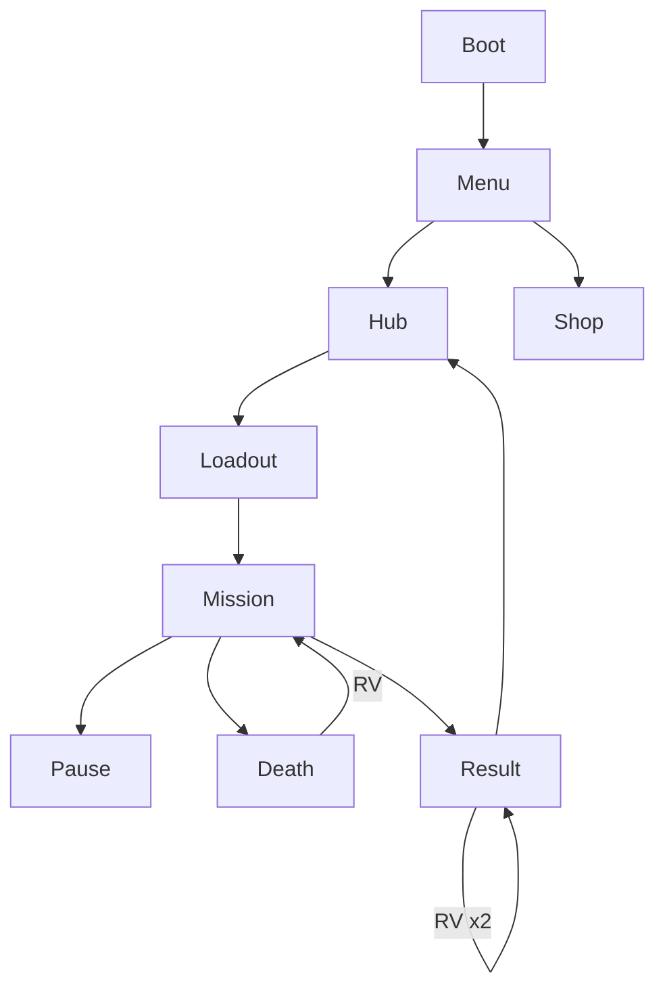

# Neon Bullet — UI_PROMPTS

**Назначение:** UI-арт + копирайт + wireframe-реализация для UI-агента.  
**Канон:** `DESIGN_LLM.md` §5–6.  
**Запрет:** mid-action interstitial; код только после CONFIRMED (этот пакет — дизайн/ассеты).

---

## Контекст

```
Neon Bullet UI: canvas Phaser, русский язык по умолчанию.
Palette: bg #07060C, text #F5F2FF, dim #9A94B8, CTA pink #FF2BD6, accent cyan #00F0FF.
Touch targets ≥44px (prefer 48).
Fonts: expressive display for titles (not Inter/Roboto); body readable sans.
Screens: Boot, MainMenu, CityHub, Loadout, HUD, Pause, DeathContinue, Result, Shop, RewardedCTA, Settings.
```

---

## JOB 1 — UI kit generation

**Промпт:**
```
Complete neon noir game UI kit, dark background #07060C, magenta #FF2BD6 and cyan #00F0FF accents: primary button 9-slice, secondary outline button, icon buttons pause settings, HP hearts, ammo counter frame, combo label style, rank badges S A B C glowing, shop item card, rewarded ad button with play triangle, modal panel, slider, toggle, scrollbar, no device mockup, export-ready flat panels
```

**Выход:** `public/assets/textures/ui/ui_kit.png`, slices в `refs/ui/slices/`

---

## JOB 2 — Screen copy (RU)

| Screen | Элементы |
|--------|----------|
| MainMenu | ИГРАТЬ / МАГАЗИН / ЕЖЕДНЕВНЫЙ КОНТРАКТ / ЛИДЕРБОРД / НАСТРОЙКИ |
| Hub | Район {name} / Выбрать миссию / Закрыто |
| Loadout | Маска / Оружие / СТАРТ / Скорость / Шум / HP |
| Pause | ПАУЗА / Продолжить / Настройки / В хаб |
| Death | ВЫ УБИТЫ / Рестарт / Продолжить (реклама) / В хаб |
| Result | МИССИЯ ВЫПОЛНЕНА / РАНГ {R} / +{n} монет / x2 за рекламу / Дальше / Повтор |
| Shop | МАГАЗИН / Мягкая валюта / Неон / Покупки / Отключить рекламу |
| RV toast | Награда получена / Реклама недоступна |
| Tutorial | Движение / Прицел / Стреляй / Не умри |

---

## JOB 3 — Wireframe acceptance (ASCII канон)

Сверяй с DESIGN_LLM §5.2–5.10. Любой UI-агент должен воспроизвести иерархию:

1. Boot: logo + progress  
2. Menu: keyart + 3 CTA  
3. Hub: node map + currency  
4. Loadout: list + preview + start  
5. HUD: HP | ammo | combo | pause; mobile sticks  
6. Pause modal center  
7. Death modal with RV secondary visual weight < Restart primary OR equal for monetization test  
8. Result: rank hero moment  
9. Shop: grid cards  



---

## JOB 4 — Component specs

| id | size | states |
|----|------|--------|
| `ui_btn_primary` | min 220×56 | normal/hover/pressed/disabled |
| `ui_btn_secondary` | min 200×48 | same |
| `ui_btn_rv` | min 240×56 | normal + "▶" badge |
| `ui_hud_heart` | 32×32 | on/off |
| `ui_rank_S` | 128×128 | glow |
| `ui_stick_base` | 128×128 | opacity 0.45 |
| `ui_stick_knob` | 64×64 | |

---

## DoD

- [ ] Все major screens имеют copy RU
- [ ] UI kit на диске
- [ ] RV кнопки visually distinct, не mimic fake close
- [ ] HUD не перекрывает >15% центрального aim zone

## Запреты

- Карточки в hero keyart menu — keyart full-bleed, CTA снизу  
- Sticky banner поверх Fire button  
- Английский UI без RU
