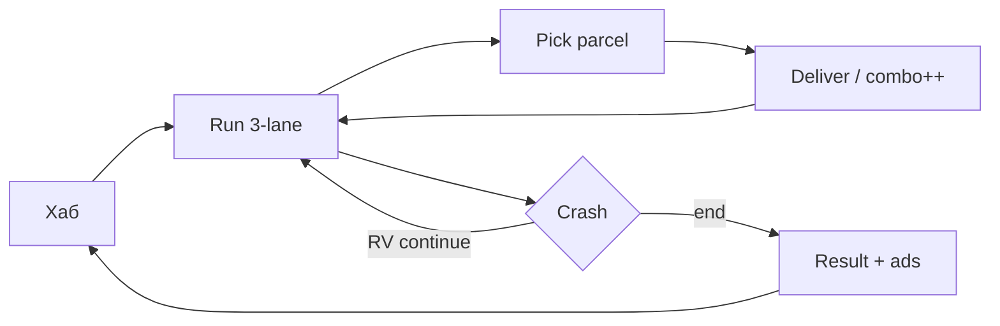

# Ночной Курьер — Game Design Document

| Поле | Значение |
|------|----------|
| **Slug** | `night-courier` |
| **Название** | Ночной Курьер |
| **Жанр** | Endless runner / delivery (3-lane) |
| **Сегмент** | J — сессионный runner, 14–35 |
| **Приоритет** | P0 |
| **Стек** | Phaser 3 + TypeScript + Vite |
| **Статус дизайна** | `DRAFT` — код до `CONFIRMED` запрещён |
| **Концепт** | `docs/concepts/10-night-courier.md` |
| **Арт** | `assets/concepts/10-night-courier.png` |

---

## Pass-2 — Feel lock (F1 демка)

> Зафиксировано 2026-07-18 из Vision / Core Loop / DESIGN_LLM §1–2.  
> Источник правды раунда: `management/demos/demos-07-10.js` → `FEEL_DEMOS["night-courier"]`.  
> Реф жанра: Subway-like 3-lane; differentiator — **delivery combo**, не pure dodge-runner.

| Поле | Значение |
|------|----------|
| **Core verb** | Свайп полосы → взять посылку → сдать в ворота (комбо растёт) |
| **Пространство** | 3 полосы, forward-scroll (камера «вперёд»); не free-move chase |
| **Win** | Смена: **6 доставок** за ран (~45–60с playtest) |
| **Fail** | Столкновение с машиной → КРАШ (continue i-frames / рестарт) |
| **Ввод** | Свайп ←→ / A·D / стик; hop — слой 2 (барьеры/дроны) |
| **Целевая длина рана** | **45–60с** feel-демка (дизайн-ран 40–90с) |
| **Анти-вектор** | Pure collect-yellow-for-score без ворот; open-world; 5+ полос; block_all на одном Z |

**Feel targets (демка):** за 5–10с понятно «взял жёлтое → сдал в бирюзовые ворота; красное = смерть».

| Число | Значение |
|-------|----------|
| Полосы | 0 / 1 / 2 |
| Carry | макс. **1** посылка |
| Win | **6** доставок |
| Скорость внутри рана | база → потолок **≤ +25%** |
| Spawn fairness | никогда 3 занятые полосы на одном Z |
| Combo | +1 за сдачу; сброс на краш / пропуск rush (rush — позже) |

---

## 1. Vision

Ночной неоновый мегаполис. Игрок — курьер на байке: три полосы, свайпы, посылки, трафик, комбо доставок. Короткий ран 40–90 сек → мета (байки/скины/районы) → daily orders. Differentiator: **delivery combo + districts**, не «ещё один subway surfer clone» без темы.

## 2. Pillars

1. **Input lag = death** — свайп ≤1 кадр реакции логики.  
2. **Fair continue** — RV continue не спавнит unavoidable crash.  
3. **Комбо доставки** — риск/награда держит tension.  
4. **Ads-first честно** — interstitial после рана; sticky в хабе.  
5. **Daily reason to return** — заказы района дня.

## 3. Core Loop

## 4. Systems

### 4.1 Movement
- Lanes: 0/1/2. Swipe L/R или tap side; jump/slide optional MVP?**LOCKED MVP:** lane change only + short hop over low barriers.  
- Speed ramps with distance; softcap.

### 4.2 Obstacles (4)
Car, barrier, pothole, drone (air — needs hop).

### 4.3 Parcels & Deliveries (3 order types)
| Type | Behavior | Score |
|------|----------|-------|
| Standard | pick → deliver zone | 100 × combo |
| Rush | timer 8s | 200 × combo |
| Fragile | no bump (near-miss ok) | 250 × combo |

Combo increments on successful delivery; resets on crash or missed rush.

### 4.4 Near-miss
Проезд ≤28px от препятствия → +score + juice + small combo shield 1s.

### 4.5 Meta
- 5 bike skins (1 free, 4 unlock/IAP)  
- 3 couriers (cosmetic + minor trail VFX)  
- Upgrades: start shield, coin magnet, combo grace  
- Districts cosmetic themes (Downtown, Harbor, Campus)

### 4.6 Daily Orders
3 goals: distance, deliveries, near-misses → coins + district token.

## 5. Monetization (ads-first)

| Канал | Как |
|-------|-----|
| Rewarded | Continue; ×2 coins; start shield |
| Interstitial | After run result dismiss |
| Sticky | Hub only |
| IAP | Remove ads, skin packs, starter pack |

Continue fair rules: max 2 RV continues / run; after continue 1.5s invuln + clear imminent obstacles in front 400px.

## 6. Content MVP
Endless + 4 obstacles + 3 order types + 5 bikes + 3 couriers + daily + leaderboard distance + cloud.

## 7. UX Screens
Boot, Hub, Run, Pause, Crash/Continue, Result, Garage, Daily, Shop, Settings.

## 8. KPIs
Tutorial swipe success ≥90%. Continue accept ≥25%. D1 ≥25%. Input lag complaint = P0 bug.

## 9. Risks
Genre saturation → brand courier fantasy hard; pay-to-continue toxicity → hard cap + fair spawn.

## 10. Audio / Juice
Whoosh на смене полосы, blip посылки, аккорд доставки, hitstop 2–3 кадра на crash, near-miss cyan streak, combo float text. BGM neon pulse loop; duck на ads.

## 11. Onboarding
≤60 сек: свайп вправо/влево → подбор → ворота доставки → near-miss tip → свободный ран. Без стены текста.

## 12. LiveOps light
District of the day (косметика дороги), weekly distance challenge на лидерборде Яндекса.

## 13. Out of Scope
Multiplayer races, open world, real maps, voice chat, 5+ lanes, photo-mode.

## 14. Связанные документы
- `DESIGN_LLM.md` — исполняемая спека  
- `prompts/*` — атомарные промпты агентам  
- Статус дизайна: `DRAFT` → REVIEW → CONFIRMED  

**Код не начинать, пока статус ≠ `CONFIRMED`.**
