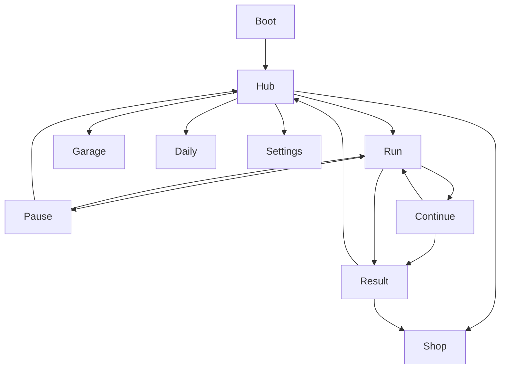

# DESIGN_LLM — night-courier (Ночной Курьер)

> Исполняемая спека. Статус: `DRAFT`. **⛔ Не писать `src/` до `CONFIRMED`.**

---

## 0. Project Contract

| Key | Value |
|-----|-------|
| `slug` | `night-courier` |
| `title_ru` | Ночной Курьер |
| `title_en` | Night Courier |
| `engine` | Phaser 3 + TypeScript + Vite |
| `platform` | Yandex Games HTML5 |
| `resolution` | 720×1280 portrait |
| `perspective` | **pseudo-3D / forward scroll** OR top-down chase — **LOCKED: forward-scroll 3-lane (Subway-like camera)** |
| `tick` | input polled every frame; spawn on fixed distance meter |
| `design_status` | `DRAFT` |
| `coding_allowed` | **`false` until `CONFIRMED`** |
| `key_art_ref` | `refs/art/key-art.png` |

```
⛔ coding_allowed = false
IF design_status != CONFIRMED: FORBIDDEN games/night-courier/src/**
✅ Allowed: docs/, prompts/, refs/, STATUS.md updates only
```

### Folders
```
games/night-courier/
  docs/ prompts/ refs/
  public/assets/{art,sprites,ui,env,audio,data}/
  src/{scenes,run,meta,ui,systems,util}/
  STATUS.md STORE_CHECKLIST.md README.md DEV_MOCK.md
```

### Asset ID schema
`{domain}_{subject}_{variant}`  
domains: `art|char|bike|obs|parcel|env|ui|vfx|audio|data`

### Integration paths
| Asset | Path |
|-------|------|
| Key art | `public/assets/art/art_key_courier.png` |
| Road atlas | `public/assets/env/env_road_scroll.png` |
| District skins | `public/assets/env/env_district_{id}.png` |
| Courier sheets | `public/assets/sprites/char_courier_{id}_sheet.png` |
| Bike sheets | `public/assets/sprites/bike_{id}_sheet.png` |
| Obstacles | `public/assets/sprites/obs_{id}_sheet.png` |
| Parcels | `public/assets/sprites/parcel_{type}.png` |
| Delivery gate | `public/assets/sprites/fx_delivery_gate_sheet.png` |
| UI atlas | `public/assets/ui/ui_kit_atlas.png` |
| Data | `public/assets/data/{obstacles,orders,upgrades,skins,daily}.json` |

---

## 1. Systems + Acceptance Criteria

### 1.1 LaneRunner
```ts
lane: 0|1|2
x = laneWidth * (lane - 1) // center lane 0 offset
speedZ: number // world scroll
distance: number
```
Swipe threshold 40px horizontal; vertical swipe → hop.

**AC:**
- [ ] AC-INP-01: lane change completes in ≤120ms tween; invuln during? **no** — only after continue.
- [ ] AC-INP-02: input buffer 50ms during tween accepts next swipe.
- [ ] AC-INP-03: on mid Android Chrome average swipe-to-move < 50ms logic.
- [ ] AC-INP-04: pause stops scroll & spawns.

### 1.2 SpawnDirector
Segments every `N` meters from weighted tables scaling with distance.

**AC:**
- [ ] AC-SPN-01: never 3 obstacles sealing all lanes same Z (unfair).
- [ ] AC-SPN-02: after RV continue call `clearFront(400)`.
- [ ] AC-SPN-03: parcel spawn rate readable (≥1 / 3s early).

### 1.3 DeliverySystem
Carry max 1 parcel MVP. Delivery gates on lanes with type color.

**AC:**
- [ ] AC-DEL-01: pick on overlap; HUD icon shows carried type.
- [ ] AC-DEL-02: wrong — no; gates accept matching only.
- [ ] AC-DEL-03: combo 1..999; multiplier `1 + (combo-1)*0.1` capped ×5.
- [ ] AC-DEL-04: rush expire → combo reset + toast.

### 1.4 Crash & Continue
Collision AABB bike vs obs (hop ignores low).

**AC:**
- [ ] AC-CRASH-01: crash → slowmo 300ms → Continue modal.
- [ ] AC-CRASH-02: max 2 RV continues per run.
- [ ] AC-CRASH-03: decline → Result; interstitial on Result close.
- [ ] AC-CRASH-04: continue grants 1.5s i-frames + clearFront.

### 1.5 Scoring
`score = distance*0.5 + deliveryScore + nearMiss*25`

### 1.6 Meta/Garage
Unlock bikes with coins; IAP skins flagged `premium`.

### 1.7 Daily & Leaderboard
YG leaderboard `distance_best`. Daily reset UTC+3.

### 1.8 SDK
RV: continue / x2 result / hub shield. Sticky hub. IAP remove ads + packs. Cloud: best distance, coins, unlocks.

---

## 2. Content Grammar

### 2.1 LOOKS
Neon night cyan `#00F5D4` + magenta `#FF2E97` + night `#0B1026`. Rain optional particles light. Readability > realism: obstacles chunky.

### 2.2 PLAYS recipes (authoring grammar)

**Grammar:** `SEGMENT := { id, zLen, lane[3], parcel?, gate?, unlockDist }`  
`lane cell := empty | car | barrier | pothole | drone | parcel | gate_{std|rush|fragile}`  
**Validator:** `count(blocked without hop) ≤ 2` AND never `block_all`.

#### Concrete recipes (≥5)

| # | Recipe ID | Composition | Teach / tension |
|---|-----------|-------------|-----------------|
| R1 | `teach_gap_parcel` | `gap_mid` → `parcel_weave` → `gap_left` | swipe + pick parcel |
| R2 | `teach_delivery` | carry parcel → `rush_gate` mid lane | deliver matching color |
| R3 | `hop_intro` | `hop_mid` ×2 with empty flanks | vertical swipe hop |
| R4 | `weave_mid` | `weave_a` → `gap_right` → `drone_left` | lane dance mid-run |
| R5 | `fragile_pressure` | `fragile_set` + sparse cars | protect magenta parcel |
| R6 | `late_dense` | `dense_gap_mid` → `twin_hop` → `gap_mid` | late speed, still fair |
| R7 | `post_continue` | forced `gap_mid` ×2 after RV | fairness clearFront |

**Early (0–200m):** R1–R3 only, frequent parcels.  
**Mid (200–800m):** R4–R5, rush orders.  
**Late (800m+):** R6 drones + fragile; always 1 safe lane pattern.

### 2.3 Segment patterns (examples)
| Pattern ID | Lanes obs | Notes |
|------------|-----------|-------|
| `gap_left` | 1,2 | safe 0 |
| `gap_mid` | 0,2 | safe 1 |
| `gap_right` | 0,1 | safe 2 |
| `hop_mid` | low mid | hop |
| `parcel_weave` | sparse + parcel | |

**Forbidden:** `block_all`, `rng_three_same_z`.

### 2.4 Difficulty curve
`speed = min(12, 6 + distance/400)`  
spawn density `lerp(0.6, 1.4, clamp(distance/1500))`

### 2.5 ASCII pattern micro-grammar
```
Lane legend: . empty  C car  B barrier  P pothole  D drone  @ parcel  G gate
gap_mid     : C . C
hop_mid     : . P .
weave_a     : C . @
drone_left  : D . C
```

---

## 3. UI Map + Wireframes

Screens: `boot`, `hub`, `garage`, `daily`, `run`, `pause`, `continue`, `result`, `shop`, `settings`.



### 3.1 Full UI component inventory

| Component ID | Screen | Behavior | Min touch |
|--------------|--------|----------|-----------|
| `ui_btn_play` | hub | start run | 64×64 |
| `ui_btn_garage` | hub | open bike/courier | 48×48 |
| `ui_btn_daily` | hub | open daily orders | 48×48 |
| `ui_btn_shop` | hub/result | open IAP shop | 48×48 |
| `ui_btn_settings` | hub | audio/cloud | 44×44 |
| `ui_score_hud` | run | live score + distance | display |
| `ui_combo_meter` | run | combo ×N pulse | display |
| `ui_parcel_icon` | run | carried type color | 40×40 |
| `ui_rush_chip` | run | rush timer toast | display |
| `ui_pause_btn` | run | open pause | 44×44 |
| `ui_swipe_zone` | run | L/R/hop input | full W × 70% H |
| `ui_continue_rv` | continue | rewarded continue 1/2 | 56×56 |
| `ui_btn_finish` | continue | decline → result | 48×48 |
| `ui_result_stats` | result | metrics breakdown | display |
| `ui_btn_x2` | result | RV ×2 coins | 56×56 |
| `ui_bike_carousel` | garage | swipe select bike | 72×72 cards |
| `ui_daily_card` | daily | goal progress CTA | 48×48 |
| `ui_shop_row` | shop | buy SKU | 48×48 |
| `ui_sticky_slot` | hub | reserved ad inset | layout only |
| `ui_tutorial_hint` | run | swipe arrows | non-block 44 |

### 3.2 Wireframe — Boot
```
+----------------------------------+
|         НОЧНОЙ КУРЬЕР            |
|            ░ LOAD ░              |
|         ████████░░░░ 58%         |
+----------------------------------+
```

### 3.3 Wireframe — Hub
```
+-- Ночной Курьер -------------+
| Best 2.4km   Coins 890  [⚙]  |
|     [key-art / neon loop]    |
|         [  Гнать  ]          |
| [Гараж] [Доставки] [SHOP]    |
| sticky ad reserved (inset)   |
+------------------------------+
```

### 3.4 Wireframe — Garage
```
+-- Гараж ----------------------+
| < bike_cyan >  trail preview  |
| Stats: SPD / STYLE            |
| Couriers: [Alex][Mira][Rex]   |
| [Купить / Экип]     [Назад]   |
+-------------------------------+
```

### 3.5 Wireframe — Daily
```
+-- Доставки дня ---------------+
| Dist 500m     ████░░ 340/500  |
| Deliveries 10 ███░░░ 6/10     |
| Near-miss 5   ██░░░░ 2/5      |
| Rewards: coins + skin chip    |
| [Забрать]            [Назад]  |
+-------------------------------+
```

### 3.6 Wireframe — Run HUD
```
+----------------------------------+
| SCORE 12540   COMBO x3   🛍 Rush |
| Dist 342m                   [❚❚]|
+----------------------------------+
|                                  |
|   lane0   lane1   lane2          |
|             BIKE                 |
|                                  |
+----------------------------------+
|         (swipe zones)            |
+----------------------------------+
```

### 3.7 Wireframe — Pause
```
+------------------------------+
|           ПАУЗА              |
| [Продолжить]                 |
| [Настройки]                  |
| [В хаб]                      |
+------------------------------+
```

### 3.8 Wireframe — Continue
```
+------------------------------+
| Столкновение!                |
| [Продолжить RV 1/2]          |
| [Завершить]                  |
+------------------------------+
```

### 3.9 Wireframe — Result
```
+-- Итог рана ------------------+
| Dist 1.2km  Score 18400       |
| Deliveries 14  Combo 9        |
| Near-miss 6   Coins +220      |
| [▶ ×2 монеты]  [В хаб]        |
| (interstitial on close)       |
+-------------------------------+
```

### 3.10 Wireframe — Shop / Settings
```
SHOP: [nc_remove_ads] [nc_starter] [nc_skin_pack_neon] [nc_bike_sakura]
SETTINGS: music / sfx / cloud sync / credits
```

---

## 4. Art Bible

Style: cyber-casual neon runner; clean shapes; **not** realistic GTA; **not** horror.

Palette:
| Role | Hex |
|------|-----|
| Night BG | `#0B1026` |
| Cyan | `#00F5D4` |
| Magenta | `#FF2E97` |
| Amber | `#FFB703` |
| Road | `#1C2541` |
| Lane mark | `#5BC0BE` |
| UI panel | `#141B2D` |
| Text | `#E8F1F2` |
| Danger | `#FF4D6D` |

Do: emissive edges on bike; chunky obs. Don't: seizure strobe; small unreadable drones; mid-run ad banners.

---

## 5. Image Prompts (copy-paste, ≥8)

> Перед генерацией сверяйся с: `refs/art/key-art.png`, `refs/ui/wireframe-main.png`, `refs/levels/layout-main.png`, `refs/sprites/sheet-main.png`.  
> Выход черновиков → `refs/`; финал → `public/assets/...` (§0 Integration).

### P1 — Key art → match `refs/art/key-art.png`
```
Endless runner game key art matching refs/art/key-art.png mood, neon night motorcycle courier delivering glowing packages through rainy cyber city, cyan #00F5D4 and magenta #FF2E97 lights, stylish cyber-casual illustration, motion feel, 16:9, no text, no UI, no watermark
```

### P2 — UI wireframe mock → `refs/ui/wireframe-main.png`
```
Mobile portrait 720x1280 neon night runner UI wireframe matching refs/ui/wireframe-main.png, hub with large Play CTA, garage daily shop row, sticky ad inset bottom, dark panels #141B2D cyan outlines, no real text glyphs fake labels as blocks only
```

### P3 — Level layout diagram → `refs/levels/layout-main.png`
```
Top-down three-lane endless runner segment diagram matching refs/levels/layout-main.png, obstacles as chunky blocks, one safe lane highlighted cyan, neon night asphalt, pattern gap_mid readable, no text
```

### P4 — Sprite sheet master → `refs/sprites/sheet-main.png`
```
Game sprite sheet overview matching refs/sprites/sheet-main.png, neon courier bike side view cells, hop and crash frames, chunky car drone barrier, transparent background, even grid, cyber-casual, no text
```

### P5 — Road scroll env
```
Portrait endless runner road segment texture, three lanes night asphalt, neon reflections, seamless vertical scroll friendly, cyber casual, match refs/art/key-art.png palette, no text
```

### P6 — District parallax
```
District backdrop downtown neon towers parallax layer, night courier game, cyan magenta glow, match refs/art/key-art.png, no text
```

### P7 — Courier + bike
```
Game character courier helmet jacket full body three-quarter neon accents transparent bg; companion motorcycle side view readable silhouette; style locked to refs/sprites/sheet-main.png
```

### P8 — Obstacles + parcels
```
Obstacle set chunky casual: night car, road barrier, pothole, delivery drone; glowing parcel icons standard cyan / rush amber / fragile magenta; transparent; match refs/sprites/sheet-main.png scale
```

### P9 — VFX
```
VFX near-miss blue streak and delivery success burst sprite sheets, continue shield flash, neon, transparent/black, consistent with refs/sprites/sheet-main.png
```

### P10 — UI kit atlas
```
Mobile neon night UI kit matching refs/ui/wireframe-main.png, dark panels #141B2D, cyan #00F5D4 CTA outlines, magenta accents, large thumb buttons, combo meter, continue modal frame, no text labels
```

---

## 6. Sprite Sheets + Timing

### 6.1 Sheet registry

| Sheet | Cell | Anims | Frames | FPS | Loop |
|-------|------|-------|--------|-----|------|
| `bike_{id}_sheet` | 128×96 | run | 4 | 12 | yes |
| `bike_{id}_sheet` | 128×96 | hop | 4 | 14 | no |
| `bike_{id}_sheet` | 128×96 | crash | 3 | 10 | no |
| `char_courier_*` | 64×64 | lean L/R | 2+2 | 8 | yes |
| `obs_car_sheet` | 96×96 | wheels | 2 | 8 | yes |
| `obs_drone_sheet` | 64×64 | hover | 4 | 8 | yes |
| `fx_delivery_gate_sheet` | 96×128 | pulse | 4 | 6 | yes |
| `vfx_near_miss` | 64×64 | streak | 6 | 20 | no |
| `vfx_continue_shield` | 128×128 | flash | 8 | 16 | no |
| `vfx_combo_up` | 64×64 | pop | 5 | 16 | no |

### 6.2 Runtime juice (ms)

| Event | ms | Ease / notes |
|-------|-----|--------------|
| Lane tween | 100–120 | sine.out; buffer next swipe 50ms |
| Hop | 280 | apex @ frame 2 / ~140ms |
| Crash slowmo | 300 | timeScale 0.35 |
| Continue i-frames | 1500 | visual shield |
| Combo toast | 500 | fade |
| Delivery success | 400 | gate burst |
| Parcel pick | 180 | scale pop |
| Result count-up | 800 | score tween |
| Hub CTA pulse | 1200 period | idle loop |
| Tutorial arrow | 600 blink | until first swipe |

---

## 7. Prompt packs
`games/night-courier/prompts/*`

---

## 8. Data
`obstacles.json`: id, hbox, needsHop, speedMod  
`orders.json`: type weights by distance  
`upgrades.json`: costs meta  
`skins.json`: bike/courier  
`daily.json`: templates

---

## 9. SKUs
`nc_remove_ads`, `nc_starter`, `nc_skin_pack_neon`, `nc_bike_sakura`

---

## 10. Tutorial ≤60s
Forced slow speed: swipe right → swipe left → pick parcel → deliver gate → near-miss tip → free run.

---

## 11. Definition of Ready
- [ ] Fair spawn rules approved
- [ ] Continue fairness approved (clearFront + i-frames + cap 2)
- [ ] Palette/style locked
- [ ] Pattern table documented
- [ ] Leaderboard metric = best distance
- [ ] Prompt packs complete
- [ ] **No coding until CONFIRMED**

## 12. Gate
⛔ No gameplay code until design CONFIRMED.

---

## 13. Pattern catalog (normative minimum)

| id | z-length | lane0 | lane1 | lane2 | parcel | unlockDist |
|----|----------|-------|-------|-------|--------|------------|
| gap_left | 40 | — | car | barrier | maybe | 0 |
| gap_mid | 40 | car | — | car | maybe | 0 |
| gap_right | 40 | barrier | pothole | — | maybe | 0 |
| hop_mid | 35 | — | pothole | — | no | 80 |
| weave_a | 60 | car | — | parcel_lane | yes | 100 |
| rush_gate | 50 | — | gate_rush | — | carry | 150 |
| drone_left | 45 | drone | — | car | maybe | 300 |
| fragile_set | 55 | — | gate_fragile | barrier | fragile | 400 |
| dense_gap_mid | 40 | car | — | car | no | 800 |
| twin_hop | 50 | pothole | — | pothole | no | 900 |

**Validator rule:** for any pattern row, count(blocked lanes without hop option) ≤ 2.

## 14. Bike & courier catalog

| bike_id | unlock | note |
|---------|--------|------|
| bike_starter | free | default |
| bike_cyan | 500 coins | trail cyan |
| bike_magenta | 800 coins | trail magenta |
| bike_taxi | IAP pack | checker |
| bike_sakura | IAP | pink petals VFX |

| courier_id | unlock |
|------------|--------|
| courier_alex | free |
| courier_mira | 600 coins |
| courier_rex | daily week / 1000 coins |

## 15. Meta upgrades

| id | maxLv | cost curve | effect |
|----|-------|------------|--------|
| upg_shield | 3 | 100*1.5^n | start shield charges |
| upg_magnet | 3 | 120*1.5^n | coin magnet radius |
| upg_combo_grace | 2 | 200*1.6^n | +0.5s combo grace after near-miss |
| upg_coin_gain | 5 | 80*1.4^n | +5%/lv coins |

## 16. Continue fairness algorithm
```
onRewardedContinue():
  continuesUsed++
  if continuesUsed > 2: deny
  player.iFrames = 1.5s
  SpawnDirector.despawnInFront(400)
  SpawnDirector.forceNextPatterns(["gap_mid","gap_mid"])
  resume speed = min(current, midTierSpeed)
```

## 17. Result screen metrics
distance, deliveries, bestCombo, nearMiss, coinsEarned, score → optional YG leaderboard submit distance.

## 18. Save schema
```json
{
  "v": 1,
  "coins": 0,
  "bestDistance": 0,
  "bestScore": 0,
  "bikesOwned": ["bike_starter"],
  "couriersOwned": ["courier_alex"],
  "equippedBike": "bike_starter",
  "equippedCourier": "courier_alex",
  "upgrades": {},
  "daily": {"date": "", "progress": {}},
  "removeAds": false,
  "lastSeenAt": 0
}
```

## 19. Audio
Engine loop low; whoosh lane; parcel pick blip; delivery success chord; crash hit; neon hub ambience; sticky-safe (mute duck on ads).

## 20. Performance budget
≤40 active obstacle sprites; object pool mandatory; particle cap 60; target 60fps / min 30fps on mid Android.

## 21. Agent handoff protocol

**Locks:** slug `night-courier`; 3-lane forward scroll; fair patterns; ads after run only; **`coding_allowed: false` until CONFIRMED**.

### 21.1 Exact message templates (copy-paste)

#### → Art agent
```text
ROLE: Art agent for night-courier.
READ: games/night-courier/docs/DESIGN_LLM.md §0,§4,§5 + prompts/ART_PROMPTS.md
GROUND TRUTH: refs/art/key-art.png, refs/ui/wireframe-main.png, refs/levels/layout-main.png, refs/sprites/sheet-main.png
DO: generate key art, districts, bikes, obstacles, parcels into refs/art/ then propose public/assets paths from §0.
FORBIDDEN: src/** ; other games; changing palette without DESIGN_LLM update.
coding_allowed=false until CONFIRMED.
```

#### → Anim agent
```text
ROLE: Sprite/anim agent for night-courier.
READ: DESIGN_LLM.md §6 + prompts/SPRITE_ANIM_PROMPTS.md
GROUND TRUTH: refs/sprites/sheet-main.png
DO: bike hop/crash sheets, drone hover, near-miss VFX; frame counts & FPS from §6.1; output refs/sprites/ then public/assets/sprites/.
FORBIDDEN: src/** ; unfair hitbox-shifting pivots.
coding_allowed=false until CONFIRMED.
```

#### → UI agent
```text
ROLE: UI agent for night-courier.
READ: DESIGN_LLM.md §3 + prompts/UI_PROMPTS.md
GROUND TRUTH: refs/ui/wireframe-main.png
DO: atlas parts + mocks for ALL screens in §3; touch mins from §3.1; sticky hub-only.
FORBIDDEN: mid-run banners; src/**.
coding_allowed=false until CONFIRMED.
```

#### → Level agent
```text
ROLE: Level/spawn agent for night-courier.
READ: DESIGN_LLM.md §2,§13,§16 + prompts/LEVEL_PROMPTS.md
GROUND TRUTH: refs/levels/layout-main.png
DO: pattern catalog + daily templates; validate never block_all; post-continue gap_mid×2; output refs/levels/.
FORBIDDEN: unfair 3-lane seals; src/**.
coding_allowed=false until CONFIRMED.
```

#### → Code agent
```text
ROLE: Code agent for night-courier.
READ: DESIGN_LLM.md + prompts/CODE_AGENT_PROMPT.md + DESIGN.md
IF design_status != CONFIRMED: STOP. Do not write src/**. Update STATUS.md only if asked.
AFTER CONFIRMED: implement systems §1 with AC checkboxes; asset paths §0; continue fairness §16.
SCOPE: games/night-courier/ only.
```

### 21.2 Handoff checklist
- [ ] Agent named + pack file linked  
- [ ] Ground-truth refs cited  
- [ ] Output folder named  
- [ ] `coding_allowed=false` restated  

---

## 22. Asset ID registry (sample)

| asset_id | domain | path (final) | notes |
|----------|--------|--------------|-------|
| `art_key_courier` | art | `public/assets/art/art_key_courier.png` | from refs/art/key-art.png |
| `env_road_scroll` | env | `public/assets/env/env_road_scroll.png` | seamless V |
| `env_district_downtown` | env | `public/assets/env/env_district_downtown.png` | parallax |
| `bike_starter_sheet` | bike | `public/assets/sprites/bike_starter_sheet.png` | §6 |
| `char_courier_alex_sheet` | char | `public/assets/sprites/char_courier_alex_sheet.png` | lean |
| `obs_car_sheet` | obs | `public/assets/sprites/obs_car_sheet.png` | wheels |
| `obs_drone_sheet` | obs | `public/assets/sprites/obs_drone_sheet.png` | hover |
| `parcel_rush` | parcel | `public/assets/sprites/parcel_rush.png` | amber |
| `fx_delivery_gate_sheet` | vfx | `public/assets/sprites/fx_delivery_gate_sheet.png` | pulse |
| `ui_kit_atlas` | ui | `public/assets/ui/ui_kit_atlas.png` | +json |
| `data_obstacles` | data | `public/assets/data/obstacles.json` | hbox |
| `data_orders` | data | `public/assets/data/orders.json` | weights |
| `audio_engine_loop` | audio | `public/assets/audio/engine_loop.mp3` | duck on ads |

---

## 23. Integration acceptance tests

### 23.1 Design → production gate
- [ ] `coding_allowed` remains false until dashboard `CONFIRMED`
- [ ] All major screens have wireframes (§3.2–3.10)
- [ ] UI inventory touch mins ≥44px interactive
- [ ] ≥5 content recipes documented (§2.2)
- [ ] ≥8 image prompts reference refs paths (§5)
- [ ] Anim timing tables complete (§6)
- [ ] Pattern catalog validates safe-lane rule (§13)
- [ ] Continue fairness algorithm signed (§16)
- [ ] Prompt packs non-stub (`prompts/*`)
- [ ] Asset IDs unique vs registry (§22)

### 23.2 Post-CONFIRMED runtime smoke (code later)
- [ ] Swipe lane ≤120ms; hop 280ms
- [ ] Never 3-lane seal same Z
- [ ] RV continue ≤2; clearFront(400); i-frames 1.5s
- [ ] Sticky ad hub only; interstitial on Result close
- [ ] Leaderboard submits `distance_best`
- [ ] Cloud restore bikes/coins/unlocks
- [ ] 60fps target / ≥30 mid Android; pool obstacles ≤40

### 23.3 Explicit coding ban
```
⛔ DO NOT START CODING until design status is CONFIRMED.
⛔ coding_allowed: false
✅ DO update docs/prompts/refs/STATUS only.
```

---

## Visual Ground Truth (обязательные референсы)

См. также `docs/REFS.md`.

| Тип | Путь |
|-----|------|
| Key art | `refs/art/key-art.png` |
| UI wireframe | `refs/ui/wireframe-main.png` |
| Level layout | `refs/levels/layout-main.png` |
| Sprite sheet | `refs/sprites/sheet-main.png` |

Любой арт-агент обязан сверяться с этими файлами перед генерацией финальных ассетов.
