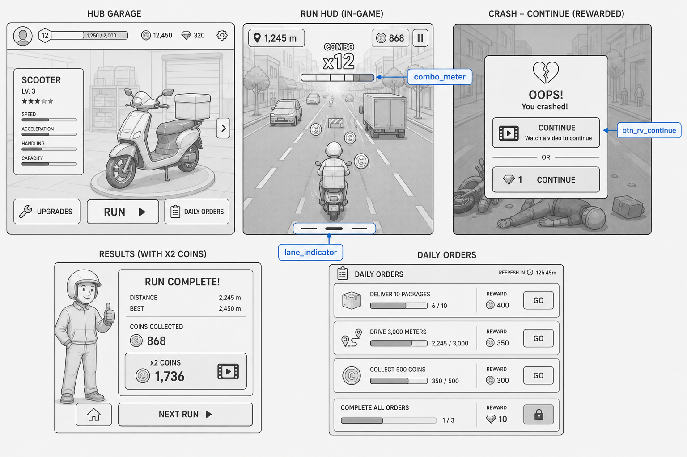
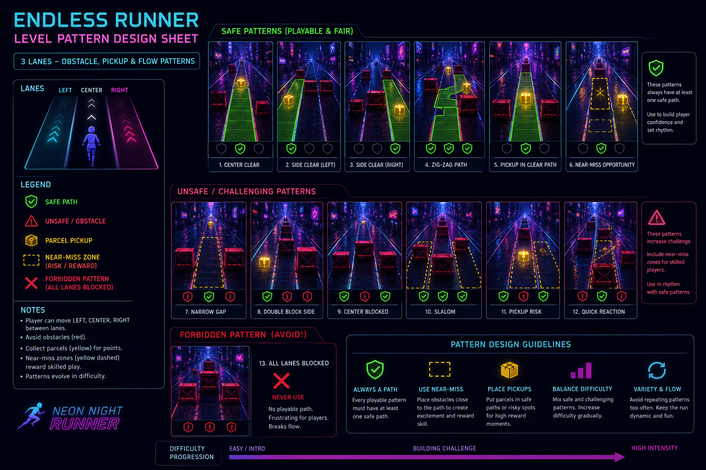
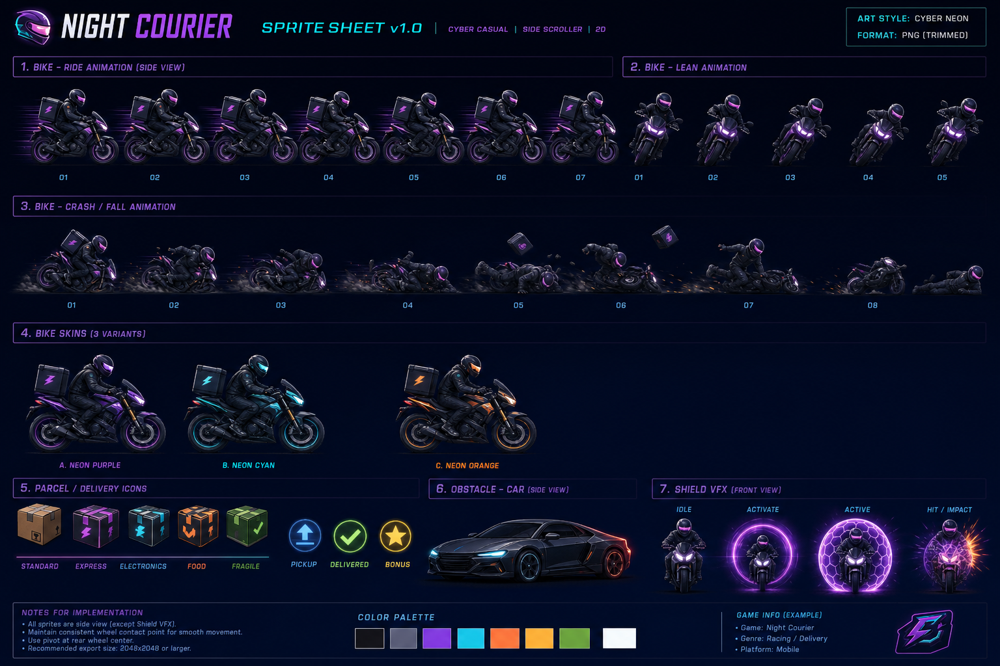

# Ночной Курьер — Visual References Index

> Эти файлы — обязательный вход для арт/UI/level LLM-агентов.  
> При генерации новых ассетов держать стиль как у референсов ниже.

## Art

`refs/art/key-art.png` — tonal/mood lock, palette, composition.

## UI Wireframes

`refs/ui/wireframe-main.png` — экраны, иерархия, CTA rewarded/IAP зоны.

## Level / Content Layout

`refs/levels/layout-main.png` — грамматика уровней/доски/маршрута.

## Sprites / Animation Sheet

`refs/sprites/sheet-main.png` — пропорции, кадры, иконки.

## Как использовать агентам

1. Открыть `DESIGN_LLM.md` (контракт).
2. Открыть этот `REFS.md` (визуальный ground truth).
3. Взять атомарный промпт из `prompts/` и **приложить** соответствующий png.
4. Сохранять результат в пути из Integration Contract `DESIGN_LLM.md`.

## DoR visuals

- [x] key-art
- [x] wireframe-main
- [x] layout-main
- [x] sheet-main
