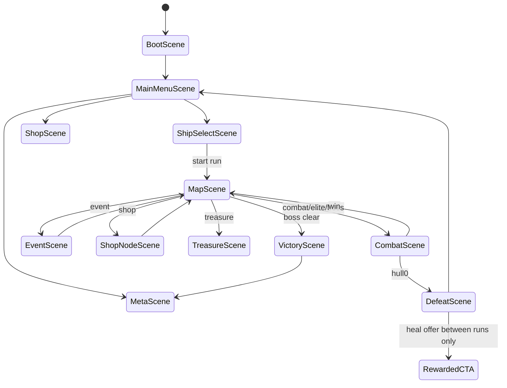
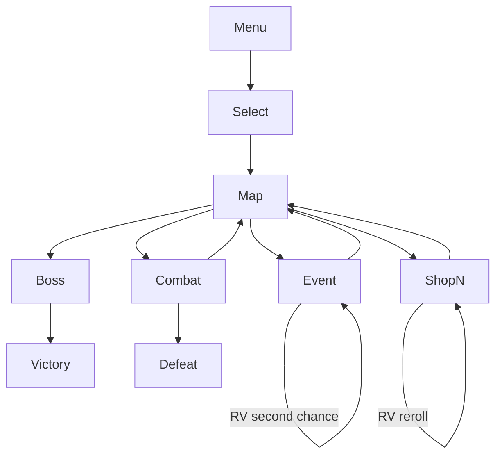

# Море Реликвий — DESIGN_LLM (исполняемая спецификация)

> **СТАТУС:** `DRAFT`  
> **⛔ НЕ НАЧИНАТЬ КОДИРОВАНИЕ `src/`, пока дизайн не CONFIRMED**  
> Единственный machine-contract source of truth после CONFIRM.

---

## 0. Project Contract

### 0.1 Identity

| Ключ | Значение |
|------|----------|
| `slug` | `tide-of-relics` |
| `displayName.ru` | Море Реликвий |
| `displayName.en` | Tide of Relics |
| `engine` | Phaser 3.80+ |
| `language` | TypeScript 5.x strict |
| `bundler` | Vite 5.x |
| `platform` | Yandex Games HTML5 |
| `orientation` | landscape preferred (combat UI); portrait map OK with reflow |
| `targetFPS` | 60 |
| `baseResolution` | 1280×720 |
| `runLengthMVP` | 8–15 min |
| `difficultyModes` | `easy`, `normal` |

### 0.2 Folder layout

```
games/tide-of-relics/
  docs/DESIGN.md
  docs/DESIGN_LLM.md
  prompts/{ART,SPRITE_ANIM,UI,LEVEL,CODE_AGENT}_PROMPTS.md  (см. имена файлов)
  refs/art|ui|levels|sprites/
  public/assets/
    textures/{ships,enemies,relics,vfx,tiles,ui,keyart,portraits}/
    audio/{sfx,music}/
    data/   # optional static json serving
  src/
    main.ts
    game/
      scenes/
      systems/{combat,map,events,meta}/
      entities/
      ui/
      data/
      sdk/
  STATUS.md
  STORE_CHECKLIST.md
  README.md
  package.json
  index.html
```

Имена prompt-файлов строго:
`ART_PROMPTS.md`, `SPRITE_ANIM_PROMPTS.md`, `UI_PROMPTS.md`, `LEVEL_PROMPTS.md`, `CODE_AGENT_PROMPT.md`

### 0.3 Naming conventions

| Тип | Правило | Пример |
|-----|---------|--------|
| Ship IDs | `ship_<class>` | `ship_brig` |
| System IDs | `sys_<name>` | `sys_shield` |
| Enemy IDs | `foe_<name>` | `foe_pirate_sloop` |
| Relic IDs | `rel_<name>` | `rel_storm_call` |
| Event IDs | `evt_<name>` | `evt_siren_bargain` |
| Node IDs | `node_<act>_<nn>` | `node_1_07` |
| Asset keys | snake with domain | `ship_brig_hull`, `ui_sys_btn_guns` |
| TS | PascalCase classes | `CombatScene.ts` |

### 0.4 Asset ID schema

`{domain}_{subject}_{variant}_{state}`  
Domains: `ship`, `foe`, `rel`, `evt`, `ui`, `vfx`, `tile`, `bg`, `sfx`, `mus`, `port` (portrait)

Path example: `public/assets/textures/ships/ship_brig_sheet.png`

### 0.5 Coding gate

```
IF designStatus != CONFIRMED:
  FORBIDDEN: games/tide-of-relics/src/**
ALLOWED: docs, prompts, refs, data drafts outside src if needed for design only
```

---

## 1. Scenes & Flow



**AC scenes:** cloud autosave on node complete; pause combat anytime; back from event always defined.

---

## 2. Input Contract

### Combat
- Tap system button → allocate +1 energy if free power >0  
- Tap powered system → -1 (optional)  
- Relic buttons bottom  
- Pause toggle large  
- Desktop: `1-5` systems, `Space` pause, `Q-E` relics  

### Map
- Tap node (only adjacent unlocked)  
- Pinch/scroll map if large  

**AC:** targets ≥48px; no accidental energy toggles from relic tap.

---

## 3. Gameplay Systems + Acceptance Criteria

### 3.1 ShipModel

```
ShipState {
  hull, hullMax,
  systems: Record<SystemId, {hp, hpMax, power, powerMax, manned?: boolean}>,
  reactorPower, reactorMax,
  relics: RelicInstance[],
  scrap: number,   // soft in-run
  crew: number     // MVP: abstract crew points 0–3 affecting repair speed
}
```

| SystemId | powerMax | role |
|----------|----------|------|
| `sys_sails` | 3 | escape charge rate, evasion minor |
| `sys_guns` | 4 | DPS volleys every `fireInterval` |
| `sys_shield` | 3 | shieldPoints regen / capacity |
| `sys_arcana` | 3 | relic CD rate + arcane shots |
| `sys_hull` | — | not powered; damaged by shots |

**Damage routing:** enemy attack rolls target: 50% hull / 50% random powered-or-present system. System at 0 HP → offline until repaired.

**AC:**
- [ ] Sum(system.power) ≤ reactorPower always  
- [ ] Damaged system power auto-ejected if hp==0  
- [ ] Easy: +20% hullMax, enemy DPS −15%

### 3.2 CombatSystem

Tick 60fps:
1. Player volley timer based on `sys_guns.power` → damage to foe  
2. Foe AI pattern → telegraph 0.6s → damage  
3. Shield absorbs before hull/system  
4. Escape: if sails.power≥1 and not boss → escapeMeter += k*sails.power*dt; at 100% leave combat as flee (no loot / reduced)

Volley formula:
`dmg = (2 + guns.power) * relicMult` every `max(0.35, 1.1 - 0.12*guns.power)` s

**AC:**
- [ ] Pause freezes timers, allows power reallocation  
- [ ] Boss: escape disabled  
- [ ] Victory grants scrap + chance relic/weapon upgrade  
- [ ] Defeat → DefeatScene, run seed stored for resume? **No** — run ends (cloud saves meta only + optional mid-run save checkpoint on map)

**Mid-run cloud:** save MapRunState after each node (required).

### 3.3 EnemyAI recipes

| foeId | hull | pattern |
|-------|------|---------|
| `foe_pirate_sloop` | 12 | guns every 1.4s light |
| `foe_pirate_brig` | 20 | volley + occasional sails jam |
| `foe_wraith_skiff` | 14 | phase (untargetable 1.5s) |
| `foe_kraken_spawn` | 18 | tentacle system smash |
| `foe_imperial_frigate` | 28 | shield + heavy |
| `foe_deep_cult` | 16 | arcana curse DoT |
| `foe_boss_leviathan` | 80 | phases 100/60/30% |

**AC:** telegraph readable color; no one-shots on Easy from full HP.

### 3.4 MapSystem

```
ActGraph {
  act: 1,
  nodes: NodeDef[], // 12–16 + boss
  edges: [from,to][]
}
NodeDef { id, type, difficulty, rewardTable, position }
```

Types: `combat|elite|event|shop|treasure|boss`  
Player path: only forward edges; visited marked.

**AC:** ≥2 routes; shop before boss reachable; elite optional branch.

### 3.5 EventSystem

```
EventDef {
  id, title, body,
  choices: { id, label, effects: Effect[], requirements? }[]
}
Effect = { type: 'damage'|'scrap'|'relic'|'heal'|'curse'|'crew', value, relicId? }
```

**AC:** каждый event ≥1 безопасный-ish выход; нет softlock; RV «second chance» перекидывает один failed roll (once/run).

### 3.6 ShopNode

Buy: repair hull, repair system, relic (rare), reactor+1 (once), heal crew.  
Reroll: RV or scrap cost.

### 3.7 RelicSystem

| id | type | effect |
|----|------|--------|
| `rel_storm_call` | active CD 18s | AoE dmg 8 |
| `rel_tentacles` | active 20s | stun foe 2.5s |
| `rel_fire_cores` | active 12s | +50% guns 5s |
| `rel_fog_veil` | active 22s | evasion + escape +30% 4s |
| `rel_tide_mend` | active 25s | heal hull 6 |
| `rel_iron_keel` | passive | hullMax +8 |
| `rel_powder_monkey` | passive | guns fireRate +10% |
| `rel_siren_compass` | passive | see elite rewards preview |

Max relics held: 4 active slots + passives unlimited-but-find-rate limited (cap 6 total MVP).

**AC:** CD respects pause; arcana.power reduces CD up to −30%.

### 3.8 MetaProgress

```
Meta {
  unlockedShips: string[]
  unlockedStartRelics: string[]
  captainTree: Record<string, number>
  dubloons: number      // soft meta
  pearls: number        // hard
  achievements: string[]
  weeklyBest: number
  removeAds: boolean
}
```

Captain perks: start scrap +5, start shield +1, event foresight, etc. Small.

---

## 4. Level / Content Grammar

### 4.1 How content LOOKS

- **Map:** parchment-teal sea chart, island nodes glowing, cursed purple currents (controlled, not generic AI purple spam — use deep sea `#0B3C5D` + gold `#D4A017` + foam `#7EC8E3`).
- **Combat:** side-view-lite or top-down ship vs ship with system panel bottom; fantasy sails, relic glyphs.
- **Events:** illustrated portrait + text panel.

### 4.2 How content PLAYS

- Early nodes teach guns vs shield.  
- Mid: introduce system damage & repair.  
- Late: elite + resource poverty before boss.  
- Always offer heal path via shop/event.

### 4.3 Encounter recipes

| Recipe | Nodes | Foes |
|--------|-------|------|
| `intro_patrol` | 1–2 | sloop |
| `pirate_pack` | combat | sloop+brig |
| `haunt` | combat | wraith |
| `cult_ambush` | elite | deep_cult + sloop |
| `imperial_tax` | elite | frigate |
| `boss_leviathan` | boss | leviathan phases |

Difficulty param `d`: foe hull × (1+0.08*d), dmg × (1+0.05*d)

### 4.4 Act 1 curve (MVP)

```
N1 combat intro
N2 event teach
N3 combat
N4 shop
N5 combat / branch elite
N6 event
N7 combat
N8 treasure
N9 combat
N10 shop
N11 elite OR event
N12 combat
N13 event
BOSS leviathan
```

**AC:** Easy players reach boss ≥25% on run 3+; Normal ≥15%.

### 4.5 “Tile” rules (map & combat bg)

Map не тайл-уровень в классике, но:
- Node icons 64×64 atlas  
- Sea bg tileset optional parallax 128×128  
- Combat bg layered: water loop, ships sprites  

Forbidden: unreadable overlapping nodes (<80px gap).

---

## 5. UI Component Map & Wireframes

### Components

`ui_btn_primary`, `ui_btn_rel`, `ui_sys_btn` (5), `ui_power_pips`, `ui_hull_bar`, `ui_foe_bar`, `ui_pause`, `ui_map_node`, `ui_event_choice`, `ui_shop_row`, `ui_rv_chip`, `ui_relic_icon`

### Boot
```
┌──────────────────────────────┐
│      МОРЕ РЕЛИКВИЙ           │
│         loading              │
└──────────────────────────────┘
```

### Main Menu
```
┌──────────────────────────────┐
│ МОРЕ РЕЛИКВИЙ                │
│ [full-bleed key art sea]     │
│   [ НОВЫЙ РАН ]              │
│   [ МЕТА ] [ МАГАЗИН ]       │
│   [ НЕДЕЛЯ ] [ ⚙ ]           │
└──────────────────────────────┘
```

### Ship Select
```
┌──────────┬───────────────────┐
│ Brig ✓   │ Preview stats     │
│ Longship │ Hull/Guns/...     │
│ Galleon🔒│ Start relic       │
│ Arcanist◆│ [ В ПЛАВАНИЕ ]    │
└──────────┴───────────────────┘
```

### Map
```
┌──────────────────────────────┐
│ Act I          scrap 40      │
│  (c)-(e)-(c)                 │
│     \  \                     │
│      (s)-(c)-(boss)          │
└──────────────────────────────┘
```

### Combat HUD
```
┌──────────────────────────────┐
│ PAUSE   HULL ████░░  FOE ███ │
│     [water + ships stage]    │
│ RELICS [R1][R2][R3]          │
│ SYS: Sails Guns Shield Arcana│
│      [■■] [■■■] [■] [■]     │
│ Power free: 2 / Reactor 8    │
└──────────────────────────────┘
```

### Pause
```
Продолжить / Настройки / Сдать ран (confirm)
```

### Event
```
┌──────┬───────────────────────┐
│ art  │ Title + body          │
│      │ [Choice A]            │
│      │ [Choice B]            │
│      │ [▶ Second chance RV]  │
└──────┴───────────────────────┘
```

### Shop node / Meta shop / Result defeat-victory / Rewarded CTA

```
Defeat: РАН ПРЕРВАН | [В меню] | [▶ +heal next start — RV]
Victory: АКТ ПРОЙДЕН | rewards | [Мета]
Shop: repair / relics / [▶ reroll]
```



---

## 6. Art Bible

### Style locks
Painterly-fantasy naval illustration for key art; **gameplay UI crisp vector/pixel-hybrid icons**; ships readable silhouettes; relics glowing gold-seafoam not generic purple void.

### Palette HEX

| Role | Hex |
|------|-----|
| Deep sea | `#071B2A` |
| Sea | `#0B3C5D` |
| Foam | `#7EC8E3` |
| Gold relic | `#D4A017` |
| Wood | `#6B3F24` |
| Sail | `#E8DCC8` |
| Danger | `#C44536` |
| Heal | `#3A9B7A` |
| Text | `#F3F6FA` |
| Map parchment | `#D9C7A1` |
| Curse accent | `#5C4D8A` (sparingly) |

### Do / Don't
**Do:** distinct ship classes; clear system icons; epic but readable boss.  
**Don't:** photoreal ships; cluttered FTL clone UI; purple-pink neon cyber look; tiny text.

---

## 7. Image Generation Prompts

### Key art
```
Cinematic key art fantasy naval game Tide of Relics: enchanted galleon on cursed teal sea, glowing gold relics, distant leviathan silhouette, storm light, painterly, 1920x1080, no text no logo no UI
```

### Environment
```
Fantasy sea chart map background parchment teal currents islands, game UI friendly, high resolution, no text; plus combat water background looping paintable layers
```

### Characters / ships
```
Side-view game ship sprites: brig, longship, galleon, arcanist vessel, fantasy sails, readable silhouettes, transparent, game asset sheet
```

### Enemies
```
Enemy fantasy ships and sea monsters for FTL-like game: pirate sloop, frigate, wraith skiff, kraken spawn, leviathan boss stages, transparent game sprites
```

### Weapons / systems icons
```
Game icons 64x64: sails, cannons, shield, arcana crystal, hull, scrap, shop, pause, energy pip, gold seafoam style
```

### Relics / VFX
```
Relic icons gold foam: storm, tentacles, fire cores, fog, tide mend; VFX sheets lightning, ink tentacles, cannon flash, heal ripple, transparent
```

### Tileset / map nodes
```
64x64 map node icons: combat crossed swords, elite skull, event question, shop coin, treasure chest, boss crown, sea chart style
```

### UI kit
```
Naval fantasy game UI kit deep sea #071B2A gold #D4A017 foam #7EC8E3: panels, system buttons, relic slots, map frame, event choices, rewarded button, 9-slice, no device mockup, no cyber neon
```

---

## 8. Sprite Sheet Specs & Timings

### Ships `ship_<id>_sheet.png`

Frame **96×64** (side view), 6 cols × 3 rows:

| anim | frames | fps | loop |
|------|--------|-----|------|
| idle bob | 0–3 | 6 | y |
| fire | 4–7 | 12 | n |
| hit | 8–10 | 10 | n |
| sink | 11–17 | 8 | n |

### Foes — same layout; boss leviathan **192×96**, phases separate rows.

### Relic VFX `vfx_rel_<id>_sheet.png` — 128×128, 6–8 frames @ 12–16fps oneshot

### UI icons — static 64×64 atlas `ui_icons_atlas.png`

### System damage sparks — 32×32, 4f @ 14fps

| Anim | fps |
|------|-----|
| ship idle | 6 |
| ship fire | 12 |
| sink | 8 |
| cannon VFX | 16 |
| heal ripple | 12 |

---

## 9. Integration paths

```
public/assets/textures/keyart/keyart_tide_of_relics.png
public/assets/textures/ships/ship_brig_sheet.png
public/assets/textures/ships/ship_longship_sheet.png
public/assets/textures/ships/ship_galleon_sheet.png
public/assets/textures/ships/ship_arcanist_sheet.png
public/assets/textures/enemies/foe_pirate_sloop_sheet.png
public/assets/textures/enemies/foe_boss_leviathan_sheet.png
public/assets/textures/relics/rel_icons_atlas.png
public/assets/textures/ui/ui_kit.png
public/assets/textures/ui/ui_icons_atlas.png
public/assets/textures/ui/ui_map_nodes_atlas.png
public/assets/textures/vfx/vfx_rel_storm_sheet.png
public/assets/data/act1_graph.json
public/assets/data/events.json
public/assets/data/relics.json
public/assets/data/ships.json
public/assets/data/foes.json
src/data/* (runtime imports — may mirror public)
```

---

## 10. SDK contract

```
showInterstitial('defeat' | 'between_runs')  // NEVER mid-combat
showRewarded('heal_boon' | 'shop_reroll' | 'event_second_chance')
purchase('remove_ads' | 'ship_arcanist' | 'pearls_m' | 'pass_s1' | 'sail_skin')
leaderboardSet('lb_weekly_seed', score)
cloudLoad/Save(Meta & MapRunState)
```

Weekly: shared seed string from date ISO week.

---

## 11. Prompt pack index

Standalone messages: `prompts/ART_PROMPTS.md`, `SPRITE_ANIM_PROMPTS.md`, `UI_PROMPTS.md`, `LEVEL_PROMPTS.md`, `CODE_AGENT_PROMPT.md`

---

## 12. Definition of Ready

- [x] Project contract complete  
- [x] Systems with AC  
- [x] Content/map grammar + act curve  
- [x] UI map + wireframes all major screens  
- [x] Art bible + palette + prompts  
- [x] Sprite specs + timings  
- [x] Integration paths  
- [x] SDK + fair IAP rules  
- [x] Explicit no-code-until-CONFIRMED  
- [ ] Human REVIEW → dashboard CONFIRMED  

---

## 13. Explicit ban

```
⛔ DO NOT START CODING until design status is CONFIRMED.
⛔ DO NOT expand to 3 acts before Store Ready of Act 1.
```

## Changelog

| 1.0 | 2026-07-17 | Initial LLM bible |

---

## Visual Ground Truth (обязательные референсы)

См. также `docs/REFS.md`.

| Тип | Путь |
|-----|------|
| Key art | `refs/art/key-art.png` |
| UI wireframe | `refs/ui/wireframe-main.png` |
| Level layout | `refs/levels/layout-main.png` |
| Sprite sheet | `refs/sprites/sheet-main.png` |

Любой арт-агент обязан сверяться с этими файлами перед генерацией финальных ассетов.
