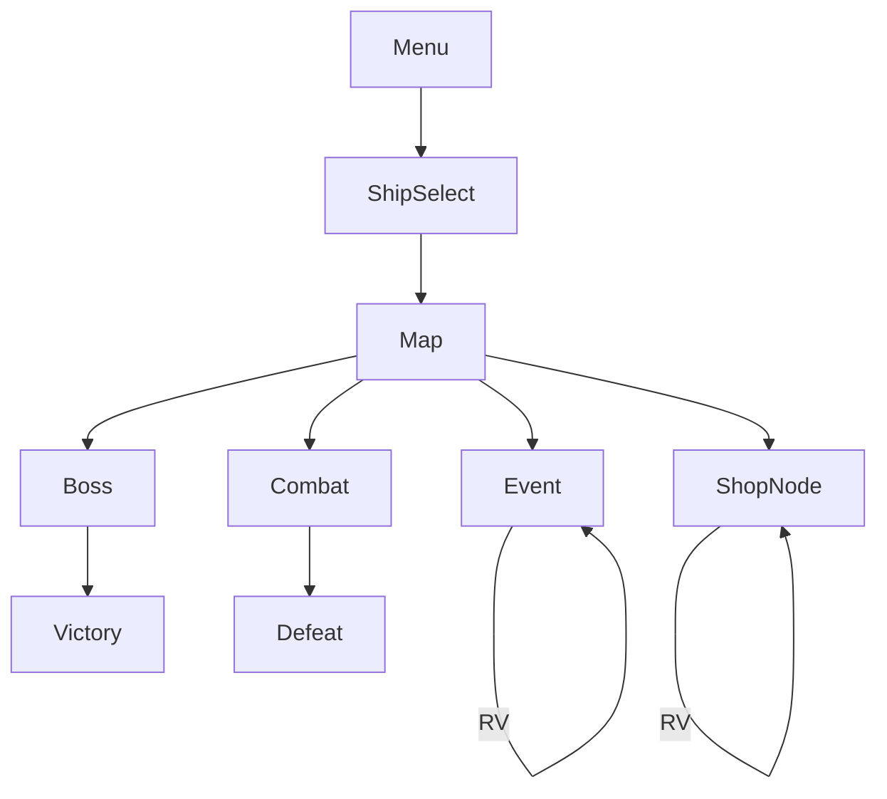

# Море Реликвий — UI_PROMPTS

**Канон:** `DESIGN_LLM.md` §5.

## Контекст
```
UI Море Реликвий: Phaser, RU, landscape combat, large system buttons ≥48px.
Colors: panel #071B2A, gold #D4A017, foam #7EC8E3, text #F3F6FA.
Screens: Boot, Menu, ShipSelect, Meta, Map, Combat, Pause, Event, ShopNode,
Treasure, Defeat, Victory, ShopIAP, Weekly, RewardedCTA, Settings.
```

## UI kit prompt
```
Naval fantasy game UI kit deep sea and gold: primary buttons, system power buttons with pip slots, hull bars, relic hotbar, pause, map node frames, event choice buttons, shop rows, rewarded play button, defeat/victory banners, 9-slice panels, no cyber neon, no device mockup
```
→ `public/assets/textures/ui/ui_kit.png`

## Copy RU

| Screen | Copy |
|--------|------|
| Menu | НОВЫЙ РАН / МЕТА / МАГАЗИН / НЕДЕЛЬНЫЙ ЗАПЛЫВ / НАСТРОЙКИ |
| ShipSelect | Бриг / Драккар / Галеон / Арканоносец / В ПЛАВАНИЕ |
| Map | Акт I / Обломки {n} |
| Combat | ПАУЗА / системы Паруса Пушки Щит Аркана |
| Pause | Продолжить / Сдать ран |
| Event | choices from events.json |
| Shop | Ремонт корпуса / Ремонт системы / Реликвия / Реактор+ / ▶ Реролл |
| Defeat | РАН ПРЕРВАН / В меню / ▶ Благословение лечения |
| Victory | АКТ ПРОЙДЕН / Награды / В мету |
| Difficulty | Лёгкий / Обычный |

## Wireflow



## Component map sizes

| id | min size |
|----|----------|
| `ui_sys_btn` | 72×72 |
| `ui_btn_rel` | 64×64 |
| `ui_map_node` | 64×64 |
| `ui_event_choice` | 280×56 |
| `ui_btn_rv` | 240×56 |

## DoD
Combat usable on mobile landscape; pause obvious; RV labeled reward; no mid-combat interstitial UI.

## Запреты
More than 5 systems; English-only; fake close ads.
